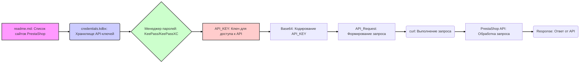

# Анализ структуры и использования API PrestaShop

## 1. <алгоритм>

**Общее описание:**
Этот документ `readme.md` предоставляет информацию о том, как управлять сайтами PrestaShop и как использовать их API. Он описывает структуру хранения API-ключей, дает примеры запросов к API и рекомендации по безопасности.

**Пошаговый алгоритм:**

1.  **Идентификация сайтов PrestaShop:**
    -   Документ содержит список сайтов PrestaShop: `e-cat.co.il`, `emil-design.com`, и `sergey.mymaster.co.il`.
    -   *Пример:* Пользователь идентифицирует `e-cat.co.il` как один из управляемых сайтов.
2.  **Хранение API ключей:**
    -   API-ключи для каждого сайта хранятся в файле `credentials.kdbx`.
    -   *Пример:* Файл `credentials.kdbx` содержит API-ключ для сайта `e-cat.co.il`, а также его URL.
3.  **Использование менеджера паролей:**
    -   Для доступа к ключам из файла `credentials.kdbx` используется менеджер паролей, поддерживающий этот формат (например, KeePass или KeePassXC).
    -   *Пример:* Пользователь открывает `credentials.kdbx` в KeePassXC, чтобы получить API-ключ.
4.  **Формирование API запроса:**
    -   Шаблон запроса к API: `curl -X GET 'https://<SITE_URL>/api/<endpoint>' -H 'Authorization: Basic <base64(API_KEY)>'`
    -   *Пример:* Пользователь заменяет `<SITE_URL>` на `e-cat.co.il` и `<endpoint>` на `products`.
    -   *Пример:* Пользователь использует `base64` для кодирования API-ключа, полученного из менеджера паролей.
5.  **Выполнение API запроса:**
    -   Запрос отправляется с использованием `curl` с заголовком `Authorization`, содержащим закодированный ключ.
    -   *Пример:* Выполняется команда `curl` для получения списка продуктов с сайта `e-cat.co.il`.
6.  **Рекомендации по безопасности:**
    -   Предостережение: не делиться файлом `credentials.kdbx`, хранить в защищенном месте, регулярно обновлять ключи.
    -   *Пример:* Пользователь сохраняет `credentials.kdbx` в папке `secrets`, исключенной из системы контроля версий.

**Поток данных:**

1.  Пользователь получает список сайтов PrestaShop из `readme.md`.
2.  Пользователь получает доступ к API-ключам через `credentials.kdbx` с помощью менеджера паролей.
3.  Пользователь формирует API запрос, используя URL сайта, необходимый endpoint и API ключ, закодированный в Base64.
4.  `curl` отправляет запрос к API.
5.  API PrestaShop возвращает ответ на запрос.

## 2. <mermaid>

**Объяснение `mermaid` диаграммы:**

-   **`A[readme.md: Список сайтов PrestaShop]`**: Этот блок представляет файл `readme.md`, который содержит список сайтов PrestaShop, с которыми работает пользователь. Он является отправной точкой для идентификации нужного сайта.
-   **`B(credentials.kdbx: Хранилище API-ключей)`**: Этот блок представляет файл `credentials.kdbx`, в котором безопасно хранятся API-ключи для каждого сайта. Он является хранилищем аутентификационной информации.
-  **`C{Менеджер паролей: KeePass/KeePassXC}`**: Этот блок представляет собой менеджер паролей (например, KeePass или KeePassXC), который используется для доступа к содержимому файла `credentials.kdbx`. Он обеспечивает безопасный доступ к API ключам.
-   **`D[API_KEY: Ключ для доступа к API]`**: Этот блок представляет собой API-ключ, полученный из менеджера паролей, который необходим для аутентификации при запросе к API PrestaShop.
-   **`E[Base64: Кодирование API_KEY]`**: Этот блок представляет процесс кодирования API-ключа с использованием Base64. Это необходимо для включения ключа в заголовок `Authorization` HTTP-запроса.
-   **`F[API_Request: Формирование запроса]`**: Этот блок представляет формирование API-запроса, который включает в себя URL сайта, endpoint API и закодированный ключ API.
-   **`G(curl: Выполнение запроса)`**: Этот блок представляет инструмент `curl`, который используется для отправки HTTP-запроса к API PrestaShop.
-   **`H[PrestaShop API: Обработка запроса]`**: Этот блок представляет сам API PrestaShop, который обрабатывает запрос и отправляет ответ.
-   **`I(Response: Ответ от API)`**: Этот блок представляет ответ, полученный от API PrestaShop после обработки запроса.

**Зависимости:**

Диаграмма показывает зависимости между различными компонентами, участвующими в процессе взаимодействия с API PrestaShop. Основные зависимости:

-   Файл `readme.md` информирует пользователя о доступных сайтах.
-   Файл `credentials.kdbx` зависит от менеджера паролей, который используется для доступа к ключам.
-   Закодированный API ключ используется для формирования запроса.
-   `curl` зависит от сформированного API запроса.
-   API PrestaShop зависит от корректного запроса и авторизации.
-   Ответ зависит от успешного запроса к API.

## 3. <объяснение>

**Импорты:**

В данном коде отсутствуют явные импорты, так как это файл `readme.md`, представляющий собой текстовую документацию, а не исполняемый код.

**Классы:**

В данном коде нет классов, поскольку это файл с описанием, а не исполняемый код.

**Функции:**

В данном коде нет функций, поскольку это файл с описанием, а не исполняемый код.

**Переменные:**

В данном документе переменные представлены в виде плейсхолдеров, используемых в примерах API запросов, например:

-   **`<SITE_URL>`**: Переменная, представляющая URL сайта PrestaShop (например, `e-cat.co.il`). Тип: строка (string).
-   **`<endpoint>`**: Переменная, представляющая endpoint API (например, `products`, `customers`). Тип: строка (string).
-   **`<API_KEY>`**: Переменная, представляющая API-ключ для доступа к API сайта. Тип: строка (string).

**Объяснение:**

-   Файл `readme.md` предназначен для предоставления информации о том, как работать с сайтами PrestaShop и их API.
-   Файл `credentials.kdbx` служит для безопасного хранения API-ключей. Для его использования необходим менеджер паролей, такой как KeePass или KeePassXC.
-   Приведен пример API запроса с использованием `curl`.
-   В запросе к API используется заголовок `Authorization: Basic <base64(API_KEY)>`, что означает передачу закодированного API-ключа в Base64.
-   Даны рекомендации по безопасности для защиты API-ключей и файла `credentials.kdbx`.
-   Предоставлена ссылка на официальную документацию API PrestaShop.

**Потенциальные ошибки и области для улучшения:**

-   **Зависимость от ручного копирования:** Примеры API запросов требуют ручного копирования и подстановки переменных. Можно улучшить, предоставив скрипты или инструменты, автоматизирующие этот процесс.
-   **Отсутствие обработки ошибок:** В описании не указано, как обрабатывать возможные ошибки при выполнении API запросов.
-   **Не хватает информации по доступным endpoint:** Было бы полезно дать больше информации о доступных endpoint в PrestaShop API и их назначении.

**Взаимосвязь с другими частями проекта:**

-   Этот `readme.md` файл является частью модуля `src/endpoints/prestashop` и предоставляет документацию по использованию API PrestaShop.
-   `credentials.kdbx` хранится в `secrets` и исключается из системы контроля версий. Это обеспечивает безопасность ключей.
-   Код, использующий этот документ, скорее всего, будет находиться в других частях проекта, которые выполняют реальные запросы к PrestaShop API.

Таким образом, файл `readme.md` играет важную роль в предоставлении информации и инструкций для работы с API PrestaShop, а также в обеспечении безопасности API-ключей.