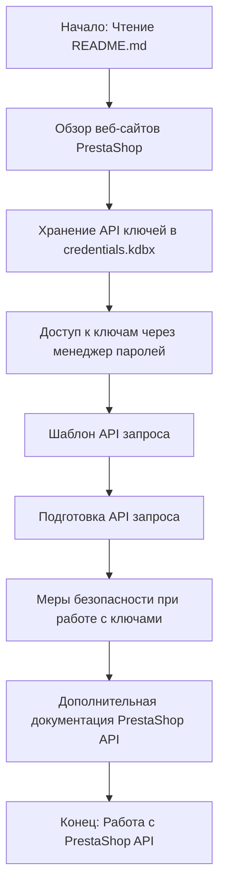

## <алгоритм>

1.  **Начало**: Пользователь знакомится с `README.md` файлом.
    *   **Пример**: Пользователь открывает файл в текстовом редакторе или на GitHub.

2.  **Обзор веб-сайтов**: Пользователь узнает список управляемых веб-сайтов PrestaShop.
    *   **Пример**: Пользователь видит список `e-cat.co.il`, `emil-design.com`, `sergey.mymaster.co.il`.

3.  **Хранение API ключей**: Пользователь узнает, что API ключи хранятся в зашифрованном файле `credentials.kdbx`.
    *   **Пример**: Файл `credentials.kdbx` используется для безопасного хранения ключей.

4.  **Работа с API ключами**: Пользователь понимает, что для доступа к файлу `credentials.kdbx` требуется менеджер паролей.
    *   **Пример**: Используется KeePass или KeePassXC для открытия и работы с файлом.

5.  **Пример запроса API**: Пользователь изучает шаблон для выполнения API запросов.
    *   **Пример**: Используется `curl` запрос, где нужно заменить `<SITE_URL>`, `<endpoint>` и `<base64(API_KEY)>`.

6.  **Подготовка API запроса**: Пользователь формирует `curl` запрос.
    *   **Пример**: Пользователь заполняет шаблон и выполняет запрос к нужному эндпоинту.

7.  **Безопасность**: Пользователь осведомлен о мерах безопасности для защиты ключей.
    *   **Пример**: Нельзя делиться файлом `credentials.kdbx`, его нужно хранить в безопасном месте.

8.  **Дополнительные ресурсы**: Пользователь получает ссылку на официальную документацию PrestaShop API.
    *   **Пример**: Ссылка на документацию `https://devdocs.prestashop.com/` для подробностей об API.

## <mermaid>

**Объяснение зависимостей в mermaid диаграмме:**

Диаграмма `mermaid` показывает последовательность действий и зависимостей при работе с API PrestaShop, основываясь на информации из `README.md`. Каждый блок представляет собой этап, который зависит от предыдущего.
*   `Start`: Начальная точка процесса, где пользователь начинает читать `README.md`.
*   `WebsiteList`: Этап, на котором пользователь знакомится со списком доступных веб-сайтов.
*   `ApiKeysStorage`: Этап, где пользователь узнает, как и где хранятся API ключи.
*   `PasswordManager`: Этап, где пользователь использует менеджер паролей для доступа к ключам.
*   `ApiRequestTemplate`: Этап, где пользователь знакомится с шаблоном API запроса.
*   `PrepareApiRequest`: Этап, где пользователь формирует свой запрос API, используя шаблон.
*  `SecurityRecommendations`: Этап, на котором пользователь узнает о мерах безопасности при работе с ключами.
* `OfficialDocumentation`: Этап, где пользователь может обратиться к официальной документации.
*   `End`: Конечная точка процесса, когда пользователь готов работать с API PrestaShop.

## <объяснение>

**Импорты**: В данном файле `README.md` нет импортов, так как это текстовый файл, описывающий работу с API PrestaShop.

**Классы**: В данном файле `README.md` нет классов, так как это текстовый файл, описывающий работу с API PrestaShop.

**Функции**: В данном файле `README.md` нет функций, так как это текстовый файл, описывающий работу с API PrestaShop.

**Переменные**: В данном файле `README.md` используются переменные, указанные в угловых скобках, которые нужно заменить:
    -   `<SITE_URL>`: URL-адрес веб-сайта PrestaShop.
    -   `<endpoint>`: Конечная точка API, к которой отправляется запрос.
    -   `<API_KEY>`: Ключ API для доступа к веб-сайту PrestaShop.
    -   `base64(API_KEY)`: Ключ API, закодированный в Base64.

**Объяснение:**

Файл `README.md` предоставляет информацию о работе с API PrestaShop для нескольких веб-сайтов. Он объясняет, как хранить API ключи, как использовать их для выполнения запросов к API, и как обеспечить безопасность. Ключевые моменты включают в себя:

*   **Список веб-сайтов**: В разделе "Websites" перечислены три веб-сайта, с которыми работает данный API.
*   **Хранение API ключей**: API ключи хранятся в файле `credentials.kdbx`, который является защищенной базой данных паролей. Рекомендуется использовать менеджер паролей, например, KeePass или KeePassXC, для доступа к этому файлу.
*   **API запрос**: Шаблон запроса API представлен с использованием `curl`. Пользователю необходимо заменить плейсхолдеры `<SITE_URL>`, `<endpoint>` и `<base64(API_KEY)>` на соответствующие значения. Пример запроса также предоставлен.
*   **Меры безопасности**: Важно не делиться файлом `credentials.kdbx` и хранить его в безопасном месте. Рекомендуется регулярно обновлять API ключи и пароли.
*   **Дополнительные ресурсы**: Ссылка на официальную документацию PrestaShop API предоставляет дополнительную информацию о доступных эндпоинтах и взаимодействии с ними.

**Потенциальные ошибки и улучшения:**

*   **Отсутствие автоматизации**: Описан процесс запросов через `curl`, но нет автоматизированных скриптов, которые могли бы упростить использование API.
*   **Не хватает описания эндпоинтов**: Не предоставлен полный список эндпоинтов API.
*   **Безопасность**:  Хранение ключей в kdbx файле повышает безопасность, но все же необходимо рассмотреть возможность использования переменных окружения или других безопасных методов хранения в будущих итерациях.
*   **Обработка ошибок**:  Отсутствует информация об обработке ошибок при API-запросах, как их отслеживать и обрабатывать.

**Взаимосвязь с другими частями проекта:**

Этот `README.md` файл является частью модуля `prestashop` внутри директории `endpoints`. Это подразумевает, что другие части проекта могут использовать этот модуль для взаимодействия с веб-сайтами PrestaShop. Могут быть другие модули для работы с API (например, `src/api_requests.py`), которые могли бы использовать API ключи и предоставлять функциональность для взаимодействия с PrestaShop, или другие модули для логирования или обработки данных от API, например `src/logs.py` и `src/data_processing.py`.