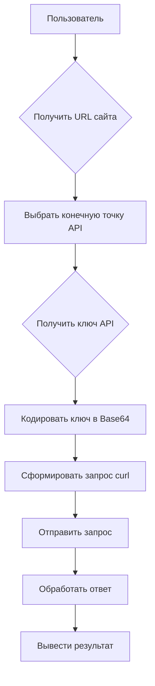

# Управление сайтами на PrestaShop

## <input code>

```
# Управление сайтами на PrestaShop
Данный `README` файл описывает структуру и способ работы с сайтами на платформе PrestaShop, а также хранение и использование ключей API.

## Сайты
Ваши сайты, работающие на PrestaShop:
1. [e-cat.co.il](https://e-cat.co.il)
2. [emil-design.com](https://emil-design.com)
3. [sergey.mymaster.co.il](https://sergey.mymaster.co.il)

Каждый из этих сайтов использует API для взаимодействия с различными параметрами и функциями.

## Хранение ключей API
Ключи API для каждого сайта хранятся в файле `credentials.kdbx`. Этот файл является защищенной базой данных паролей и содержит следующие данные для каждого сайта:
- URL сайта
- Ключ API
- Дополнительные метаданные (если необходимо)

Для работы с ключами из файла используйте менеджер паролей, поддерживающий формат `.kdbx`, например, [KeePass](https://keepass.info/) или [KeePassXC](https://keepassxc.org/).

## Пример использования API
Чтобы подключиться к API одного из сайтов, следуйте следующему шаблону:

### Запрос данных через API
**Шаблон API-запроса:**
```bash
curl -X GET 'https://<URL_сайта>/api/<endpoint>' \
-H 'Authorization: Basic <base64(API_KEY)>'
```
**Объяснение параметров:**
- `<URL_сайта>` — адрес сайта, например, `e-cat.co.il`.
- `<endpoint>` — конечная точка API (например, `products`, `customers`).
- `<API_KEY>` — ключ API, закодированный в формате Base64.

### Пример вызова API
Для получения списка продуктов на сайте `e-cat.co.il`:
```bash
curl -X GET 'https://e-cat.co.il/api/products' \
-H 'Authorization: Basic <base64(API_KEY)>'
```

## Рекомендации по безопасности
- Никогда не передавайте файл `credentials.kdbx` третьим лицам.
- Убедитесь, что файл находится в защищенном месте, доступном только вам.
- Регулярно обновляйте ключи API и пароли для базы данных.

## Дополнительно
Если у вас возникли вопросы или трудности с подключением, ознакомьтесь с [официальной документацией PrestaShop API](https://devdocs.prestashop.com/), где представлена информация о доступных конечных точках и способах работы с ними.
```

## <algorithm>

Этот код не содержит программного кода, а представляет собой руководство по работе с PrestaShop API.  Алгоритм работы основан на использовании командной строки (curl) для отправки запросов к API.

1. **Получение URL сайта:** Из документации берётся URL сайта (например, `e-cat.co.il`).
2. **Выбор конечной точки API:**  Определяется необходимая конечная точка (например, `products`).
3. **Получение ключа API:**  Из файла `credentials.kdbx` (с помощью менеджера паролей) извлекается ключ API для данного сайта.
4. **Кодирование ключа в Base64:**  Ключ API кодируется в формате Base64.
5. **Формирование запроса curl:** Создаётся команда curl с указанием URL сайта, конечной точки API и заголовка `Authorization` с закодированным ключом.
6. **Отправка запроса:**  Команда curl отправляет запрос к API.
7. **Обработка ответа:** Полученный ответ обрабатывается в соответствии с потребностями приложения.


## <mermaid>




## <explanation>

Этот `README` файл описывает, как взаимодействовать с API PrestaShop для управления сайтами.  В нём нет кода на каком-либо языке программирования.  Файл предоставляет информацию о:

* **Сайтах:** Список сайтов, использующих PrestaShop API.
* **Хранение ключей API:** Инструкции о хранении ключей API в защищённом файле `credentials.kdbx`.
* **Пример использования API:** Шаблон запроса к API с использованием команды `curl` и пояснения параметров.
* **Рекомендации по безопасности:** Важные советы по обеспечению безопасности.


**Возможные ошибки/улучшения:**

* Не указан способ получения значения `API_KEY`  из `credentials.kdbx`. Нужно более подробно описать этот процесс.
* Не указаны типы возвращаемых данных.
* Отсутствует описание структуры файла `credentials.kdbx`.

**Взаимосвязи с другими частями проекта (если применимо):**

* Файл `credentials.kdbx` - критически важный, так как хранит конфиденциальные данные для авторизации.  Это указывает на необходимость наличия других частей проекта, которые используют эти данные для запросов к PrestaShop API.  Однако, в самом файле README это не показано.
* Потребность в  клиентском коде/серверной логике, которая использует API запросы, описанные в `README`.
* Возможные другие конфигурационные файлы, описывающие настройки API.


В целом, `README` файл отлично подходит для документирования процесса взаимодействия с API, но для практического использования необходима более детальная спецификация и код на языке программирования.