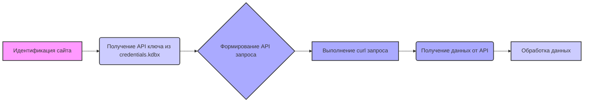

## Анализ документации по работе с PrestaShop API

### 1. <алгоритм>

Данный документ описывает процесс работы с API PrestaShop, включая хранение ключей и примеры запросов. Вот пошаговый алгоритм:

1.  **Идентификация сайтов:**
    *   Список сайтов на PrestaShop (e-cat.co.il, emil-design.com, sergey.mymaster.co.il) для которых будет использоваться API.
    *   _Пример_: Пользователь хочет получить информацию о товарах на сайте e-cat.co.il.
2.  **Доступ к ключам API:**
    *   Ключи API хранятся в защищенной базе данных `credentials.kdbx`.
    *   Использование менеджера паролей (KeePass/KeePassXC) для доступа к `credentials.kdbx`.
    *   _Пример_: Пользователь открывает KeePassXC и получает ключ API для e-cat.co.il.
3.  **Формирование API запроса:**
    *   Общий шаблон запроса: `curl -X GET 'https://<URL_сайта>/api/<endpoint>' -H 'Authorization: Basic <base64(API_KEY)>'`.
    *   `<URL_сайта>`: Заменяется на адрес нужного сайта (например, `e-cat.co.il`).
    *   `<endpoint>`: Заменяется на нужную конечную точку API (например, `products`).
    *   `<API_KEY>`: Ключ API кодируется в Base64.
    *    _Пример_: Для получения списка товаров, endpoint будет `products`.
4.  **Выполнение запроса:**
    *   Выполняется команда `curl` с сформированными параметрами.
    *   _Пример_: `curl -X GET 'https://e-cat.co.il/api/products' -H 'Authorization: Basic <base64(ключ_API)>'`.
5.  **Получение данных:**
    *   API возвращает данные (например, в формате JSON).
    *    _Пример_: API возвращает JSON-массив с информацией о товарах.
6.  **Обработка данных:**
    *   Полученные данные анализируются и используются.
    *    _Пример_: Пользователь анализирует полученный список товаров для обновления информации на своем сайте.

### 2. <mermaid>

**Объяснение диаграммы `mermaid`:**

*   **Идентификация сайта** - начало процесса, где пользователь определяет, с каким сайтом PrestaShop необходимо взаимодействовать.
*   **Получение API ключа из credentials.kdbx** - этап, где из защищенного хранилища паролей извлекается API ключ, необходимый для авторизации запросов.
*   **Формирование API запроса** -  шаг, на котором формируется HTTP-запрос с URL, endpoint и авторизационными данными.
*   **Выполнение curl запроса** -  этап, где  запрос отправляется на сервер PrestaShop.
*   **Получение данных от API** - шаг, на котором  получается ответ от сервера, содержащий запрошенные данные.
*   **Обработка данных** - завершающий этап, на котором  полученные данные используются для дальнейшей обработки.

### 3. <объяснение>

**Общее назначение:**

Документ предоставляет инструкции по использованию API PrestaShop для управления сайтами. Он охватывает процесс получения ключей, формирования запросов и меры безопасности.

**Импорты:**

В представленном тексте нет явных импортов, так как это документация, а не код. Однако, можно отметить, что для выполнения API-запросов используется утилита `curl`, которая является стандартной для большинства операционных систем.

**Классы:**

Документ не содержит определений классов, поскольку является инструкцией по работе с API, а не кодом.

**Функции:**

Документ не содержит определений функций. Однако он фактически описывает использование функции `curl` для выполнения HTTP-запросов.
  *   `curl -X GET 'https://<URL_сайта>/api/<endpoint>' -H 'Authorization: Basic <base64(API_KEY)>'`: Это функция command line, для выполнения http GET запроса.

    *   **Аргументы**:
        *   `-X GET`: Метод запроса (GET).
        *   `https://<URL_сайта>/api/<endpoint>`: URL запроса, состоящий из адреса сайта и конечной точки API.
        *   `-H 'Authorization: Basic <base64(API_KEY)>'`: Заголовок авторизации, где API-ключ закодирован в Base64.
    *   **Возвращаемое значение**: Ответ от API (например, JSON-данные).

**Переменные:**

В документе используются следующие переменные (в контексте API-запроса):
*   `<URL_сайта>`: Строка, представляющая URL сайта PrestaShop (например, `e-cat.co.il`).
*   `<endpoint>`: Строка, представляющая конечную точку API (например, `products`, `customers`).
*   `<API_KEY>`: Строка, представляющая API-ключ для доступа к сайту.
*   `credentials.kdbx`: Путь к защищенной базе данных.

**Потенциальные ошибки и области для улучшения:**

1.  **Безопасность:**
    *   Необходимо четкое указание, что файл `credentials.kdbx` должен храниться в защищенном месте и не передаваться третьим лицам. (отмечено)
    *   Регулярное обновление ключей и паролей также важно, но необходимо более детальное объяснение, как это следует делать. (отмечено)
2.  **Обработка ошибок:**
    *   Не описано, как обрабатывать ошибки, возникающие при API-запросах (например, ошибки авторизации, неверные конечные точки). Следует добавить информацию о кодах ошибок API PrestaShop и возможных способах их обработки.
3.  **Использование переменных:**
    *   Необходимо подробнее объяснить, как правильно подставлять переменные в URL и параметры API запроса, особенно если используются данные из `credentials.kdbx`.
4.  **Документация API:**
    *   Хотя документ ссылается на официальную документацию PrestaShop API, было бы полезно предоставить более конкретные примеры использования различных конечных точек и их параметров.

**Взаимосвязь с другими частями проекта:**

Этот документ является частью структуры проекта по взаимодействию с PrestaShop API. Он предполагает, что существуют другие части проекта, которые будут использовать информацию из этого документа для выполнения API-запросов (например, скрипты для автоматизации задач). Взаимодействует с  утилитами `curl` и менеджером паролей `KeePass`/`KeePassXC`

В целом, документ предоставляет хорошую основу для работы с PrestaShop API, но нуждается в дополнениях для улучшения безопасности, обработки ошибок и ясности инструкций.