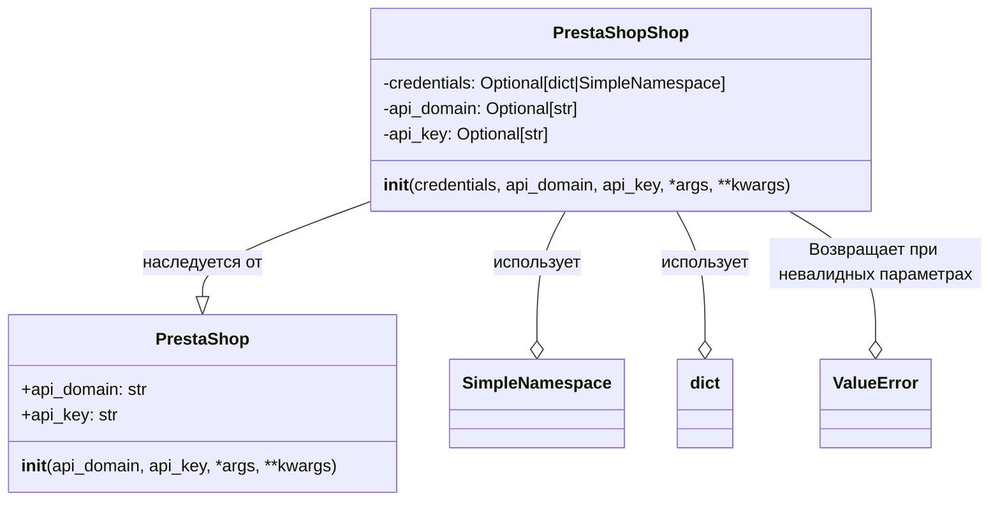

## Анализ кода `hypotez/src/endpoints/prestashop/shop.py`

### <алгоритм>
1. **Инициализация:**
   - Класс `PrestaShopShop` наследуется от класса `PrestaShop`.
   - Конструктор `__init__` принимает:
     - `credentials`: Словарь или `SimpleNamespace`, содержащий `api_domain` и `api_key`, или `None`.
     - `api_domain`: Домен API PrestaShop (опционально).
     - `api_key`: Ключ API PrestaShop (опционально).
     - `*args`, `**kwargs`: дополнительные параметры.
   - Если `credentials` предоставлены, то значения `api_domain` и `api_key` берутся из него, если они там есть, иначе остаются переданные значения.

2. **Проверка параметров:**
   - Проверяется, что `api_domain` и `api_key` оба не `None` и не пустые.
   - Если одно из них отсутствует, возбуждается исключение `ValueError`.

3. **Инициализация родительского класса:**
   - Вызывается конструктор родительского класса `PrestaShop` с полученными `api_domain`, `api_key` и дополнительными параметрами.

**Примеры:**

- **Пример 1 (с `credentials`):**
  ```python
  credentials = {'api_domain': 'https://example.com', 'api_key': 'test_key'}
  shop = PrestaShopShop(credentials=credentials)
  # shop.api_domain будет 'https://example.com'
  # shop.api_key будет 'test_key'
  ```

- **Пример 2 (без `credentials`, с параметрами):**
  ```python
  shop = PrestaShopShop(api_domain='https://example.com', api_key='test_key')
  # shop.api_domain будет 'https://example.com'
  # shop.api_key будет 'test_key'
  ```

- **Пример 3 (недостаточно параметров):**
  ```python
  try:
    shop = PrestaShopShop(api_domain='https://example.com') # KeyError
  except ValueError as e:
      print(e)  # Выведет "Необходимы оба параметра: api_domain и api_key."
  ```

### <mermaid>



**Описание диаграммы:**

-   **`PrestaShopShop`**: Класс для работы с магазинами PrestaShop. Содержит атрибуты `credentials`, `api_domain` и `api_key`.
    Метод `__init__` обрабатывает параметры инициализации, включая credentials, api_domain, api_key. Использует `SimpleNamespace` или `dict` для хранения credentials.
-   **`PrestaShop`**: Базовый класс для работы с API PrestaShop. Имеет атрибуты `api_domain` и `api_key`.
    Метод `__init__` инициализирует основные параметры API. Является родительским классом для `PrestaShopShop`,  реализует общую логику подключения к API.
- **`SimpleNamespace`**: Простой класс для хранения атрибутов, используется как альтернатива `dict` для `credentials`.
- **`dict`**: Стандартный словарь Python, используется для хранения credentials.
- **`ValueError`**: Стандартное исключение Python, которое возбуждается при отсутствии необходимых параметров.

**Зависимости:**

-   `PrestaShopShop` наследует от `PrestaShop`, что указывает на отношение "is a". `PrestaShopShop` специализирует `PrestaShop`.
-   `PrestaShopShop` использует `SimpleNamespace` и `dict` для хранения параметров аутентификации.
-   `PrestaShopShop` может вызывать исключение `ValueError`, если входные параметры не корректны.

### <объяснение>

**Импорты:**

-   `types.SimpleNamespace`: Используется для создания объектов с атрибутами, доступными через точку, что может быть удобным для представления конфигурации.
-   `typing.Optional`: Используется для аннотации типов, указывая, что переменная может быть либо определенного типа, либо `None`.
-   `header`: Скорее всего, это модуль, предоставляющий общие функции или константы для проекта (не видно содержимого).
-    `src.gs`: Вероятно, это модуль для глобальных настроек или сервисов (не видно содержимого).
-    `src.logger.logger`: Модуль для логирования, вероятно, используется для записи событий и ошибок.
-   `src.utils.jjson.j_loads`:  Функция для загрузки JSON данных из строки, вероятно используется для обработки ответов от API.
-   `.api.PrestaShop`: Импортирует класс `PrestaShop`, используемый как базовый класс.
-   `src.logger.exceptions.PrestaShopException`: Модуль для специфических исключений PrestaShop (не видно содержимого).
-   `pathlib.Path`:  Используется для работы с путями файловой системы (здесь не используется, возможно, остался от предыдущей итерации кода).
-   `attr.attr`, `attr.attrs`: Библиотека `attrs` для определения классов с атрибутами (здесь не используется, возможно, остался от предыдущей итерации кода).
-   `sys`: Модуль для доступа к некоторым системным параметрам (здесь не используется, возможно, остался от предыдущей итерации кода).
-   `os`: Модуль для работы с операционной системой (здесь не используется, возможно, остался от предыдущей итерации кода).

**Классы:**

-   **`PrestaShopShop(PrestaShop)`**:
    -   **Роль**: Специализированный класс для работы с магазинами PrestaShop. Наследует функциональность базового класса `PrestaShop` и добавляет логику инициализации на основе переданных параметров.
    -   **Атрибуты**:
        - `credentials`: Хранит словарь или `SimpleNamespace` с учетными данными (`api_domain`, `api_key`). Может быть `None`.
        - `api_domain`:  Домен API PrestaShop.
        -  `api_key`: Ключ API PrestaShop.
    -   **Методы**:
        -   `__init__(self, credentials=None, api_domain=None, api_key=None, *args, **kwargs)`: Конструктор класса, инициализирует объект. Обрабатывает входные параметры, извлекает `api_domain` и `api_key` из `credentials` если необходимо и  вызывает конструктор родительского класса.

**Функции:**

-   `__init__`:
    -   **Аргументы**:
        -   `credentials`: `Optional[dict | SimpleNamespace]` -  Учетные данные для доступа к API.
        -   `api_domain`: `Optional[str]` - Домен API.
        -   `api_key`: `Optional[str]` - API ключ.
        -   `*args`, `**kwargs`: Дополнительные аргументы, которые передаются в конструктор родительского класса `PrestaShop`.
    -   **Возвращаемое значение**: `None`.
    -   **Назначение**: Инициализирует объект `PrestaShopShop`, проверяет валидность параметров, вызывает конструктор родительского класса.
        - Пример: `PrestaShopShop(api_domain='https://my-prestashop.com/api', api_key='my_api_key')`
        - Пример: `PrestaShopShop(credentials={'api_domain': 'https://my-prestashop.com/api', 'api_key': 'my_api_key'})`

**Переменные:**

-   `MODE = 'dev'`:  Глобальная переменная, вероятно, указывает на текущий режим работы (разработка).

**Потенциальные ошибки и улучшения:**

-   **Обработка `credentials`:** Код предполагает, что `credentials` могут быть либо словарем, либо `SimpleNamespace`. Стоит добавить проверку на соответствие типов, что бы избежать ошибок в рантайме.
-   **Обработка исключений:**  Возможно, стоит добавить более специфичную обработку исключений, таких как `KeyError`, которые могут возникать при обращении к ключам в словаре `credentials`.
-   **Логирование:**  Добавить логирование важных событий, таких как успешная инициализация и возникновение ошибок.
-   **Валидация входных данных**: Желательно добавить валидацию входных `api_domain` на наличие протокола `https` и т.д.

**Взаимосвязь с другими частями проекта:**

-   Зависит от модуля `.api.PrestaShop`, что указывает на архитектуру, где класс `PrestaShop` является абстракцией для работы с API, а `PrestaShopShop` - это конкретная реализация для магазинов.
-   Использует `src.logger.logger` для логирования, что является типичным для сервисов.
-   Использует `src.utils.jjson.j_loads`, подразумевая, что  обрабатываются JSON данные от API PrestaShop.

**Цепочка взаимосвязей:**

1.  `PrestaShopShop` -> `.api.PrestaShop` (наследование): `PrestaShopShop` использует функциональность базового класса `PrestaShop` для взаимодействия с API.
2.  `PrestaShopShop` -> `src.logger.logger` (использование): `PrestaShopShop` использует модуль логирования для записи событий.
3.  `PrestaShopShop` -> `src.utils.jjson.j_loads` (использование): `PrestaShopShop` использует функцию для обработки JSON данных от API.
4. `PrestaShopShop` -> `src.logger.exceptions.PrestaShopException` (использование): `PrestaShopShop` использует для выброса специфических исключений