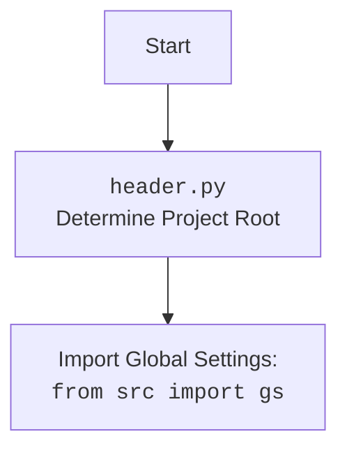

## <алгоритм>

1. **Инициализация:**
   - При создании экземпляра класса `PrestaShopShop` вызывается метод `__init__`.
   - Метод `__init__` принимает аргументы: `credentials` (словарь или SimpleNamespace), `api_domain` и `api_key` (опциональные).
   - Если `credentials` предоставлены, то `api_domain` и `api_key` берутся из `credentials`, иначе используются переданные напрямую значения.
   - Проверяется, что `api_domain` и `api_key` не пустые. Если хотя бы один из них пустой, выбрасывается исключение `ValueError`.
   - Вызывается конструктор родительского класса `PrestaShop` с переданными значениями `api_domain`, `api_key` и дополнительными аргументами `*args, **kwards`.

   **Пример:**
   ```python
   # Пример 1: Инициализация с credentials
   credentials = {'api_domain': 'example.com', 'api_key': 'test_key'}
   shop1 = PrestaShopShop(credentials=credentials) 

   # Пример 2: Инициализация с api_domain и api_key
   shop2 = PrestaShopShop(api_domain='example.net', api_key='another_key')

   # Пример 3: Инициализация без credentials, но с ошибкой
   try:
        shop3 = PrestaShopShop() # Вызовет ошибку ValueError 
   except ValueError as e:
       print(e) # Выведет: Необходимы оба параметра: api_domain и api_key.
   ```

## <mermaid>

```mermaid
flowchart TD
    Start[Начало: Инициализация PrestaShopShop] --> CheckCredentials{Проверерка credentials};
    CheckCredentials -- Есть credentials? --> UseCredentials{Использовать credentials};
    CheckCredentials -- Нет credentials --> UseArgs{Использовать api_domain и api_key из аргументов};
    UseCredentials --> GetApiDomainFromCredentials{Получить api_domain из credentials};
    UseCredentials --> GetApiKeyFromCredentials{Получить api_key из credentials};    
    GetApiDomainFromCredentials --> CheckApiDomainAndKey{Проверка api_domain и api_key на пустоту};
    GetApiKeyFromCredentials --> CheckApiDomainAndKey
    UseArgs --> CheckApiDomainAndKey
    CheckApiDomainAndKey -- api_domain или api_key пустые? --> Error[Вызвать ValueError];
    CheckApiDomainAndKey -- api_domain и api_key не пустые --> CallSuperInit{Вызов super().__init__()};
    CallSuperInit --> End[Конец: Инициализирован PrestaShopShop];
    Error --> End
```



**Объяснение зависимостей `mermaid`:**

*   `Start`: Начальная точка процесса инициализации класса `PrestaShopShop`.
*   `CheckCredentials`: Условный блок, проверяющий наличие переданного параметра `credentials`.
*   `UseCredentials`: Блок, активируемый при наличии `credentials`.
*   `UseArgs`: Блок, активируемый при отсутствии `credentials`.
*   `GetApiDomainFromCredentials`: Получение значения `api_domain` из словаря `credentials`.
*   `GetApiKeyFromCredentials`: Получение значения `api_key` из словаря `credentials`.
*    `CheckApiDomainAndKey`: Проверка на пустоту переменных `api_domain` и `api_key`.
*   `CallSuperInit`: Вызов конструктора родительского класса `PrestaShop` с полученными параметрами.
*   `Error`: Блок, вызывающий исключение `ValueError` если `api_domain` или `api_key` не были переданы.
*   `End`: Конечная точка процесса инициализации.

## <объяснение>

**Импорты:**

*   `from types import SimpleNamespace`: Импортируется класс `SimpleNamespace` для создания простых объектов с атрибутами.
*   `from typing import Optional`: Импортируется тип `Optional` для объявления переменных, которые могут быть None.
*   `import header`: Импортируется модуль `header.py`.
*   `from src import gs`: Импортируется модуль `gs` из пакета `src`, который содержит глобальные настройки проекта.
*    `from src.logger.logger import logger`: Импортируется объект `logger` для логирования событий, скорее всего для отладки.
*   `from src.utils.jjson import j_loads`: Импортируется функция `j_loads` для работы с JSON.
*   `from .api import PrestaShop`: Импортируется класс `PrestaShop` из модуля `api`, предположительно для взаимодействия с API PrestaShop.
*    `from src.logger.exceptions import PrestaShopException`: Импортируется `PrestaShopException` для обработки ошибок, связанных с PrestaShop.
*   `from pathlib import Path`: Импортируется класс `Path` для работы с путями в файловой системе.
*   `from attr import attr, attrs`: Импортируются функции `attr` и `attrs` из библиотеки `attr`, скорее всего для упрощения определения классов.
*   `import sys`: Импортируется модуль `sys` для доступа к параметрам среды выполнения.
*   `import os`: Импортируется модуль `os` для взаимодействия с операционной системой.

**Классы:**

*   `PrestaShopShop(PrestaShop)`:
    *   **Роль:** Класс `PrestaShopShop` наследуется от класса `PrestaShop` и предназначен для работы с конкретным магазином PrestaShop.
    *   **Атрибуты:** Не имеет объявленных атрибутов, помимо унаследованных от `PrestaShop`.
    *   **Методы:**
        *   `__init__(self, credentials: Optional[dict | SimpleNamespace] = None, api_domain: Optional[str] = None, api_key: Optional[str] = None, *args, **kwards)`: Конструктор класса.
            *   **Аргументы:**
                *   `credentials`: Словарь или `SimpleNamespace` с настройками `api_domain` и `api_key`.
                *   `api_domain`: Домен API PrestaShop.
                *   `api_key`: Ключ API PrestaShop.
                *   `*args`: Произвольные позиционные аргументы.
                *   `**kwards`: Произвольные именованные аргументы.
            *   **Возвращаемое значение:** None.
            *   **Назначение:** Инициализирует экземпляр класса `PrestaShopShop`, получая данные для доступа к API PrestaShop либо из `credentials`, либо из отдельных `api_domain` и `api_key`.

**Переменные:**

*   ``: Глобальная переменная, определяющая режим работы приложения. В данном случае, установлена в значение 'dev'.

**Потенциальные ошибки и области для улучшения:**

*   Не хватает обработки исключений при обращении к `credentials.get()`. Может быть ошибка, если в `credentials` не будет полей `api_domain` или `api_key`.
*   Стоит добавить валидацию форматов `api_domain` и `api_key` для обеспечения корректности данных.
*   Было бы полезно добавить документацию в виде docstring для `PrestaShopShop`.

**Взаимосвязь с другими частями проекта:**

*   `header.py` устанавливает корневой каталог проекта для правильной работы импортов.
*   `src.gs` содержит глобальные настройки проекта, такие как путь к БД, что позволяет конфигурировать различные части приложения.
*   `src.logger.logger` используется для логирования действий, что полезно при отладке и мониторинге работы системы.
*   `src.utils.jjson` отвечает за работу с json, что может быть использовано для обмена данными с API.
*   `.api.PrestaShop` - базовый класс для работы с PrestaShop API, от которого наследуется класс `PrestaShopShop`, что демонстрирует использование парадигмы ООП.
*   `src.logger.exceptions.PrestaShopException` используется для обработки ошибок, специфичных для PrestaShop.

Данный класс `PrestaShopShop` является точкой входа для работы с конкретным магазином PrestaShop. Он инициализируется с необходимыми ключами и далее может использовать методы родительского класса `PrestaShop` для взаимодействия с API.