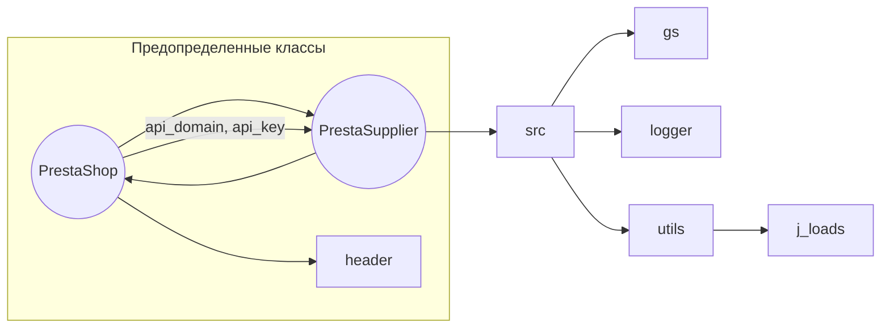

```MD
# Анализ кода файла `hypotez/src/endpoints/prestashop/supplier.py`

## <input code>

```python
## \file hypotez/src/endpoints/prestashop/supplier.py
# -*- coding: utf-8 -*-\
#! venv/Scripts/python.exe
#! venv/bin/python/python3.12

"""
.. module: src.endpoints.prestashop 
	:platform: Windows, Unix
	:synopsis:

"""
MODE = 'dev'

from types import SimpleNamespace
from typing import Optional
import header
from src import gs
from src.logger import logger
from src.utils import j_loads as j_loads
from .api import PrestaShop


class PrestaSupplier(PrestaShop):
    """Класс для работы с поставщиками PrestaShop."""

    def __init__(self, 
                 credentials: Optional[dict | SimpleNamespace] = None, 
                 api_domain: Optional[str] = None, 
                 api_key: Optional[str] = None, 
                 *args, **kwards):
        """Инициализация поставщика PrestaShop.

        Args:
            credentials (Optional[dict | SimpleNamespace], optional): Словарь или объект SimpleNamespace с параметрами `api_domain` и `api_key`. Defaults to None.
            api_domain (Optional[str], optional): Домен API. Defaults to None.
            api_key (Optional[str], optional): Ключ API. Defaults to None.
        """

        if credentials is not None:
            api_domain = credentials.get('api_domain', api_domain)
            api_key = credentials.get('api_key', api_key)

        if not api_domain or not api_key:
            raise ValueError('Необходимы оба параметра: api_domain и api_key.')

        super().__init__(api_domain, api_key, *args, **kwards)

```

## <algorithm>

Блок-схема алгоритма:

```mermaid
graph TD
    A[Вход в __init__()] --> B{credentials = None?};
    B -- Да --> C[api_domain = None, api_key = None];
    B -- Нет --> D{credentials.get('api_domain')};
    D -- Да --> E[api_domain = credentials.get('api_domain')];
    D -- Нет --> F[api_domain = api_domain];
    E --> G{credentials.get('api_key')};
    G -- Да --> H[api_key = credentials.get('api_key')];
    G -- Нет --> I[api_key = api_key];
    H --> J[Проверка api_domain и api_key];
    I --> J;
    J -- Не null оба --> K[super().__init__(api_domain, api_key)];
    J -- Иначе --> L[ValueError];
    K --> M[Выход];
    L --> M;
```

Пример использования:

```python
credentials = {'api_domain': 'example.com', 'api_key': 'abcdef'}
supplier = PrestaSupplier(credentials=credentials) 
```

## <mermaid>



## <explanation>

**Импорты:**

- `from types import SimpleNamespace`: Импортирует класс `SimpleNamespace` для создания объектов, хранящих атрибуты. Используется для удобного хранения параметров.
- `from typing import Optional`: Импортирует тип `Optional`, позволяющий указывать, что переменная может иметь значение None.
- `import header`: Импортирует, вероятно, модуль с настройками или константами.  Необходимость и содержимое этого модуля должны быть уточнены, исходя из контекста всего проекта.
- `from src import gs`: Импортирует модуль `gs`, вероятно, связанный с Google Sheets (или другим хранилищем данных).
- `from src.logger import logger`: Импортирует логгер, позволяющий вести записи в лог-файл. 
- `from src.utils import j_loads as j_loads`: Импортирует функцию `j_loads`, вероятно, для обработки JSON-строк.
- `from .api import PrestaShop`: Импортирует класс `PrestaShop`, вероятно, представляющий базовый класс для работы с API PrestaShop. Используется импорт из текущей подпапки `api`.


**Классы:**

- `PrestaSupplier(PrestaShop)`: Наследуется от класса `PrestaShop`, расширяя его функционал для работы с поставщиками PrestaShop.
    - `__init__(self, credentials=None, api_domain=None, api_key=None, *args, **kwards)`: Конструктор класса.
        - Принимает необязательные аргументы `credentials`, `api_domain`, `api_key`.  `credentials` позволяет задать параметры в виде словаря или объекта `SimpleNamespace`.
        - Если `credentials` предоставлен, то значения `api_domain` и `api_key` из него берутся по умолчанию.
        -  Требует наличия как `api_domain`, так и `api_key`, иначе генерируется исключение `ValueError`.
        - Вызывает конструктор базового класса `PrestaShop`, передавая значения `api_domain` и `api_key`.

**Функции:**

Нет функций в данном фрагменте кода.

**Переменные:**

- `MODE = 'dev'`: Переменная, хранящая строковое значение, скорее всего, режим работы приложения (например, 'dev' или 'prod').
- `credentials`:  Переменная, принимающая словарь или объект `SimpleNamespace`, используемый для передачи данных.

**Возможные ошибки и улучшения:**

- Отсутствие обработки ошибок при работе с `credentials`. Если `credentials` не словарь и не `SimpleNamespace`, то код может сломаться.
- Неясно, как и где обрабатываются возможные исключения при взаимодействии с API PrestaShop,  в `PrestaShop`. 
- Проверка типов аргументов в `__init__` может быть улучшена.

**Взаимосвязь с другими частями проекта:**

Код использует классы и функции из других модулей (`src`, `src.logger`, `src.utils`, `.api`). Это указывает на модульную структуру проекта, где различные компоненты работают вместе.  Необходимые детали (например, какие именно методы используются в `PrestaShop`) могут быть найдены в файлах `src/endpoints/prestashop/api.py`.