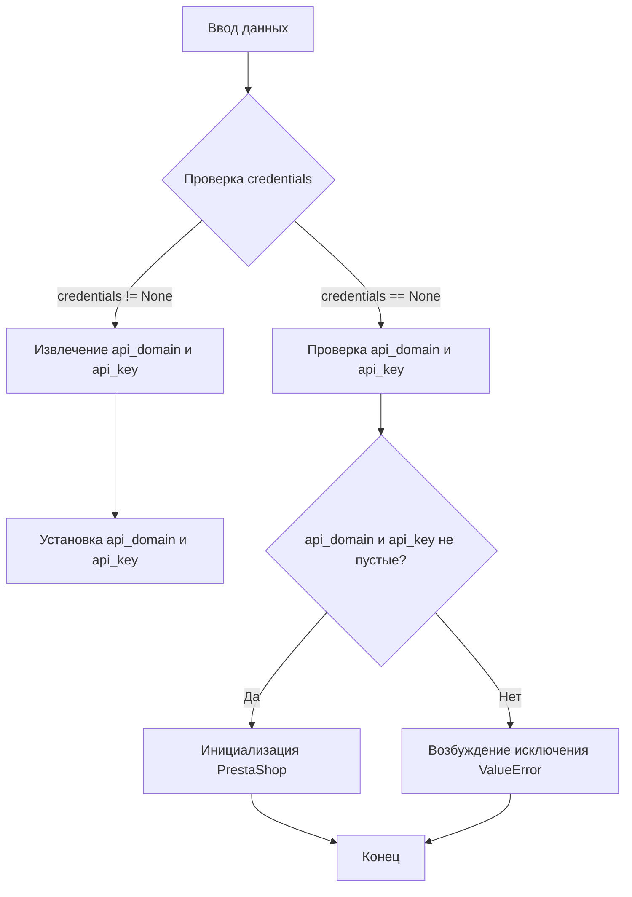
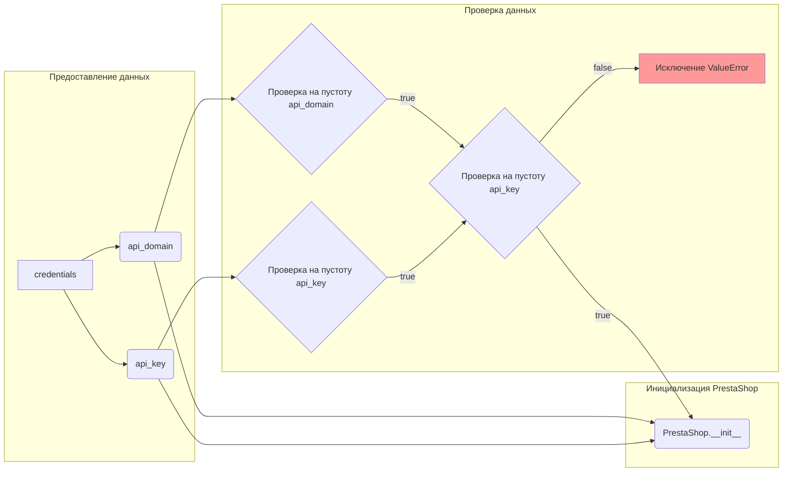

```MD
# Анализ кода файла hypotez/src/endpoints/prestashop/supplier.py

## <input code>

```python
## \file hypotez/src/endpoints/prestashop/supplier.py
# -*- coding: utf-8 -*-\
#! venv/Scripts/python.exe
#! venv/bin/python/python3.12

"""
.. module: src.endpoints.prestashop 
	:platform: Windows, Unix
	:synopsis:

"""
MODE = 'dev'

from types import SimpleNamespace
from typing import Optional
import header
from src import gs
from src.logger import logger
from src.utils.jjson import j_loads_ns
from .api import PrestaShop


class PrestaSupplier(PrestaShop):
    """Класс для работы с поставщиками PrestaShop."""

    def __init__(self, 
                 credentials: Optional[dict | SimpleNamespace] = None, 
                 api_domain: Optional[str] = None, 
                 api_key: Optional[str] = None, 
                 *args, **kwards):
        """Инициализация поставщика PrestaShop.

        Args:
            credentials (Optional[dict | SimpleNamespace], optional): Словарь или объект SimpleNamespace с параметрами `api_domain` и `api_key`. Defaults to None.
            api_domain (Optional[str], optional): Домен API. Defaults to None.
            api_key (Optional[str], optional): Ключ API. Defaults to None.
        """

        if credentials is not None:
            api_domain = credentials.get('api_domain', api_domain)
            api_key = credentials.get('api_key', api_key)

        if not api_domain or not api_key:
            raise ValueError('Необходимы оба параметра: api_domain и api_key.')

        super().__init__(api_domain, api_key, *args, **kwards)

```

## <algorithm>

Блок-схема алгоритма:



**Пример:**

Если `credentials` содержит `api_domain` и `api_key`, то они используются для инициализации. Если `credentials` отсутствует, то `api_domain` и `api_key` передаются напрямую. Если хотя бы один из них не задан, то генерируется ошибка.


## <mermaid>



Зависимости:

* `src.endpoints.prestashop.api`: Класс `PrestaShop` для работы с API.  
* `src`: Вероятно, корневая папка проекта.
* `src.logger`: Модуль для логгирования.
* `src.utils.jjson`: Модуль для обработки JSON.
* `header`: Модуль, вероятно, содержащий общие настройки или функции для проекта.
* `types`: Стандартный модуль Python для работы с типами данных.
* `typing`: Стандартный модуль Python для работы с типами данных.


## <explanation>

**Импорты:**

* `header`:  Неизвестно назначение, но, вероятно, содержит конфигурацию или общие функции.  Связь с `src` неясна без дополнительных деталей.
* `src.gs`:  Неизвестно назначение.  Связь с `src` очевидна. Вероятно, содержит вспомогательные функции или классы.
* `src.logger`:  Логгирование - важнейший элемент для отладки.  
* `src.utils.jjson`: Обработка JSON.
* `types` и `typing`:  Стандартные библиотеки Python, необходимые для работы с типами данных (в частности, `SimpleNamespace`).
* `.api`: Импортирует класс `PrestaShop` из модуля `api` в текущем каталоге.


**Классы:**

* `PrestaSupplier`: Наследуется от `PrestaShop`.  Предназначен для работы с поставщиками PrestaShop.
* `PrestaShop`: Предполагаемый базовый класс для работы с API PrestaShop.  Не показан, поэтому невозможно оценить его атрибуты и методы.

**Функции:**

* `__init__`: Конструктор класса `PrestaSupplier`.  Принимает опциональные параметры для настройки API: `credentials`, `api_domain`, `api_key` и т.д.  
  * Важно: Задаёт значения по умолчанию для атрибутов.
  * Важно: Проверяет наличие обязательных параметров `api_domain` и `api_key`.


**Переменные:**

* `MODE`:  Переменная глобального уровня, вероятно, задаёт режим работы приложения ('dev').
* `credentials`:  Может содержать данные для доступа к API, заданные через словарь или `SimpleNamespace`.
* `api_domain`, `api_key`:  Ключевые параметры для доступа к API PrestaShop.


**Возможные ошибки или улучшения:**

* **Проверка типов:** Дополнительная проверка типов аргументов `credentials` (например, `isinstance(credentials, (dict, SimpleNamespace))`) сделала бы код более надежным.
* **Документация:** Добавьте подробную документацию для методов и функций, включая описания типов аргументов и возвращаемых значений, и примеры использования.
* **Обработка исключений:** Обработайте исключения, которые могут возникнуть при обращении к внешним ресурсам (API PrestaShop).
* **Тестирование:**  Добавить тесты для проверки корректной работы класса.


**Цепочка взаимосвязей:**

`PrestaSupplier` использует `PrestaShop`, который, в свою очередь, вероятно, взаимодействует с API Престашоп. Проект, скорее всего, имеет модули для работы с базами данных или другими внешними системами.  Без доступа к полному коду сложно определить полную цепочку.