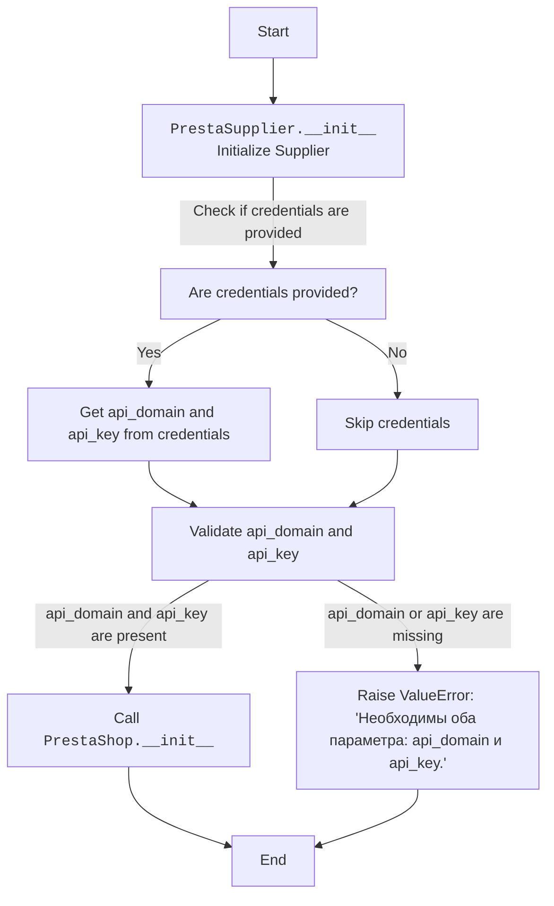
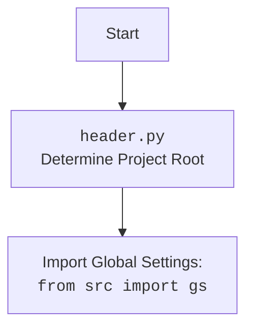

## <алгоритм>
1. **Инициализация:**
   - При создании объекта `PrestaSupplier` вызывается метод `__init__`.
   - Метод принимает необязательные аргументы: `credentials` (словарь или SimpleNamespace), `api_domain` (строка) и `api_key` (строка).
   - Если `credentials` переданы, то извлекаются значения `api_domain` и `api_key` из этого словаря или объекта `SimpleNamespace`, если они там есть.
   - Проверяется, что `api_domain` и `api_key` определены. Если нет, то выбрасывается исключение `ValueError`.
   - Вызывается конструктор родительского класса `PrestaShop` с полученными значениями `api_domain` и `api_key`, а также любыми дополнительными аргументами `*args` и `**kwards`.
   - **Пример:**
     ```python
     # Пример 1: Инициализация с передачей credentials
     credentials_data = {'api_domain': 'example.com', 'api_key': 'test_key'}
     supplier1 = PrestaSupplier(credentials=credentials_data) 
     # api_domain будет example.com, api_key будет test_key

     # Пример 2: Инициализация с передачей api_domain и api_key явно
     supplier2 = PrestaSupplier(api_domain='another.com', api_key='another_key')
     # api_domain будет another.com, api_key будет another_key

     # Пример 3: Инициализация без credentials, но с api_domain и api_key
     supplier3 = PrestaSupplier(api_domain='test.com', api_key='test_api')
     # api_domain будет test.com, api_key будет test_api

     # Пример 4: Инициализация без необходимых параметров вызовет исключение ValueError
     try:
         supplier4 = PrestaSupplier()
     except ValueError as e:
        print(e)  # Выведет: "Необходимы оба параметра: api_domain и api_key."
     ```

## <mermaid>



## <объяснение>
### Импорты:
- `from types import SimpleNamespace`: Импортирует класс `SimpleNamespace`, который используется для создания объектов с атрибутами, доступными через точку. Позволяет работать со словареподобными объектами, обращаясь к элементам как к атрибутам.
- `from typing import Optional`: Импортирует тип `Optional`, который используется для указания, что переменная может быть либо указанного типа, либо `None`.
- `import header`: Импортирует модуль `header`, который, вероятно, содержит общие настройки проекта. Этот импорт используется для определения корневой директории проекта.
- `from src import gs`: Импортирует глобальные настройки проекта из модуля `gs` в директории `src`.
- `from src.logger.logger import logger`: Импортирует объект `logger` из модуля `logger` в директории `src.logger` для логирования событий.
- `from src.utils.jjson import j_loads_ns`: Импортирует функцию `j_loads_ns` из модуля `jjson` в директории `src.utils`, которая, вероятно, используется для загрузки JSON данных в объект `SimpleNamespace`.
- `from .api import PrestaShop`: Импортирует класс `PrestaShop` из модуля `api`, находящегося в той же директории, что и текущий файл (`src/endpoints/prestashop`). Этот класс, вероятно, является базовым классом для взаимодействия с API PrestaShop.

### Классы:
- `class PrestaSupplier(PrestaShop)`:
   -   Определяет класс `PrestaSupplier`, который наследует функциональность от класса `PrestaShop`. Это указывает на то, что `PrestaSupplier` будет использовать API PrestaShop.
    -   **`__init__`**:
        -   `credentials` (Optional[dict | SimpleNamespace]): Необязательный параметр, представляющий собой словарь или объект `SimpleNamespace`, содержащий параметры `api_domain` и `api_key`.
        -   `api_domain` (Optional[str]): Необязательный параметр, представляющий домен API PrestaShop.
        -   `api_key` (Optional[str]): Необязательный параметр, представляющий ключ API PrestaShop.
        -   Функциональность:
            -   Если `credentials` предоставлены, он извлекает значения `api_domain` и `api_key` из объекта `credentials`, если они там есть, перезаписывая ранее переданные значения.
            -   Проверяет, что оба параметра `api_domain` и `api_key` были предоставлены (либо напрямую, либо через `credentials`). Если какого-либо из параметров нет, то вызывает исключение `ValueError`.
            -   Вызывает конструктор родительского класса `PrestaShop` (super().__init__(api_domain, api_key, *args, **kwards)), передавая ему необходимые параметры.

### Функции:
- `__init__(self, credentials: Optional[dict | SimpleNamespace] = None, api_domain: Optional[str] = None, api_key: Optional[str] = None, *args, **kwards)`:
   -   Это конструктор класса `PrestaSupplier`, который инициализирует объект класса.

### Переменные:
- ``: Глобальная переменная `MODE`, установленная в `dev`. Предположительно, указывает на режим разработки.
- `credentials`: Локальная переменная в методе `__init__`, которая хранит данные для аутентификации.
- `api_domain`: Локальная переменная в методе `__init__`, которая хранит домен API.
- `api_key`: Локальная переменная в методе `__init__`, которая хранит ключ API.

### Потенциальные ошибки и области для улучшения:
- **Обработка ошибок**: Хотя есть проверка на наличие `api_domain` и `api_key`, можно добавить дополнительные проверки для валидации форматов этих параметров (например, проверка, что `api_domain` является корректным URL).
- **Логирование**:  Можно добавить логирование для отслеживания хода работы метода `__init__`, особенно при возникновении исключений. Это помогло бы в отладке и выявлении проблем.
- **Расширение функциональности:**  В дальнейшем можно расширить этот класс методами для выполнения конкретных действий с поставщиками PrestaShop, используя методы из класса `PrestaShop`.

### Взаимосвязи с другими частями проекта:
-  Этот класс `PrestaSupplier` является частью модуля `prestashop`, который является частью пакета `endpoints`. 
-   Он использует глобальные настройки из `src.gs` и логгер из `src.logger`.
-   Зависит от `PrestaShop`, который, как предполагается, является частью этого же модуля, но в файле `api.py`.
-   `header` импортируется для определения корня проекта и, скорее всего, для доступа к общим настройкам.

Этот код является базовым для работы с поставщиками через API PrestaShop. Он устанавливает соединение с API, используя предоставленные учетные данные, и может быть расширен методами для выполнения конкретных действий с поставщиками.