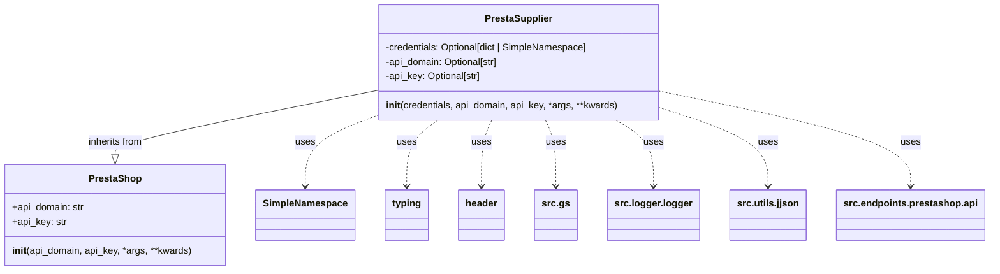

## Анализ кода `hypotez/src/endpoints/prestashop/supplier.py`

### <алгоритм>
1. **Инициализация класса `PrestaSupplier`**:
   - При создании объекта `PrestaSupplier` вызывается метод `__init__`.
   - Метод принимает аргументы: `credentials` (словарь или `SimpleNamespace`, содержащий `api_domain` и `api_key`), `api_domain`, `api_key` и произвольные `*args`, `**kwards`.
   - Если `credentials` предоставлены, он пытается извлечь `api_domain` и `api_key` из этого объекта. Если `credentials` не предоставлен, используется значение по умолчанию для `api_domain` и `api_key`
   - Проверяется, установлены ли `api_domain` и `api_key`. Если хотя бы один из них не установлен, выбрасывается `ValueError` с сообщением об ошибке.
   - Вызывается конструктор родительского класса `PrestaShop` с полученными `api_domain` и `api_key`, и все дополнительные аргументы `*args`, `**kwards`.

**Пример:**
   -   Пример 1: `supplier = PrestaSupplier(credentials={'api_domain': 'example.com', 'api_key': 'secret'})` - Инициализация с помощью словаря
   -   Пример 2: `supplier = PrestaSupplier(api_domain='example.com', api_key='secret')` - Инициализация с передачей параметров напрямую
   -   Пример 3: `supplier = PrestaSupplier(credentials=SimpleNamespace(api_domain='example.com', api_key='secret'))` - Инициализация с использованием `SimpleNamespace`
   -   Пример 4: `supplier = PrestaSupplier()` - Выбросит ошибку, так как не передан ни credentials, ни api_domain с api_key

### <mermaid>

**Объяснение зависимостей:**
-   `PrestaSupplier` наследуется от `PrestaShop`, указывая на то, что он расширяет или специализирует функциональность `PrestaShop` для работы с поставщиками.
-   `PrestaSupplier` использует `SimpleNamespace` из модуля `types`, для возможности передачи аргумента `credentials` в виде объекта
-   `PrestaSupplier` использует `Optional` из модуля `typing` для аннотации типов аргументов, указывая, что аргументы могут быть или не быть переданы
-   `PrestaSupplier` использует `header` (скорее всего, модуль для работы с заголовками), `src.gs`, `src.logger.logger` и `src.utils.jjson` - это модули, расположенные внутри проекта.
    -   `src.gs`, вероятно, содержит глобальные настройки или общие сервисы.
    -   `src.logger.logger`  - обеспечивает функциональность логирования
    -   `src.utils.jjson` - предоставляет функции для работы с JSON.
-   `PrestaSupplier` использует `PrestaShop` из `.api`, что указывает на использование класса для работы с API PrestaShop.

### <объяснение>

**Импорты:**
   -   `from types import SimpleNamespace`: Импортирует `SimpleNamespace` для удобного создания объектов с атрибутами, когда не требуется создавать полноценный класс.
   -   `from typing import Optional`: Импортирует `Optional` для указания, что переменная может иметь значение или быть `None`.
   -   `import header`: Импортирует модуль `header`, который, вероятно, содержит функциональность для работы с заголовками HTTP.
   -   `from src import gs`: Импортирует `gs` из пакета `src`, возможно, содержащий общие настройки или глобальные переменные.
   -   `from src.logger.logger import logger`: Импортирует `logger` из модуля `src.logger.logger` для логирования событий.
   -   `from src.utils.jjson import j_loads_ns`: Импортирует функцию `j_loads_ns` из `src.utils.jjson`, вероятно, для загрузки JSON в объект `SimpleNamespace`.
   -   `from .api import PrestaShop`: Импортирует `PrestaShop` из модуля `api` внутри текущего пакета (`src.endpoints.prestashop`), что указывает на использование общего API-клиента PrestaShop.

**Класс `PrestaSupplier`:**
   -   **Роль**: Класс предназначен для работы с поставщиками PrestaShop. Он наследуется от `PrestaShop`, расширяя его функциональность.
   -   **Атрибуты**:
      -   `credentials`: `Optional[dict | SimpleNamespace]` - Словарь или `SimpleNamespace` с параметрами `api_domain` и `api_key`.
      -   `api_domain`: `Optional[str]` - Домен API.
      -   `api_key`: `Optional[str]` - Ключ API.
   -   **Методы**:
      -   `__init__(self, credentials: Optional[dict | SimpleNamespace] = None, api_domain: Optional[str] = None, api_key: Optional[str] = None, *args, **kwards)`: Конструктор класса, инициализирует атрибуты объекта, проверяет наличие `api_domain` и `api_key`. Если они не переданы через `credentials` или как отдельные аргументы,  выбрасывает исключение `ValueError`. Вызывает конструктор родительского класса `PrestaShop` для инициализации базовой части API-клиента.

**Переменные:**
   -   `MODE`: Глобальная переменная, установленная в значение `dev`, вероятно, для определения режима работы (разработка, продакшн и т.д.).
   -   `credentials`: Параметр метода `__init__`, принимающий словарь или объект SimpleNamespace, содержащий домен API и ключ API, или None
   -   `api_domain`: Параметр метода `__init__`, принимающий строку, содержащую домен API, или None.
   -   `api_key`: Параметр метода `__init__`, принимающий строку, содержащую API ключ, или None

**Потенциальные ошибки и области для улучшения:**
   -   **Обработка ошибок**:  В коде есть только проверка на наличие `api_domain` и `api_key`. Возможно, стоит добавить дополнительные проверки, например, на тип аргументов или на формат `api_key`.
   -   **Логирование**: Было бы полезно добавить логирование в метод `__init__` для отслеживания процесса инициализации и возможных ошибок.
   -   **Дополнительная валидация:** Добавить проверку на валидность `api_domain` (проверка домена)

**Взаимосвязи с другими частями проекта:**
   -   Использует `PrestaShop` из `src.endpoints.prestashop.api` в качестве базового класса, что означает, что `PrestaSupplier` является специфическим типом API-клиента для работы с поставщиками.
   -   Использует `gs` из `src`, что указывает на зависимость от глобальных настроек проекта.
   -   Использует `logger` из `src.logger.logger` для логирования, что показывает интеграцию с системой логирования проекта.
   -   Использует `j_loads_ns` из `src.utils.jjson` для работы с JSON, что демонстрирует использование утилит для работы с данными.

**Цепочка взаимосвязей:**
1.  `PrestaSupplier` зависит от `PrestaShop` для базовой работы с PrestaShop API.
2.  `PrestaShop` в свою очередь зависит от логики HTTP запросов (не отображено в текущем коде).
3.  `PrestaSupplier` может использовать `src.gs` для доступа к глобальным настройкам проекта.
4.  `PrestaSupplier` использует `src.logger.logger` для записи логов.
5.  `PrestaSupplier` использует `src.utils.jjson` для обработки JSON данных, если они передаются в `credentials`

Таким образом, `PrestaSupplier` является специализированным классом для работы с поставщиками PrestaShop, использующим общий API-клиент, настройки проекта, логирование и утилиты для работы с данными.