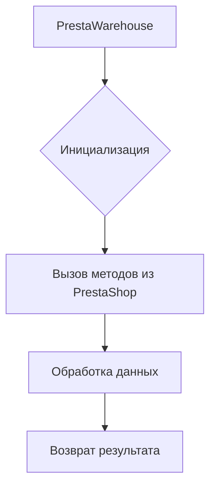

# <input code>

```python
## \file hypotez/src/endpoints/prestashop/warehouse.py
# -*- coding: utf-8 -*-
#! venv/Scripts/python.exe
#! venv/bin/python/python3.12

"""
.. module: src.endpoints.prestashop 
	:platform: Windows, Unix
	:synopsis:

"""
MODE = 'dev'

import os,sys
from attr import attr, attrs
from pathlib import Path
import header
from src import gs
from src.utils.printer import  pprint
from .api import PrestaShop
from src.logger import logger


class PrestaWarehouse(PrestaShop): 
    ...
```

# <algorithm>

К сожалению, предоставленный код фрагментарен и не содержит реализации класса `PrestaWarehouse`.  Построить блок-схему или продемонстрировать алгоритм работы невозможно.  Необходимо полное содержание кода класса, чтобы понять его функциональность.  При отсутствии реализации класса `PrestaWarehouse`,  алгоритм  не может быть визуализирован.

# <mermaid>



Эта диаграмма является крайне упрощенной, так как не содержит деталей о конкретных методах и их взаимодействии. При добавлении кода, реализующего методы класса `PrestaWarehouse`, диаграмма может быть существенно расширена.

# <explanation>

**Импорты:**

* `os`, `sys`: Стандартные модули Python, используемые для взаимодействия с операционной системой (например, получение пути к файлам).
* `attr`: Модуль для аннотаций классов и атрибутов. Позволяет описать и использовать атрибуты класса.
* `pathlib`: Модуль для работы с путями к файлам и каталогам в объектно-ориентированном стиле.
* `header`: Вероятно, собственный модуль, определенный в `src`, содержащий какие-либо конфигурационные параметры или вспомогательные функции.
* `gs`: Модуль `gs` из пакета `src`. Это не стандартная библиотека Python и его назначение неясно без дополнительного кода.
* `pprint`: Модуль `pprint` из пакета `src.utils`. Вероятно, предоставляет улучшенную функцию печати.
* `PrestaShop`: Класс из модуля `.api`, также расположенного в папке `prestashop`. Скорее всего, представляет собой базовый класс или интерфейс для доступа к API PrestaShop.
* `logger`: Модуль из `src.logger`, вероятно, служит для ведения журналов (логирования) событий и ошибок.

**Классы:**

* `PrestaWarehouse`: Наследует от класса `PrestaShop`.  Это ключевой класс, выполняющий специфическую логику работы с складом PrestaShop.  Без реализации методов класса, его назначение и функциональность не могут быть определены.  Наследование обеспечивает переиспользование кода и логики, определенных в родительском классе.

**Функции:**

(Нет определенных функций, только класс, поэтому нет описания функций).

**Переменные:**

* `MODE`:  Строковая переменная, хранящая значение, скорее всего, режима работы (например, 'dev', 'prod').  Использование неясно без контекста.

**Возможные ошибки или области для улучшений:**

* Код фрагментарен, отсутствует реализация методов класса `PrestaWarehouse`.  Невозможно оценить корректность работы класса без его полного кода.
* Неясно, какие данные обрабатывает класс `PrestaWarehouse`.  Для анализа требуется контекст.
* Отсутствие документации (docstrings) внутри класса и методов затрудняет понимание их функциональности.
* Неопределенное использование модуля `gs`.

**Взаимосвязь с другими частями проекта:**

* `PrestaWarehouse` использует `PrestaShop`, указывая на то, что она часть системы взаимодействия с PrestaShop API, находящейся в `src.endpoints.prestashop.api`.
* `PrestaWarehouse` использует `src.utils.printer` и `src.logger`, которые представляют собой вспомогательные компоненты проекта, обеспечивающие вывод информации и логирование.
* `PrestaWarehouse` скорее всего,  использует данные, полученные из других частей проекта (например, из других `endpoints`).  Без полного кода, это утверждение не может быть подтверждено.


**Заключение:** Для более глубокого анализа требуется полный код класса `PrestaWarehouse` и контекст проекта.