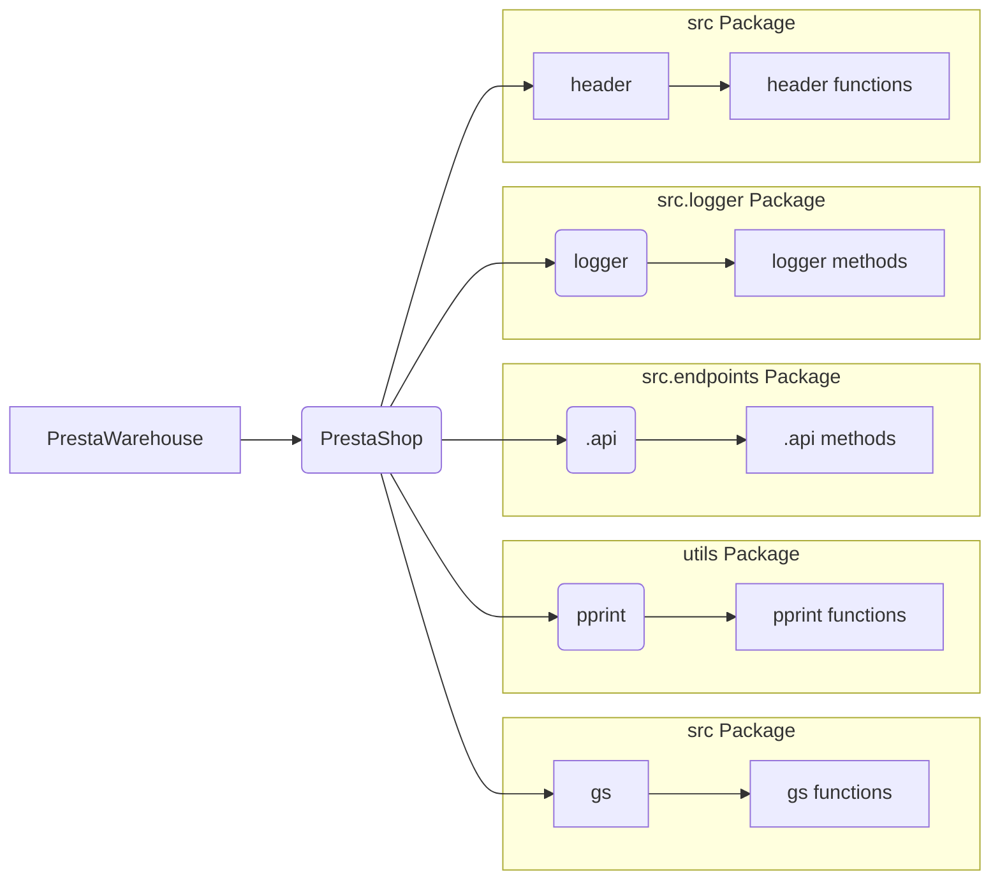

```MD
# Анализ кода hypotez/src/endpoints/prestashop/warehouse.py

## <input code>

```python
## \file hypotez/src/endpoints/prestashop/warehouse.py
# -*- coding: utf-8 -*-
#! venv/Scripts/python.exe
#! venv/bin/python/python3.12

"""
.. module:: src.endpoints.prestashop 
	:platform: Windows, Unix
	:synopsis:

"""
MODE = 'dev'

import os,sys
from attr import attr, attrs
from pathlib import Path
import header
from src import gs
from src.utils.printer import pprint
from .api import PrestaShop
from src.logger import logger

class PrestaWarehouse(PrestaShop): 
    ...
```

## <algorithm>

К сожалению, предоставленный код фрагментарный и не содержит логики.  `...` указывает на отсутствие тела класса `PrestaWarehouse`.  Без тела невозможно построить алгоритм работы.  Таким образом, пошаговая блок-схема и примеры не могут быть созданы.


## <mermaid>



## <explanation>

**Импорты:**

* `os`, `sys`: Стандартные библиотеки Python для работы с операционной системой и системными переменными.
* `attr`: Библиотека для аннотирования классов и атрибутов.  Вероятно, используется для создания структуры данных.
* `pathlib`: Модуль для работы с путями к файлам и каталогам.
* `header`: Возможно, собственный модуль проекта, содержащий настройки или константы.  Связь с другими частями проекта не определена без контекста.
* `gs`: Возможно, инициализация или доступ к Google Sheets.  Связь с другими частями проекта не определена без контекста.
* `pprint`: Модуль из подпапки `utils`, вероятно, для красивой печати данных.  Связь с другими частями проекта неясна.
* `.api`: Модуль, содержащий базовый класс `PrestaShop`, скорее всего, для работы с API Престашоп.
* `src.logger`: Модуль для логирования, вероятно, собственной реализации. Связь с другими частями проекта не определена.

**Классы:**

* `PrestaWarehouse`: Наследует от класса `PrestaShop` из модуля `.api`.  Отсутствие тела (`...`) не позволяет понять функциональность.  Предполагается, что он расширяет или модифицирует функциональность `PrestaShop` для работы с  складом Престашоп.

**Функции:**

Не определены, так как у `PrestaWarehouse` нет тела.

**Переменные:**

* `MODE`: Строковая переменная, содержащая значение `'dev'`.  Предположительно, определяет режим работы программы (разработка).

**Возможные ошибки или области для улучшений:**

* **Недостаточная информация:** Код фрагментарный и не содержит логики.  Невозможно оценить его качество и возможные ошибки без тела класса `PrestaWarehouse`.
* **Неясные зависимости:** Роль модулей `header`, `gs`, `src.utils.printer`, `src.logger` и их связь с `PrestaWarehouse` не ясна без дополнительного контекста.
* **Отсутствие документации:** Класс `PrestaWarehouse` не содержит документации, что затрудняет понимание его функциональности.


**Цепочка взаимосвязей:**

`PrestaWarehouse` наследуется от `PrestaShop`.  `PrestaShop`, скорее всего, взаимодействует с API Престашоп (модуль `.api`).  `gs` предполагает взаимодействие с Google Sheets, а `utils.printer` - с инструментами для вывода данных.  `header`, `src.logger` обеспечивают настройки и логирование.  Без дополнительного кода трудно определить точную цепочку взаимосвязей.