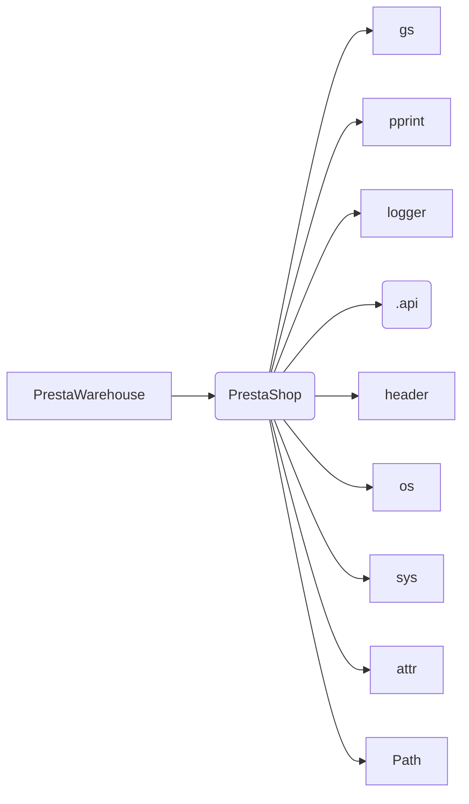

```MD
# Анализ кода hypotez/src/endpoints/prestashop/warehouse.py

## <input code>

```python
## \file hypotez/src/endpoints/prestashop/warehouse.py
# -*- coding: utf-8 -*-
#! venv/Scripts/python.exe
#! venv/bin/python/python3.12

"""
.. module: src.endpoints.prestashop 
	:platform: Windows, Unix
	:synopsis:

"""
MODE = 'dev'

import os,sys
from attr import attr, attrs
from pathlib import Path
import header
from src import gs
from src.utils import pprint
from .api import PrestaShop
from src.logger import logger

class PrestaWarehouse(PrestaShop): 
    ...
```

## <algorithm>

Этот код представляет собой фрагмент Python-скрипта, который, предположительно, определяет класс `PrestaWarehouse`.  Поскольку код содержит комментарии, но не реализует весь класс, блок-схема не может быть построена.  Полный анализ алгоритма невозможен без просмотра полных определений.


## <mermaid>



**Описание диаграммы:**

Диаграмма описывает зависимости класса `PrestaWarehouse` от других модулей/классов.  Стрелки указывают, что класс `PrestaWarehouse` использует функции, классы, переменные, или объекты из указанных зависимостей.  Отсутствующая реализация класса `PrestaWarehouse` не позволяет создать полную блок-схему.

## <explanation>

**Импорты:**

* `os`, `sys`: Стандартные библиотеки Python, предоставляющие доступ к операционной системе и системным параметрам.
* `attr`: Библиотека для аннотирования данных. Вероятно, используется для определения атрибутов класса.
* `pathlib`: Библиотека для работы с файловыми путями.
* `header`:  Модуль, вероятно, содержащий дополнительные конфигурации или функции для данного проекта (`src`). Непосредственное назначение неясно без доступа к `header`.
* `gs`:  Модуль из пакета `src`, вероятно, связан с обработкой данных Google Sheets или другими сервисами.
* `pprint`:  Модуль из пакета `src.utils`, вероятно, для форматированного вывода данных.
* `.api`:  Модуль из текущей папки (`prestashop`), содержащий, предположительно, класс `PrestaShop`.  Непосредственное назначение не ясно без доступа к реализации.
* `src.logger`: Модуль из пакета `src`, вероятно, содержит функции для логирования.

**Классы:**

* `PrestaWarehouse`:  Наследует класс `PrestaShop` из модуля `.api`. Это указывает на то, что `PrestaWarehouse` расширяет функциональность `PrestaShop`, вероятно, добавляя специфические для склада методы.  Ключевое слово `...` указывает на неполное определение класса.  Это означает, что `PrestaWarehouse` содержит дополнительные атрибуты или методы, которые необходимо посмотреть в полном коде.

**Функции:**

В приведенном коде нет явных определений функций.  Функциональность будет скрыта внутри `PrestaShop` и `PrestaWarehouse`


**Переменные:**

* `MODE`: Строковая переменная, вероятно, определяющая режим работы приложения ('dev').

**Возможные ошибки и улучшения:**

* **Неполное определение класса:**  Ключевое слово `...` указывает на отсутствие реализации методов класса `PrestaWarehouse`. Это мешает понять функциональность класса и  связь с другими модулями.  Чтобы завершить анализ, необходимо рассмотреть полный код.
* **Недостаток комментариев:**  Комментарии в коде не содержат достаточной информации о внутренних процессах и принятых решениях.  Более подробные комментарии улучшили бы читаемость и понимание.
* **Отсутствие контекста:** Без полного понимания проекта (`src`) трудно определить всю область применения кода.


**Цепочка взаимосвязей:**

Непосредственные взаимосвязи можно проследить через наследование (`PrestaWarehouse` от `PrestaShop`) и импорты (`gs`, `pprint`, `logger` и т.д.).  Для построения полной картины необходимо иметь доступ к связанным файлам.