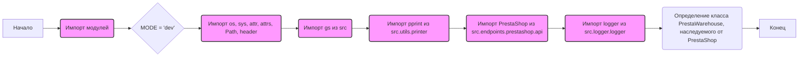

## Анализ кода `hypotez/src/endpoints/prestashop/warehouse.py`

### <алгоритм>

1. **Инициализация модуля:**
   - Устанавливается `MODE = 'dev'`, что указывает на режим разработки.
   - Импортируются необходимые модули: `os`, `sys`, `attr`, `attrs`, `Path`, `header`, `src.gs`, `src.utils.printer.pprint`, `src.endpoints.prestashop.api.PrestaShop`, и `src.logger.logger`.
2. **Объявление класса `PrestaWarehouse`:**
   - Класс `PrestaWarehouse` наследуется от класса `PrestaShop`, импортированного из `src.endpoints.prestashop.api`.
   - Внутри класса пока нет явных методов или атрибутов, что обозначено `...`. Это может означать, что класс является заглушкой или его реализация будет добавлена позже.

**Пример использования:**
```python
# Создание экземпляра класса PrestaWarehouse
warehouse_instance = PrestaWarehouse(api_url="https://example.com/api", api_key="your_api_key")
# Вызов методов, унаследованных от PrestaShop (если такие есть)
# Например: warehouse_instance.get_products()
```
### <mermaid>


### <объяснение>
#### Импорты:
- **`import os,sys`**:
    - `os`: Модуль для взаимодействия с операционной системой, используется для работы с файловой системой, переменными окружения и т.д.
    - `sys`: Модуль для доступа к некоторым переменным и функциям, которые взаимодействуют с интерпретатором Python, например, для получения аргументов командной строки.

- **`from attr import attr, attrs`**:
    - `attr`, `attrs`: Модули из библиотеки `attrs`, используется для создания классов с минимальным количеством кода, автоматически добавляя методы `__init__`, `__repr__` и др.

- **`from pathlib import Path`**:
    - `Path`: Класс из модуля `pathlib`, который представляет пути к файлам и каталогам, облегчает работу с путями.

- **`import header`**:
    - `header`: Скорее всего, собственный модуль в проекте `hypotez`, который может содержать общие функции или константы.

- **`from src import gs`**:
    - `gs`: Модуль, скорее всего, из пакета `src`, который может предоставлять глобальные настройки или утилиты.

- **`from src.utils.printer import pprint`**:
    - `pprint`: Функция для форматированного вывода данных, вероятно, улучшенная версия стандартной функции `print`.

- **`from .api import PrestaShop`**:
    - `PrestaShop`: Класс, представляющий собой базовый API для взаимодействия с PrestaShop, находится в том же пакете `src.endpoints.prestashop`, но в модуле `api.py`.

- **`from src.logger.logger import logger`**:
    - `logger`: Модуль для логирования, который предоставляет функции для записи сообщений отладки, ошибок и т.д.

#### Классы:

- **`class PrestaWarehouse(PrestaShop): ...`**:
    - **Роль**: Класс `PrestaWarehouse` предназначен для работы с данными о складах PrestaShop.
    - **Наследование**: Он наследует функциональность класса `PrestaShop` из `src.endpoints.prestashop.api`, что подразумевает наличие общего интерфейса для работы с API PrestaShop.
    - **Атрибуты и методы**: В предоставленном коде не определены атрибуты и методы, но, вероятно, будут добавлены методы для выполнения CRUD операций (создание, чтение, обновление, удаление) данных о складах, а также для получения списка складов, информации об отдельном складе и т.д.
    - **Взаимодействие**: `PrestaWarehouse` взаимодействует с API PrestaShop через методы, унаследованные от `PrestaShop`, а также может взаимодействовать с `logger` для логирования операций.

#### Функции:

- В этом коде нет явно определенных функций, кроме импортированной функции `pprint`. Методы класса `PrestaWarehouse` не показаны в предоставленном фрагменте.

#### Переменные:
- **`MODE = 'dev'`**:
    - **Тип**: Строка.
    - **Использование**: Используется для определения режима работы приложения (в данном случае, режим разработки).

#### Потенциальные ошибки и улучшения:

- **Неполная реализация класса**: Класс `PrestaWarehouse` пока не имеет никакой реализации, кроме наследования от `PrestaShop`. Это может быть улучшено путем добавления методов для работы с данными о складах.
- **Отсутствие проверок**: В коде нет проверок на наличие необходимых переменных окружения или параметров, необходимых для работы с API PrestaShop.
- **Жестко заданный режим**: `MODE` определен как `'dev'`, что может потребовать изменения при переходе к производственной среде. Можно использовать переменные окружения для управления режимом работы.
- **Зависимости**:  Хотя код хорошо структурирован и использует импорты,  необходимо убедиться, что все зависимости установлены и соответствуют ожиданиям, а также проверить корректность импорта пакета `header`, так как он не является стандартной библиотекой python и должен быть частью проекта.
#### Цепочка взаимосвязей:
1. `warehouse.py` зависит от `api.py`, так как наследует класс `PrestaShop`.
2.  `api.py` (вероятно) взаимодействует с API PrestaShop, используя `requests` или аналогичную библиотеку.
3. `warehouse.py` использует `logger` для логирования событий.
4. `warehouse.py` использует `pprint` для форматированного вывода.
5. `warehouse.py` может использовать глобальные настройки из `gs`.
6. `warehouse.py` использует `header` для возможно каких либо общих функциональностей.
7. `warehouse.py` может использовать `os` и `sys` для работы с окружением и интерпретатором.

Таким образом, `warehouse.py` играет роль конкретного endpoint для работы со складами, используя общую функциональность API из `api.py` и вспомогательные утилиты из других модулей проекта.