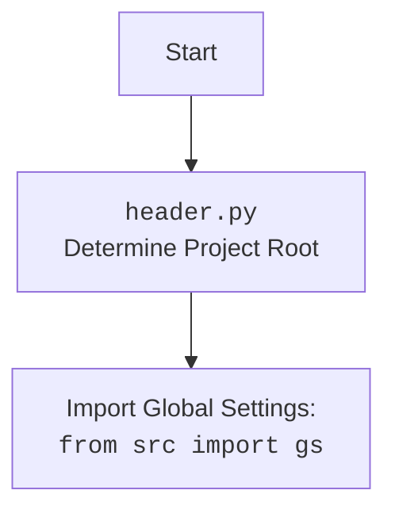

## АНАЛИЗ КОДА: `hypotez/src/endpoints/prestashop/warehouse.py`

### 1. <алгоритм>

1. **Начало**: Задается переменная `MODE` со значением `'dev'`. Это может указывать на режим разработки.
2. **Импорт библиотек**:
   - Импортируются стандартные модули `os` и `sys` для работы с операционной системой и системными вызовами.
   - Импортируется `attr` и `attrs` из библиотеки `attr` для удобного создания классов данных.
   - Импортируется `Path` из `pathlib` для работы с путями файлов.
   - Импортируется `header` (предположительно, из пользовательского модуля) для общих настроек проекта.
   - Импортируется `gs` из `src` (предположительно, глобальные настройки проекта).
   - Импортируется `pprint` из `src.utils.printer` для красивого вывода.
   - Импортируется `PrestaShop` из `.api` (предположительно, базовый класс для работы с PrestaShop API).
   - Импортируется `logger` из `src.logger.logger` для логирования.
3. **Определение класса `PrestaWarehouse`**:
   - Создается класс `PrestaWarehouse`, наследуемый от `PrestaShop`, что подразумевает его использование для работы с API PrestaShop, но с конкретной ориентацией на складские операции.
   -  Класс в настоящее время не имеет реализации, обозначен многоточием `...`.

**Пример:**

```
  # Режим разработки
import os #  Работа с операционной системой
import sys #  Работа с системными вызовами
from attr import attr, attrs #  Создание классов данных
from pathlib import Path # Работа с путями файлов
import header #  Заголовочные данные
from src import gs  # Глобальные настройки проекта
from src.utils.printer import pprint #  Красивый вывод данных
from .api import PrestaShop #  Базовый класс для работы с PrestaShop API
from src.logger.logger import logger #  Для логирования

class PrestaWarehouse(PrestaShop):
    ... #  Наследуется от PrestaShop и предназначен для работы со складскими операциями.
```

### 2. <mermaid>

```mermaid
flowchart TD
    Start --> MODE_Declaration[]
    MODE_Declaration --> Import_OS[Import os]
    Import_OS --> Import_SYS[Import sys]
    Import_SYS --> Import_ATTR[Import attr, attrs from attr]
    Import_ATTR --> Import_PATHLIB[Import Path from pathlib]
    Import_PATHLIB --> Import_HEADER[Import header]
    Import_HEADER --> Import_GS[Import gs from src]
    Import_GS --> Import_PPRINT[Import pprint from src.utils.printer]
    Import_PPRINT --> Import_PrestaShop_API[Import PrestaShop from .api]
    Import_PrestaShop_API --> Import_LOGGER[Import logger from src.logger.logger]
    Import_LOGGER --> Class_PrestaWarehouse[class PrestaWarehouse(PrestaShop)]
    Class_PrestaWarehouse --> End
```



**Объяснение зависимостей `mermaid`:**

- **`flowchart TD`**:  Определяет тип диаграммы как блок-схему с направлением сверху вниз.
- **`Start`**: Начало блок-схемы.
- **`MODE_Declaration`**: Узел, представляющий объявление переменной `MODE`.
- **`Import_OS`, `Import_SYS`, `Import_ATTR`, `Import_PATHLIB`, `Import_HEADER`, `Import_GS`, `Import_PPRINT`, `Import_PrestaShop_API`, `Import_LOGGER`**: Узлы, представляющие импорт различных модулей и классов.
- **`Class_PrestaWarehouse`**: Узел, представляющий объявление класса `PrestaWarehouse`.
- **`End`**: Конец блок-схемы.
- **Стрелки `-->`**: Показывают поток выполнения программы (зависимости) от одного узла к другому.

**Импортированные зависимости:**
- **os, sys**:  Стандартные модули Python, предоставляющие интерфейсы к операционной системе и интерпретатору Python соответственно.
- **attr, attrs**:  Используются для определения классов данных, где каждый атрибут имеет четкое описание (тип, валидация и т.д.).
- **pathlib**:  Предоставляет классы для работы с путями файловой системы в объектно-ориентированном стиле.
- **header**: Пользовательский модуль, который, вероятно, содержит информацию о структуре проекта и его настройках.
- **gs**: Глобальные настройки проекта, предположительно, содержащие конфигурации и параметры.
- **pprint**: Функция для красивого вывода данных (вероятно, сложных структур данных) на консоль.
- **PrestaShop**:  Базовый класс для работы с API PrestaShop.
- **logger**: Модуль для логирования действий приложения.

### 3. <объяснение>

**Импорты:**

-   `os`, `sys`: Стандартные модули Python. `os` используется для операций с операционной системой, например, работы с файлами и директориями. `sys` предоставляет доступ к системным переменным и функциям, связанным с интерпретатором Python.
-   `attr`, `attrs` из `attr`: Библиотека `attr` помогает создавать классы данных с меньшим объемом шаблонного кода.  `attrs` - декоратор классов, а `attr` - для декорирования атрибутов.
-   `Path` из `pathlib`:  Предоставляет объектно-ориентированный подход к работе с путями файлов.
-   `header`: Пользовательский модуль (вероятно,  `src/header.py`), который может содержать информацию о проекте, его структуре и корневой директории.
-   `gs` из `src`:  Предположительно, модуль, содержащий глобальные настройки приложения. Расположен в корневой директории `src`.
-   `pprint` из `src.utils.printer`:  Модуль, обеспечивающий "красивый" вывод данных. Упрощает чтение сложных структур данных.
-   `PrestaShop` из `.api`:  Модуль, определяющий базовый класс для взаимодействия с API PrestaShop.
-   `logger` из `src.logger.logger`:  Модуль для журналирования событий, происходящих в приложении.

**Классы:**

-   `PrestaWarehouse(PrestaShop)`:
    -   **Роль**: Представляет собой класс для управления складскими операциями в PrestaShop.
    -   **Наследует**: `PrestaShop`, что подразумевает его использование для работы с API PrestaShop.
    -   **Атрибуты**: На данный момент не определены, но предполагается, что класс будет содержать атрибуты, специфичные для операций со складом.
    -   **Методы**: На данный момент отсутствуют, но предполагается, что класс будет содержать методы для добавления, удаления, изменения и получения информации о складах.
    -   **Взаимодействие**: Взаимодействует с API PrestaShop через унаследованные методы и, возможно, собственные методы для специфичных складских операций.
    -    **Цепочка взаимосвязей**: `PrestaWarehouse` наследуется от `PrestaShop`, который, в свою очередь, является частью `src.endpoints.prestashop`.  Это говорит о том, что `PrestaWarehouse` взаимодействует с другими классами в рамках этого подпроекта для работы с PrestaShop.

**Функции:**

-   Функций нет в приведенном фрагменте кода.

**Переменные:**

-   ``: Строковая переменная, устанавливающая режим работы приложения (в данном случае - "разработка"). Может влиять на поведение приложения (логирование, вывод, доступ к ресурсам и т.д.).

**Потенциальные ошибки и области для улучшения:**

-   Класс `PrestaWarehouse` не имеет реализации. Необходимо добавить необходимые атрибуты и методы.
-   Необходимо реализовать методы для выполнения операций со складом через API PrestaShop.
-   Отсутствуют обработки ошибок, необходимо добавить обработку исключений при работе с API и файловой системой.
-   Не хватает документации для класса `PrestaWarehouse` и его будущих методов.

**Цепочка взаимосвязей с другими частями проекта:**

-   `PrestaWarehouse` является частью подпроекта `src.endpoints.prestashop`.
-   Использует общие настройки проекта (`gs` из `src`) и логирование (`logger` из `src.logger.logger`).
-   Наследуется от `PrestaShop` из модуля `src.endpoints.prestashop.api`.
-   Использует общие утилиты, такие как `pprint` из `src.utils.printer`.
-   Использует  `header` для получения информации о структуре проекта (предположительно, `src/header.py`)