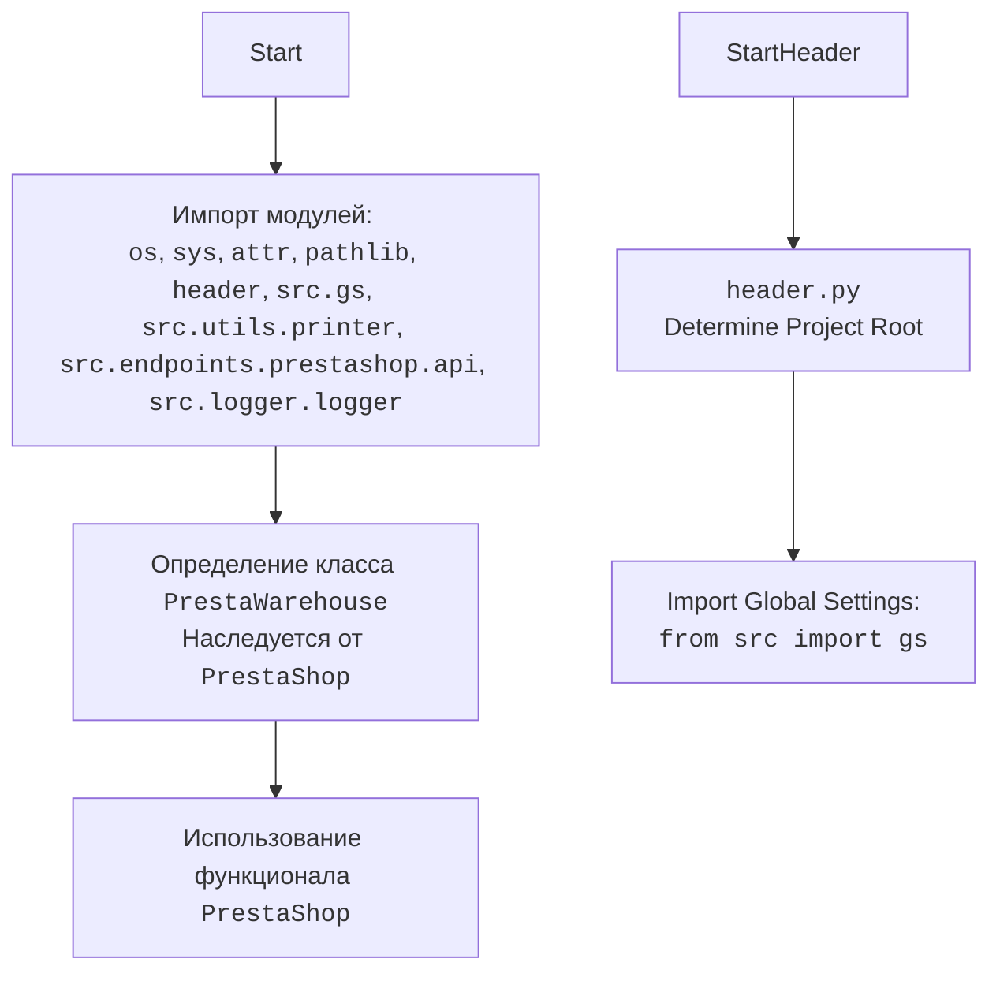

## АНАЛИЗ КОДА: `hypotez/src/endpoints/prestashop/warehouse.py`

### 1. <алгоритм>

1. **Импорт модулей:**
   - Импортируются необходимые библиотеки: `os`, `sys`, `attr`, `pathlib`, `header`, `src.gs`, `src.utils.printer`, `src.endpoints.prestashop.api`, `src.logger.logger`.
   - Пример: `import os` импортирует модуль для работы с операционной системой.
2. **Инициализация класса `PrestaWarehouse`:**
   - Создается класс `PrestaWarehouse`, который наследуется от `PrestaShop` (из `src.endpoints.prestashop.api`).
   - Пример: `class PrestaWarehouse(PrestaShop): ...` определяет новый класс.
3. **Использование родительского класса PrestaShop:**
   - Класс `PrestaWarehouse` использует функционал класса `PrestaShop`, как родительский.
   - Пример: Методы класса `PrestaShop` могут быть вызваны из класса `PrestaWarehouse`.

### 2. <mermaid>

**Объяснение зависимостей:**

- **`os`**: Модуль для взаимодействия с операционной системой, например, для работы с путями к файлам.
- **`sys`**: Модуль для доступа к системным переменным и функциям, например, для работы с аргументами командной строки.
- **`attr`**: Библиотека для создания классов с атрибутами, позволяет создавать классы с удобной инициализацией и валидацией.
- **`pathlib`**: Модуль для работы с файловыми путями в объектно-ориентированном стиле.
- **`header`**: Модуль, который, вероятно, отвечает за определение корневой директории проекта и других настроек.
- **`src.gs`**:  Модуль, содержащий глобальные настройки проекта, которые могут использоваться в разных его частях.
- **`src.utils.printer`**: Модуль для форматированного вывода, вероятно, используется для отладки и логирования.
- **`src.endpoints.prestashop.api`**: Модуль, представляющий API для взаимодействия с PrestaShop. Класс `PrestaWarehouse` наследуется от класса `PrestaShop` в этом модуле.
- **`src.logger.logger`**: Модуль для логирования событий в приложении.

### 3. <объяснение>

**Импорты:**

-   `import os, sys`: Импортирует модули `os` и `sys`, предоставляющие функциональность для взаимодействия с операционной системой и интерпретатором Python.
-   `from attr import attr, attrs`: Импортирует декораторы `attr` и `attrs` из библиотеки `attr`, которые используются для автоматического создания классов с атрибутами.
-   `from pathlib import Path`: Импортирует класс `Path` из модуля `pathlib`, предназначенный для работы с путями к файлам и директориям.
-   `import header`: Импортирует кастомный модуль `header`, который, вероятно, отвечает за установку переменных окружения или путей для проекта, и его главной задачей является определение корня проекта.
-   `from src import gs`: Импортирует модуль `gs` из пакета `src`, который, вероятно, содержит глобальные настройки или константы для проекта.
-   `from src.utils.printer import pprint`: Импортирует функцию `pprint` из модуля `printer` пакета `src.utils`, которая, скорее всего, используется для форматированного вывода данных.
-   `from .api import PrestaShop`: Импортирует класс `PrestaShop` из модуля `api`, находящегося в текущем пакете (`src.endpoints.prestashop`). Этот класс, вероятно, является базовым классом для работы с API PrestaShop.
-   `from src.logger.logger import logger`: Импортирует объект `logger` из модуля `logger` пакета `src.logger`, который предоставляет функциональность логирования.

**Классы:**

-   `class PrestaWarehouse(PrestaShop):`: Определяет класс `PrestaWarehouse`, который наследует от класса `PrestaShop`. Это означает, что класс `PrestaWarehouse` будет иметь все атрибуты и методы класса `PrestaShop`. Судя по названию класса, он, вероятно, отвечает за работу со складами в PrestaShop. Класс в данный момент пуст, но подразумевается, что в дальнейшем он будет содержать методы для работы с API складов PrestaShop.
    -   **Роль:** Представляет конкретную сущность (склад) PrestaShop.
    -   **Атрибуты:** На данный момент нет атрибутов, но они будут добавлены в будущем для представления данных склада.
    -   **Методы:** В данный момент нет методов, но они будут добавлены для взаимодействия со складами через API PrestaShop (создание, чтение, обновление, удаление).
    -   **Взаимодействие:** Зависит от `PrestaShop`, наследуя его функционал.

**Функции:**

-   В данном коде нет явных функций, но есть класс, который содержит методы, которые являются функциями, связанными с классом.

**Переменные:**

-   В данном коде нет явных переменных.

**Потенциальные ошибки и области для улучшения:**

-   Класс `PrestaWarehouse` пока пуст. Необходимо реализовать методы для работы с API складов PrestaShop.
-   Необходимо добавить документацию к классу и методам.
-   Может потребоваться обработка исключений для более надежной работы.
-   Проверить, как используется модуль `header` и убедиться, что он правильно определяет корневую директорию.

**Цепочка взаимосвязей с другими частями проекта:**

-   `src.endpoints.prestashop.warehouse` зависит от `src.endpoints.prestashop.api` через наследование, что указывает на то, что он является частью API PrestaShop.
-   `src.endpoints.prestashop.warehouse` использует `src.gs` для глобальных настроек.
-   `src.endpoints.prestashop.warehouse` использует `src.utils.printer` для форматированного вывода.
-   `src.endpoints.prestashop.warehouse` использует `src.logger.logger` для логирования.
-   `src.endpoints.prestashop.warehouse` зависит от модуля `header` для определения корня проекта и других настроек.