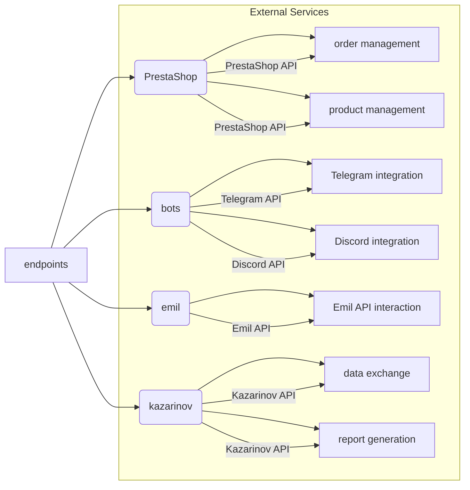

# <algorithm>

Этот код описывает модуль `endpoints` для взаимодействия с различными внешними сервисами (PrestaShop, боты, Emil, Kazarinov, и т.д.).  Он не содержит  реализации самих функций, но описывает структуру и функциональность этих модулей.  Блок-схема не может быть построена, поскольку код представляет собой документацию, а не работающий код.

## <mermaid>



## <explanation>

Этот код не содержит функционального Python кода, а является текстовой документацией к модулю `endpoints`. Он описывает структуру, функциональные возможности, и взаимодействие различных подмодулей этого модуля, предназначенных для интеграции с внешними сервисами.

**Импорты:**

Документация описывает, как импортировать модули, необходимые для работы с конкретными сервисами, например:

```python
from src.endpoints.prestashop import PrestashopAPI
from src.endpoints.advertisement import AdvertisementAPI
```

Это указывает на иерархическую структуру проекта (`src.endpoints.<service>`).  Однако, сам код импортов не представлен.

**Классы:**

Документация описывает классы, такие как `PrestashopAPI`, `AdvertisementAPI`, которые, вероятно, реализуют взаимодействие с API соответствующих сервисов. В описании даны основные функции этих классов, но отсутствует реализация самих классов.

**Функции:**

Документация описывает функции, которые могут быть методами классов, например: создание, редактирование и удаление товаров (`PrestashopAPI`) или управление рекламными кампаниями (`AdvertisementAPI`).  Функциональность описана, но  код функций не приведен.

**Переменные:**

Переменные в контексте этого документации описываются как данные, которые могут передаваться в методы или использоваться в классах для взаимодействия с внешними сервисами.  Но в тексте документации нет примеров переменных.


**Возможные ошибки и улучшения:**

* Отсутствие примеров кода. Несмотря на подробное описание, не представлен ни один пример функционального кода.
* Не определены типы данных. Не указаны типы данных для аргументов и возвращаемых значений функций и методов, что может привести к ошибкам в будущих реализациях.
* Отсутствие тестов. Отсутствуют указания о тесте функциональности модуля, которые должны быть включены в любой серьезный проект.

**Взаимосвязь с другими частями проекта:**

Модуль `endpoints` взаимодействует с внешними сервисами и, вероятно, с другими частями проекта, использующими полученные данные из этих сервисов.  Связь проявляется в импорте модулей, но детали взаимодействия скрыты.  Не хватает описания того, как данные передаются и обрабатываются между разными частями приложения.
```