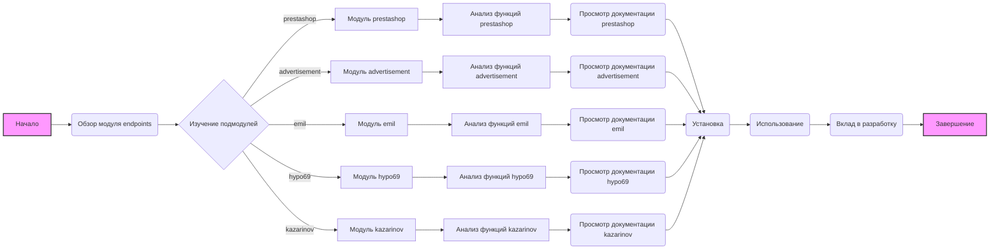

## <алгоритм>

1. **Начало**: Пользователь начинает изучение документации по модулю `endpoints`.
2. **Обзор**: Пользователь читает общее описание модуля `endpoints`, его назначения как модуля конечных точек взаимодействия с потребителями данных и разделение на подмодули.
   * Пример: Пользователь узнает, что модуль `endpoints` содержит API для разных потребителей данных, таких как `prestashop`, `advertisement`, `emil`, `hypo69` и `kazarinov`.
3. **Изучение подмодулей**: Пользователь просматривает описание каждого подмодуля.
   * Пример: Пользователь выбирает подмодуль `prestashop` для изучения и узнает, что он предназначен для интеграции с PrestaShop и позволяет работать с заказами, товарами и клиентами.
4. **Анализ функций**: Пользователь анализирует основные функции каждого подмодуля.
   * Пример: В подмодуле `prestashop`, пользователь видит основные функции: создание, редактирование и удаление товаров, а также управление заказами и пользователями.
5. **Просмотр документации**: Пользователь переходит по ссылкам на документацию конкретных подмодулей, если они доступны.
   * Пример: Пользователь переходит по ссылке [Документация](https://github.com/hypo69/hypo/blob/master/src/endpoints/prestashop/readme.ru.md) для получения более детальной информации о `prestashop`.
6. **Установка**: Пользователь читает инструкции по установке.
   * Пример: Пользователь узнает, что нужно выполнить команду `pip install -r requirements.txt` для установки зависимостей.
7. **Использование**: Пользователь знакомится с примерами импорта и использования модулей.
   * Пример: Пользователь видит пример импорта `from src.endpoints.prestashop import PrestashopAPI` и `from src.endpoints.advertisement import AdvertisementAPI`.
8. **Вклад в разработку**: Пользователь изучает правила для внесения изменений в модуль.
   * Пример: Пользователь узнает, что нужно использовать PEP 8, добавлять тесты и оставлять комментарии.
9. **Завершение**: Пользователь заканчивает изучение документации, получив общее представление о структуре и функциональности модуля `endpoints`.

## <mermaid>



**Описание диаграммы:**

*   `A` - Начало: Начальная точка анализа документации.
*   `B` - Обзор модуля endpoints: Описание общего назначения модуля.
*   `C` - Изучение подмодулей: Разветвление потока на различные подмодули.
*   `D`, `E`, `F`, `G`, `H` - Модули prestashop, advertisement, emil, hypo69, kazarinov: Описание отдельных подмодулей.
*   `DA`, `EA`, `FA`, `GA`, `HA` - Анализ функций каждого модуля: Изучение основных функций подмодулей.
*  `I`,`J`,`K`, `L`, `M` - Просмотр документации каждого модуля: Переход к документации для каждого подмодуля.
*  `N` - Установка: Инструкции по установке зависимостей.
*   `O` - Использование: Примеры импорта и использования модулей.
*   `P` - Вклад в разработку: Правила для внесения изменений.
*   `Q` - Завершение: Конечная точка анализа документации.

**Импорты и зависимости:**

В данной диаграмме не используются импорты как таковые, поскольку это диаграмма потока процессов, а не кода. Но она показывает логическую зависимость между различными этапами изучения документации и компонентами модуля `endpoints`, которые необходимо понимать для эффективного использования. Основная зависимость - это изучение подмодулей и их функций, которое предшествует использованию и внесению вклада в разработку.

## <объяснение>

**Импорты:**

В данном файле нет импортов как таковых, поскольку это файл документации в формате Markdown, а не программный код. Тем не менее, здесь упоминаются импорты в контексте примеров использования модуля:

```python
from src.endpoints.prestashop import PrestashopAPI
from src.endpoints.advertisement import AdvertisementAPI
```

Эти импорты указывают, что в проекте есть модули `PrestashopAPI` и `AdvertisementAPI` в поддиректориях `prestashop` и `advertisement` внутри `src/endpoints`.

**Классы:**

Хотя явные классы в документе не описаны, мы видим по импортам, что существуют классы `PrestashopAPI` и `AdvertisementAPI`, которые вероятно инкапсулируют логику взаимодействия с соответствующими сервисами.

*   `PrestashopAPI`: Этот класс, вероятно, содержит методы для взаимодействия с PrestaShop, такие как создание, редактирование товаров, управление заказами и клиентами.
*  `AdvertisementAPI`: Этот класс, вероятно, предоставляет API для управления рекламными кампаниями и сбора аналитических данных.
*  По аналогии можно предположить существование `EmilAPI`, `Hypo69API`, `KazarinovAPI`, которые реализуют логику взаимодействия с соответствующими сервисами.

**Функции:**

В этом документе не описаны конкретные функции, но из описания модулей можно предположить, что в каждом API-классе есть методы для реализации следующих задач:

*   **`prestashop`:**
    *   `create_product()`, `edit_product()`, `delete_product()`: Методы для управления товарами.
    *   `manage_orders()`: Методы для работы с заказами.
    *   `manage_users()`: Методы для управления пользователями.
*   **`advertisement`:**
    *   `create_campaign()`, `edit_campaign()`, `delete_campaign()`: Методы для управления рекламными кампаниями.
    *   `get_analytics()`: Метод для сбора и обработки аналитических данных.
*   **`emil`:**
    *   `send_request()`: Метод для отправки запросов в сервис Emil.
    *   `get_data()`: Метод для сбора данных из API Emil.
*   **`hypo69`:**
    *   `get_customer_data()`: Метод для получения данных о клиентах.
    *   `get_custom_reports()`: Метод для работы с пользовательскими отчетами.
*   **`kazarinov`:**
    *   `integrate_data()`: Метод для интеграции данных между системами.
    *   `create_reports()`: Метод для создания отчетов и аналитики.

**Переменные:**

В данном документе переменных не описано, так как это файл документации. Однако, в самих модулях, скорее всего, используются переменные для хранения настроек API, данных, полученных от сервисов и т.д. Например, ключи API, URL-адреса сервисов и т.д.

**Цепочка взаимосвязей с другими частями проекта:**

*   Модуль `endpoints` является частью более крупного проекта, предположительно, фреймворка или набора инструментов.
*   Он зависит от `requirements.txt`, который определяет необходимые библиотеки для работы.
*   Подмодули `prestashop`, `advertisement`, `emil`, `hypo69` и `kazarinov` являются частями этого модуля и работают независимо, но совместно, через общий интерфейс.
*   Модули взаимодействуют с внешними сервисами, такими как PrestaShop, рекламные платформы, Emil, Hypo69 и Kazarinov.
*  Модули могут взаимодействовать с другими частями проекта, такими как база данных, для хранения полученных данных, и с пользовательским интерфейсом, для отображения данных.

**Потенциальные ошибки и области для улучшения:**

1.  **Отсутствие конкретики в описании функций:** Описание функций каждого модуля слишком общее. Желательно предоставить более конкретную информацию о методах, их параметрах и возвращаемых значениях.
2.  **Недостаточное количество примеров:** Примеры импорта есть, но нет конкретных примеров использования методов классов. Было бы полезно добавить примеры с использованием реальных данных.
3.  **Отсутствие информации об обработке ошибок:** Не описано, как обрабатывать ошибки, возникающие при взаимодействии с внешними сервисами.
4.  **Безопасность:** В примечаниях есть предупреждение об аутентификации и авторизации, но нет конкретных инструкций или ссылок на них.
5. **Документация:** Ссылки на документацию конкретных подмодулей `advertisement`, `emil`, `hypo69` и `kazarinov` не указаны, что затрудняет понимание их функциональности.
6.  **Установка зависимостей:** Установка через `requirements.txt` описана, но было бы полезно добавить информацию о том, как устанавливать зависимости только для конкретных подмодулей.

**Заключение:**

Модуль `endpoints` предоставляет API для взаимодействия с различными сервисами. Документация дает общее представление о структуре модуля и его подмодулях. Для более эффективного использования, следует дополнить документацию конкретными примерами, деталями по методам, обработке ошибок, безопасности и ссылками на документацию каждого модуля.