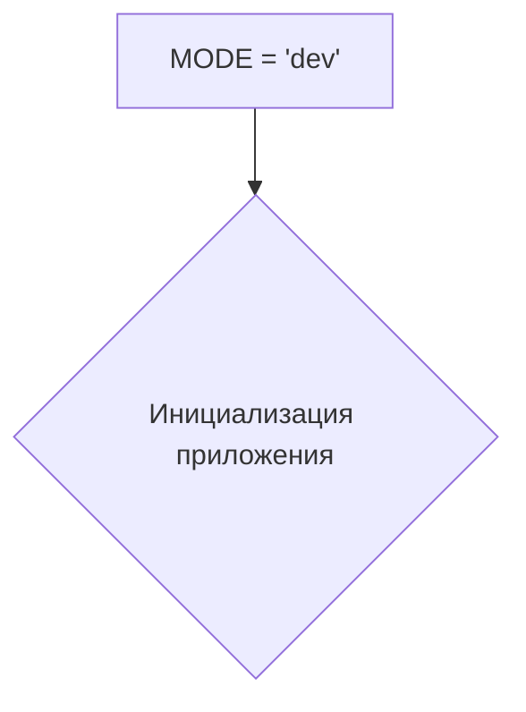
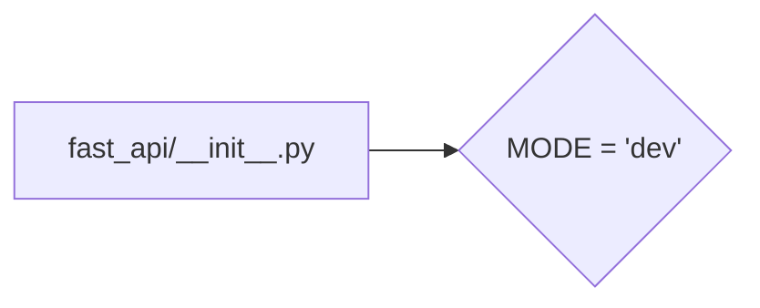

# <input code>

```python
## \file hypotez/src/fast_api/__init__.py
# -*- coding: utf-8 -*-\
#! venv/Scripts/python.exe
#! venv/bin/python/python3.12

"""
.. module: src.fast_api 
	:platform: Windows, Unix
	:synopsis:

"""
MODE = 'dev'
```

# <algorithm>

Этот файл является инициализационным модулем для пакета `fast_api`.  Он содержит лишь одну строковую константу `MODE`, которая, вероятно, используется для определения режима работы приложения (например, 'dev', 'prod').  

Поскольку файл очень короткий, блок-схема будет простой.



В данном случае нет сложных вычислений или взаимодействий с внешними сервисами.


# <mermaid>



# <explanation>

- **Импорты**:  В этом файле нет импортов. Он не использует внешние библиотеки или модули.

- **Классы**: Нет классов.

- **Функции**: Нет функций.

- **Переменные**:  `MODE` - строковая переменная, хранящая значение 'dev'. Вероятно, это конфигурационная переменная, которая может быть использована для управления поведением приложения. Например, в зависимости от значения этой переменной могут быть загружены разные настройки, активированы разные логгеры или использованы альтернативные сервисы.

- **Возможные ошибки или области для улучшений**:  Код очень прост и, возможно, не является полным модулем.  Не хватает логики инициализации.
    * Отсутствие проверки значения `MODE`.  Необходимо убедиться, что значение `MODE` имеет корректное значение ('dev', 'prod' или др.).
    * Отсутствие документирования. Указанные комментарии в docstrings не полны.
    * Отсутствие связей с другими частями проекта.


**Цепочка взаимосвязей с другими частями проекта**:

Файл `hypotez/src/fast_api/__init__.py` скорее всего будет импортирован другими модулями в папке `fast_api` или, возможно, в папке `hypotez`, для использования переменной `MODE` в настройках.  Без дальнейшего кода из других файлов трудно сказать, как именно это будет использоваться.


**Подводя итог:** Файл `hypotez/src/fast_api/__init__.py` является простым инициализационным файлом, который определяет константу `MODE` для последующего использования. Недостаток детальной логики и документирования затрудняет понимание его роли в общем проекте.