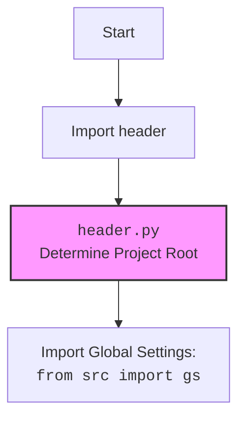
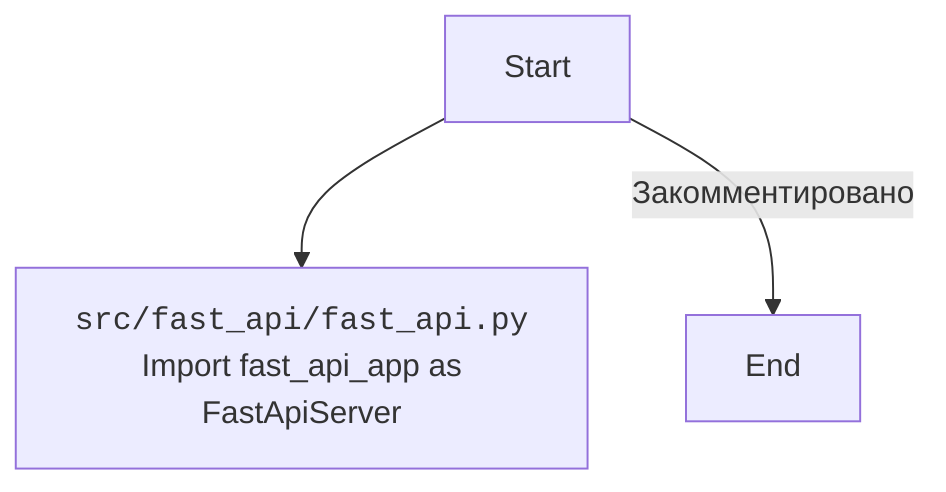

### **Анализ кода `hypotez/src/fast_api/__init__.py`**

#### **1. <алгоритм>**:

1.  **Импорт `header`**: Импортирует модуль `header`, который, вероятно, содержит общие настройки и конфигурации для проекта. Этот шаг позволяет получить доступ к общим переменным и функциям, определенным в `header.py`.

2.  **Закомментированный импорт `FastApiServer`**: В коде присутствует закомментированная строка `from src.fast_api.fast_api import fast_api_app as FastApiServer`. Если бы она была активна, она импортировала бы экземпляр приложения FastAPI из модуля `src.fast_api.fast_api` и присваивала бы его переменной `FastApiServer`.

#### **2. <mermaid>**:

#### **3. <объяснение>**:

-   **Импорты**:
    -   `import header`: Импортирует модуль `header`, который, вероятно, используется для определения корневой директории проекта и импорта глобальных настроек.
-   **Переменные**:
    -   В данном файле явно не определены переменные, но импортированный модуль `header` может содержать переменные, используемые в проекте.
-   **Потенциальные улучшения**:
    -   Рассмотреть возможность активации импорта `FastApiServer`, если планируется использование FastAPI.
    -   Добавить описание модуля и указать его назначение в контексте проекта.