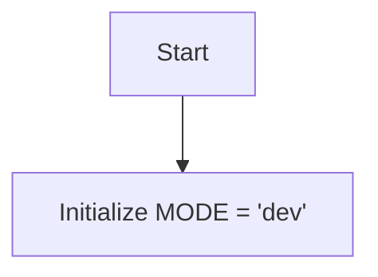

## Анализ кода `hypotez/src/fast_api/__init__.py`

### 1. <алгоритм>

**Начало**

1.  **Инициализация:** Устанавливается переменная `MODE` со значением `'dev'`.
    *   Пример: `MODE = 'dev'`

**Конец**

### 2. <mermaid>

**Объяснение зависимостей:**

В данном коде нет импортов, поэтому нет зависимостей от других модулей. Зависимость только от внутренней переменной `MODE`.

### 3. <объяснение>

**Импорты:**

В данном файле нет импортов.

**Классы:**

В данном файле нет классов.

**Функции:**

В данном файле нет функций.

**Переменные:**

*   `MODE`:
    *   Тип: `str`.
    *   Значение: `'dev'`.
    *   Использование: Эта переменная, вероятно, используется для определения режима работы приложения (например, режим разработки или продакшн). В данном случае, она инициализирована в режим разработки (`'dev'`). В других частях кода,  значение этой переменной может определять, какие настройки или поведение приложения следует использовать.

**Цепочка взаимосвязей:**

Этот файл (`__init__.py`) является файлом инициализации пакета `src.fast_api`. Он, по сути, устанавливает общую настройку, которая может быть использована в других модулях пакета.  Таким образом, `MODE` является отправной точкой для определения глобальной настройки приложения, особенно при работе в рамках `fast_api`. Другие модули в `src.fast_api` могут импортировать и использовать эту переменную для настройки своего поведения.

**Потенциальные ошибки или области для улучшения:**

*   **Отсутствие комментариев:** В коде нет явных комментариев, которые могли бы объяснить назначение `MODE`. Хотя это кажется очевидным, добавление комментариев может улучшить читаемость и понимание кода.
*   **Жестко заданное значение:** Значение `MODE` жестко задано как `'dev'`. В реальном приложении значение переменной MODE должно устанавливаться в зависимости от окружения. Это может быть сделано с помощью переменных окружения, аргументов командной строки или конфигурационных файлов.
*   **Узкое использование:** В данном примере `MODE` определена как простая переменная, которая может быть использована только в рамках пакета. Если предполагается использование переменной `MODE` во всем приложении, лучше использовать переменные окружения.

**Дополнительно:**

Использование `__init__.py` для определения глобальных переменных, является хорошей практикой, если они применяются только в рамках этого пакета. В другом случае необходимо использовать более явные подходы для определения глобальных переменных (например, использовать класс конфигурирования или использовать переменные окружения).