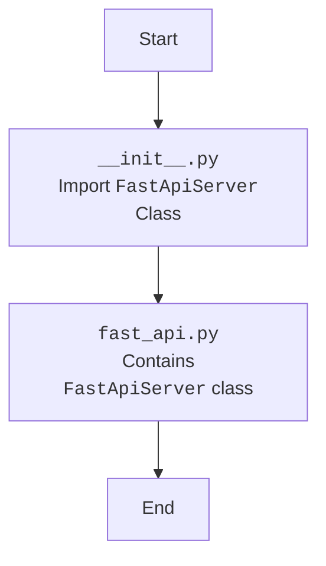

## АНАЛИЗ КОДА: `src/fast_api/__init__.py`

### <алгоритм>
1. **Импорт модуля `FastApiServer`**:
   - Код начинается с импорта `from .fast_api import FastApiServer`. Это означает, что из модуля `fast_api.py`, находящегося в той же директории, импортируется класс `FastApiServer`.
   - **Пример**: Если бы в файле `fast_api.py` был класс:
     ```python
     # fast_api.py
     class FastApiServer:
         def __init__(self, host="127.0.0.1", port=8000):
             self.host = host
             self.port = port
     ```
     то после импорта в `__init__.py` мы можем создать объект `server = FastApiServer(host="0.0.0.0", port=8080)`.

2. **Конец выполнения**:
    - После импорта выполнение скрипта завершается.
    - **Пример**: Если в `__init__.py` не добавляются дополнительные переменные, функции или вызовы, то программа на этом заканчивается.
    

### <mermaid>

### <объяснение>

**Импорты**:
-   `from .fast_api import FastApiServer`: Этот импорт говорит о том, что из модуля `fast_api.py`, расположенного в той же директории (обозначенной точкой `.`), импортируется класс `FastApiServer`. Модуль `fast_api.py`, вероятно, содержит класс, который реализует функциональность FastAPI-сервера. Взаимосвязь с другими пакетами `src`: `__init__.py` является точкой входа в пакет `fast_api` внутри пакета `src`. Импорт `FastApiServer` позволяет использовать этот класс в других частях пакета `src`.

**Классы**:
 - В данном файле нет определения классов, здесь выполняется только импорт. Ожидается, что `FastApiServer` будет классом в `fast_api.py`, который отвечает за создание, запуск и управление FastAPI-сервером. Этот класс, скорее всего, будет иметь методы для инициализации сервера, добавления маршрутов, запуска и остановки сервера.

**Функции**:
  - В данном файле нет определения функций.

**Переменные**:
- В данном файле нет определения переменных.

**Потенциальные ошибки и области для улучшения**:

-   **Отсутствие логики в `__init__.py`:**  Файл `__init__.py` в текущем виде просто импортирует класс. Часто `__init__.py` используется для инициализации пакета, например, для создания экземпляров классов и предоставления их для использования в других частях проекта. Возможно, стоит добавить логику для автоматического создания объекта `FastApiServer`.
-   **Неявные зависимости:**  Зависимость от `fast_api.py` неявная. Если файл `fast_api.py` не существует или содержит ошибки, то импорт `FastApiServer` вызовет ошибку. Было бы полезно добавить обработку ошибок импорта для более надежного кода.
-   **Отсутствие документации:**  Хотя есть docstring для модуля, но хорошо было бы иметь более подробные docstrings для классов, методов, функций и переменных, чтобы другие разработчики могли понять, что делает каждый блок кода.

**Цепочка взаимосвязей:**

1.  Пакет `src` содержит подпакет `fast_api`.
2.  Файл `__init__.py` является точкой входа в пакет `fast_api`.
3.  `__init__.py` импортирует класс `FastApiServer` из `fast_api.py`, делая его доступным для других модулей, импортирующих пакет `fast_api`.
4.  Другие части проекта могут использовать `FastApiServer` для создания и управления FastAPI-сервером, например:
```python
from src.fast_api import FastApiServer

server = FastApiServer(host="0.0.0.0", port=8080)
# ... конфигурация и запуск сервера
```
Таким образом, `__init__.py` связывает функциональность сервера, определенную в `fast_api.py`, с остальной частью проекта, обеспечивая возможность импорта и использования `FastApiServer`.