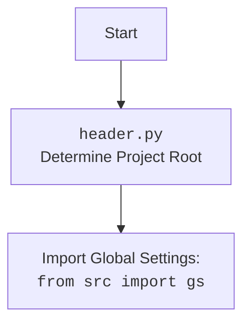

## АНАЛИЗ КОДА: `fast_api.py`

### 1. <алгоритм>
**Блок-схема:**

```mermaid
graph TD
    A[Start] --> B{Создание FastApiServer (Singleton)};
    B --> C{Инициализация: title, host, router, server_tasks, servers};
    C --> D{add_route: /hello, GET, test_function};
    D --> E{add_route: /post, POST, test_post};
    E --> F{register_router};
    F --> G{start: port=8080};
    G --> H{_start_server: port=8080};
    H --> I{uvicorn.Config: host, port};
    I --> J{uvicorn.Server};
    J --> K{server.serve(): Run on port};
    K --> L{start: port=8081};
    L --> M{_start_server: port=8081};
    M --> N{uvicorn.Config: host, port};
    N --> O{uvicorn.Server};
    O --> P{server.serve(): Run on port};
    P --> Q{stop: port=8080};
    Q --> R{stop server};
    R --> S{stop_all};
    S --> T{stop server on port 8081};
    T --> U[End];

    style A fill:#f9f,stroke:#333,stroke-width:2px
    style U fill:#f9f,stroke:#333,stroke-width:2px
    style G fill:#ccf,stroke:#333,stroke-width:2px
    style L fill:#ccf,stroke:#333,stroke-width:2px
    style Q fill:#ccf,stroke:#333,stroke-width:2px
    style S fill:#ccf,stroke:#333,stroke-width:2px

    classDef func fill:#eef,stroke:#333,stroke-width:2px
    classDef class fill:#ffd,stroke:#333,stroke-width:2px
    class C,B,H,I,J,M,N,O class:class;
    class D,E,F,G,L,Q,S class:func;
```

**Примеры:**

1. **Создание `FastApiServer`:** Класс `FastApiServer` создается как singleton с параметрами `title` (например, "My API") и `host` (например, "0.0.0.0").
2. **Добавление маршрута `add_route`:** 
    - `/hello` (метод GET) связан с функцией `test_function`, возвращающей строку "It is working!!!".
    - `/post` (метод POST) связан с функцией `test_post`, принимающей `data: Dict[str, str]` и возвращающей `{"result": "post ok", "data": data}`.
3. **Регистрация роутера `register_router`:** Все добавленные маршруты регистрируются в FastAPI приложении.
4. **Запуск сервера `start`:**
    - Сервер запускается асинхронно на порту 8080 и затем на порту 8081. Используется `uvicorn.Config` и `uvicorn.Server`.
5. **Остановка сервера `stop`:**
    - Сервер на порту 8080 останавливается.
6. **Остановка всех серверов `stop_all`:** Все запущенные серверы останавливаются.

**Поток данных:**

- Параметры `title`, `host`, `path`, `func`, `methods` передаются в `FastApiServer`.
- Роуты, добавленные в `add_route`, хранятся в `router` и регистрируются через `include_router`.
- Запущенные серверы хранятся в словаре `servers`, их задачи в `server_tasks`.

### 2. <mermaid>

```mermaid
classDiagram
    class Singleton {
        <<metaclass>>
        _instances: dict
        __call__(cls, *args, **kwargs)
    }
    class FastApiServer {
        <<singleton>>
        title: str
        host: str
        router: APIRouter
        server_tasks: Dict[int, asyncio.Task]
        servers: Dict[int, uvicorn.Server]
        __init__(title: str, host: str, **kwargs)
        add_route(path: str, func: Callable, methods: List[str], **kwargs)
        register_router()
        _start_server(port: int)
        start(port: int)
        stop(port: int)
        stop_all()
        get_app()
    }
    class APIRouter {
        <<FastAPI>>
        add_api_route(path: str, endpoint: Callable, methods: List[str], **kwargs)
    }
    class uvicorn.Config {
        host: str
        port: int
        log_level: str
        ...
    }
    class uvicorn.Server {
        config: uvicorn.Config
        serve()
        stop()
        ...
    }
    class test_function {
        <<function>>
        ()
    }
     class test_post {
       <<function>>
        (data: Dict[str, str])
    }


    FastApiServer --|> Singleton: metaclass
    FastApiServer *-- APIRouter: router
    FastApiServer *-- uvicorn.Server: servers
    FastApiServer o-- test_function: route
    FastApiServer o-- test_post: route
    uvicorn.Server *-- uvicorn.Config: config

```

**Объяснение зависимостей `mermaid`:**

-   **`Singleton`**: Метакласс, реализующий паттерн singleton. Это гарантирует, что у `FastApiServer` будет только один экземпляр.
-   **`FastApiServer`**: Класс, представляющий FastAPI сервер. Он использует `Singleton` в качестве метакласса, содержит `APIRouter` для маршрутизации, `server_tasks` для отслеживания задач, `servers` для управления серверами `uvicorn` и имеет методы для добавления маршрутов, запуска и остановки сервера.
-   **`APIRouter`**: Класс из `fastapi`, который используется для определения маршрутов API. Методом `add_api_route` устанавливаются endpoints для запросов.
-   **`uvicorn.Config`**: Класс для конфигурации сервера `uvicorn` (хост, порт, логгирование).
-  **`uvicorn.Server`**: Класс, представляющий экземпляр сервера `uvicorn`. Он управляется методами `serve` и `stop`.
- **`test_function`, `test_post`**: Примеры функций, которые используются как обработчики запросов в `add_route`.


### 3. <объяснение>

**Импорты:**

-   `fastapi`: Фреймворк для создания API. Импортируются `FastAPI` (основной класс приложения) и `APIRouter` (для управления маршрутами).
-   `uvicorn`: ASGI-сервер для запуска FastAPI.
-   `typing`: Используется для аннотации типов. Импортируются `List`, `Callable`, `Dict`, `Any`.
-   `functools`: Используется для обертки функций с сохранением метаданных (`functools.wraps`).
-   `asyncio`: Библиотека для асинхронного программирования.
-   `header`: Кастомный модуль (описан в `mermaid` выше), вероятно, для определения корня проекта и импорта глобальных настроек.
-   `src.utils.jjson`: Модуль для работы с JSON. Импортируется `j_dumps` для сериализации данных в JSON.

**Классы:**

1.  **`Singleton`**:
    -   **Роль**: Метакласс, гарантирующий создание только одного экземпляра класса.
    -   **Атрибуты**: `_instances` (словарь для хранения экземпляров).
    -   **Методы**: `__call__` (перехватывает вызов класса и возвращает существующий экземпляр или создает новый).

2.  **`FastApiServer`**:
    -   **Роль**: Основной класс для FastAPI сервера, реализующий шаблон Singleton.
    -   **Атрибуты**:
        -   `title`: Заголовок приложения.
        -   `host`: Хост для сервера.
        -   `router`: Экземпляр `APIRouter` для управления маршрутами.
        -   `server_tasks`: Словарь для хранения запущенных задач сервера (`port: task`).
        -   `servers`: Словарь для хранения экземпляров сервера `uvicorn` (`port: server`).
    -   **Методы**:
        -   `__init__`: Инициализация сервера.
        -   `add_route`: Добавляет маршрут к приложению.
        -   `register_router`: Регистрирует все маршруты в приложении.
        -   `_start_server`: Запускает сервер `uvicorn` на указанном порту.
        -   `start`: Запускает сервер на указанном порту асинхронно.
        -  `stop`: останавливает сервер на указанном порту.
         - `stop_all`: останавливает все сервера
        -   `get_app`: возвращает экземпляр FastAPI приложения.

**Функции:**

-   **`test_function`**:
    -   **Аргументы**: Нет.
    -   **Возвращаемое значение**: Строка "It is working!!!".
    -   **Назначение**: Пример функции для тестирования GET-запроса.
-   **`test_post`**:
    -   **Аргументы**: `data` (словарь `Dict[str, str]`).
    -   **Возвращаемое значение**: Словарь `{"result": "post ok", "data": data}`.
    -   **Назначение**: Пример функции для тестирования POST-запроса, принимает данные и возвращает их.
-  **`main`**:
    -   **Аргументы**: Нет.
    -   **Возвращаемое значение**: Нет.
    -   **Назначение**: Асинхронная функция для запуска и управления серверами `FastApiServer`

**Переменные:**

-   Переменные в `Singleton`: `_instances` (словарь для хранения экземпляров singleton).
-   Переменные в `FastApiServer`:
    -   `title`, `host`, `router`, `server_tasks`, `servers`.
-   Переменные в `main` :
    -  `api` (экземпляр `FastApiServer`).

**Потенциальные ошибки и области для улучшения:**

1. **Обработка ошибок:** В коде отсутствует обработка исключений. Необходимо добавить блоки `try...except` для корректной обработки ошибок при запуске и остановке серверов.
2. **Конфигурация:** Хост и порт сервера устанавливаются в коде, а не через конфигурационные файлы или переменные окружения. Это усложняет развертывание.
3. **Логирование:** Используется стандартное логирование `print`, которое подходит только для простых примеров. Для production рекомендуется использовать библиотеку `logging`.
4. **Отслеживание статуса:** Было бы полезно добавить механизмы для отслеживания статуса запущенных задач, например, возможность проверить, запустился ли сервер корректно.
5. **Использование `j_dumps`:** Вызовы  `j_dumps` после каждого старта и стопа не совсем оправданы. Лучше сохранять список серверов при завершении приложения.

**Взаимосвязь с другими частями проекта:**

-   Код использует модули `src.utils.jjson` и `header` из того же проекта, показывая взаимодействие между различными частями.
-   `header.py` отвечает за определение корневой директории проекта и импорт глобальных настроек.
-   `j_dumps`  используется для сохранения списка запущенных серверов в файл, что может быть полезно для мониторинга или восстановления состояния.

Этот анализ обеспечивает подробное понимание кода, его функциональности и взаимосвязей.