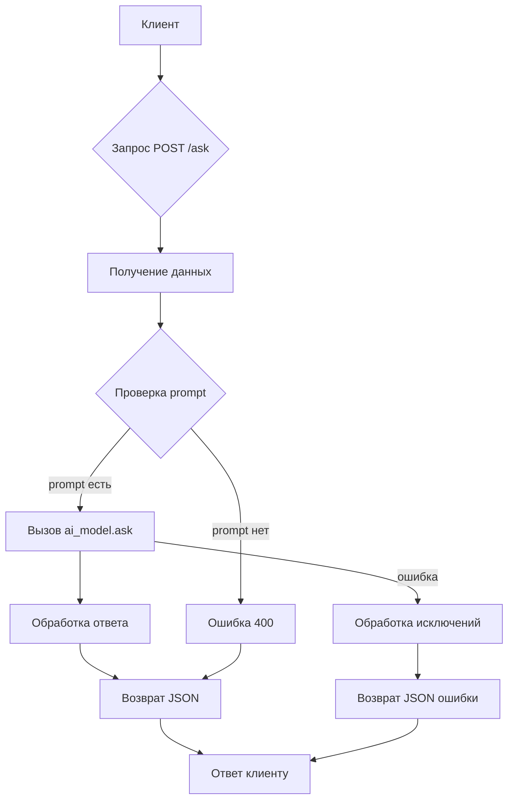

# <input code>

```python
## \file hypotez/src/fast_api/gemini.py
# -*- coding: utf-8 -*-
#! venv/Scripts/python.exe
#! venv/bin/python/python3.12

"""
.. module: src.fast_api 
	:platform: Windows, Unix
	:synopsis:

"""
MODE = 'dev'


"""
	:platform: Windows, Unix
	:synopsis:

"""


"""
	:platform: Windows, Unix
	:synopsis:

"""


"""
  :platform: Windows, Unix

"""
"""
  :platform: Windows, Unix
  :platform: Windows, Unix
  :synopsis:
"""MODE = 'dev'
  
""" module: src.fast_api """


""" HERE SHOULD BE A DESCRIPTION OF THE MODULE OPERATION ! """

import header 
from flask import Flask, request, jsonify
from src.ai.google_generativeai.generative_ai import GoogleGenerativeAI

app = Flask(__name__)
ai_model = GoogleGenerativeAI()

@app.route('/ask', methods=['POST'])
def ask():
    data = request.get_json()
    prompt = data.get('prompt')
    
    if not prompt:
        return jsonify({"error": "No prompt provided"}), 400

    try:
        reply = ai_model.ask(prompt)
        return jsonify({"reply": reply})
    except Exception as e:
        return jsonify({"error": str(e)}), 500
if __name__ == '__main__':
    app.run(debug=True)
```

# <algorithm>

**Шаг 1:** Импорт необходимых библиотек.
- `header`: Вероятно, содержит дополнительные настройки или функции.
- `Flask`: Для создания веб-приложения.
- `request`: Для получения данных от клиента.
- `jsonify`: Для отправки ответа в формате JSON.
- `GoogleGenerativeAI`: Для взаимодействия с моделью Google Generative AI.

**Шаг 2:** Инициализация приложения Flask и модели Generative AI.
- `app = Flask(__name__)`: Создает Flask-приложение.
- `ai_model = GoogleGenerativeAI()`: Создает экземпляр класса `GoogleGenerativeAI`.

**Шаг 3:** Определение маршрута `/ask` с методом POST.
- `@app.route('/ask', methods=['POST'])`: Устанавливает маршрут для обработки запросов POST на `/ask`.

**Шаг 4:** Получение данных запроса.
- `data = request.get_json()`: Извлекает данные из запроса в формате JSON.
- `prompt = data.get('prompt')`: Получает значение поля `prompt` из данных запроса.

**Шаг 5:** Проверка наличия запроса.
- `if not prompt:`: Проверяет, был ли предоставлен prompt. Если нет, возвращается ошибка 400.

**Шаг 6:** Вызов модели Google Generative AI.
- `reply = ai_model.ask(prompt)`: Отправляет запрос на модель Google Generative AI.

**Шаг 7:** Обработка ответа модели.
- `return jsonify({"reply": reply})`: Возвращает ответ в формате JSON с полем `reply`.

**Шаг 8:** Обработка ошибок.
- `except Exception as e:`: Обрабатывает исключения, которые могут возникнуть при обращении к модели.
- `return jsonify({"error": str(e)}), 500`: Возвращает ошибку 500 с описанием произошедшей ошибки.


**Пример данных:**

Запрос POST на `/ask` с телом:
```json
{
  "prompt": "Напишите стихотворение о любви"
}
```

Ответ:
```json
{
  "reply": "Стихотворение о любви..."
}
```

# <mermaid>



# <explanation>

**Импорты:**

- `header`: Непонятно, для чего используется этот импорт без дальнейших уточнений. Возможно, он содержит глобальные конфигурации, функции или переменные.
- `Flask`, `request`, `jsonify`: Из пакета `flask`. Используются для создания веб-сервера и обработки запросов.
- `GoogleGenerativeAI`: Из модуля `src.ai.google_generativeai.generative_ai`.  Предполагается, что этот модуль реализует взаимодействие с API Google AI.  Эта зависимость показывает структуру проекта, где есть отдельный блок для работы с AI-моделями.

**Классы:**

- `GoogleGenerativeAI`:  Представляет класс для взаимодействия с Google Generative AI моделью.  Необходимо изучить реализацию этого класса в `src.ai.google_generativeai.generative_ai` для понимания деталей взаимодействия с API.  Например, как происходит инициализация, и что делает метод `ask()`.

**Функции:**

- `ask()`: Обрабатывает POST-запросы на `/ask`.
    - `data = request.get_json()`: Парсит данные запроса в формате JSON.
    - `prompt = data.get('prompt')`: Извлекает поле `prompt` из данных.  Важная проверка отсутствия `prompt`.
    - `if not prompt:`: Проверка наличия параметра `prompt`.  Важно для предотвращения ошибок.
    - `ai_model.ask(prompt)`: Вызывает метод `ask()` у объекта `ai_model` для получения ответа от модели.
    - Обработка исключений: `try...except`  важная часть, которая защищает приложение от критических ошибок в работе с внешними сервисами.

**Переменные:**

- `MODE`: Имеет значение `'dev'`. Вероятно, используется для различных конфигураций (например, `dev`, `prod`).
- `app`: Объект приложения Flask.
- `ai_model`: Экземпляр класса `GoogleGenerativeAI`.

**Возможные ошибки и улучшения:**

- **Отсутствие документации:** Не хватает описания модуля `header` и класса `GoogleGenerativeAI`. Необходимо добавить детальную документацию, особенно в части взаимодействия с API.
- **Обработка ошибок `ai_model.ask`:** В блоке `try...except` нужно обработать конкретные типы исключений (например, `google.generative.api.exceptions.GoogleGenerativeAPIError`).  Для более robustного решения, нужно также добавить логирование ошибок.
- **Валидация данных:** Важно добавить валидацию `prompt`, чтобы предотвратить атаки типа SQL injection, XSS или иных атак.
- **Детализация логирования:**  Логирование ошибок в отдельном файле поможет отслеживать проблемы.
- **Типизация:** Для улучшения читаемости и поддержки, можно добавить типизацию параметров и возвращаемых значений.
- **Тестирование:** Необходимо добавить unit-тесты для функций и классов.

**Взаимосвязи с другими частями проекта:**

- Модуль `Gemini` напрямую зависит от `GoogleGenerativeAI` для работы с моделью.
- Непосредственная связь с API Google Generative AI.