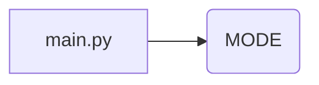

```MD
1. **<input code>**

```python
## \file hypotez/src/fast_api/gemini/backend/main.py
# -*- coding: utf-8 -*-\
#! venv/Scripts/python.exe
#! venv/bin/python/python3.12

"""
.. module: src.fast_api.gemini.backend 
	:platform: Windows, Unix
	:synopsis:

"""
MODE = 'dev'

"""
	:platform: Windows, Unix
	:synopsis:

"""

"""
	:platform: Windows, Unix
	:synopsis:

"""


"""
  :platform: Windows, Unix

"""
"""
  :platform: Windows, Unix
  :platform: Windows, Unix
  :synopsis:
"""MODE = 'dev'
  
""" module: src.fast_api.gemini.backend """


```

2. **<algorithm>**

К сожалению, предоставленный код не содержит реализованного алгоритма. Он состоит только из комментариев и констант.  Поэтому построить блок-схему, показать примеры и движение данных невозможно.


3. **<mermaid>**



4. **<explanation>**

* **Импорты**:  В коде отсутствуют импорты. Отсутствуют  и  имена  модулей,  классов,  функций. Таким  образом,  нет  возможности  описать  взаимосвязи  между  файлами  проекта `src`.

* **Классы**: Отсутствуют классы.

* **Функции**: Отсутствуют функции.

* **Переменные**: Единственная переменная `MODE` имеет строковое значение `'dev'`.  Она глобальная и задает режим работы, скорее всего, для дальнейшей конфигурации приложения.

* **Возможные ошибки или области для улучшений**: Код пуст и не имеет никакой функциональности. Необходимо добавить реализацию алгоритмов и логику работы.  Вместо многочисленных пустых строк комментариев, следует использовать документацию в виде строк-документации `""" ... """` в начале модулей и функций для ясного описания их назначения и поведения.


**Цепочка взаимосвязей с другими частями проекта:**


Без наличия импортов и определения функций или классов невозможно проследить за взаимосвязями с другими частями проекта. Код в текущем виде не связан с другими частями приложения.  Для анализа связей требуется дополнить код функциональностью и импортами.