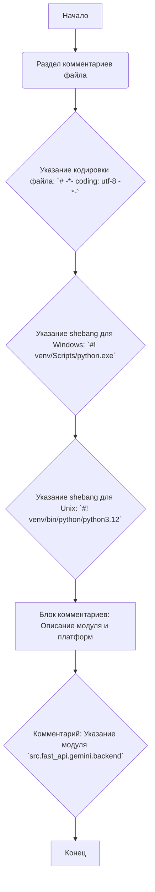
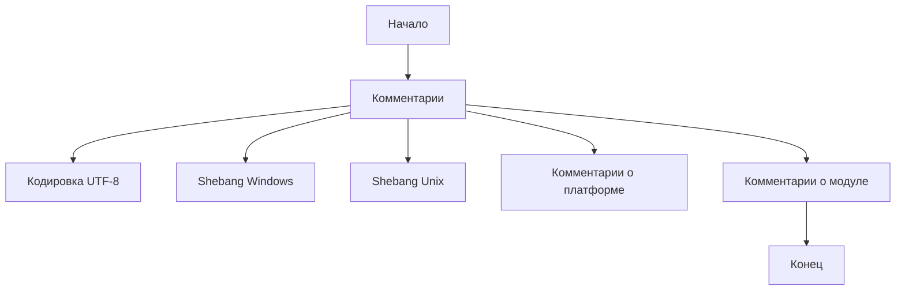

# Анализ кода `hypotez/src/fast_api/gemini/backend/main.py`

## 1. <алгоритм>

Поскольку предоставленный код состоит только из комментариев и не содержит исполняемого кода, пошаговая блок-схема будет представлять только структуру файла.

**Блок-схема:**

**Примеры для блоков:**

*   **A[Начало]:** Начало обработки файла Python.
*   **B(Раздел комментариев файла):** В данном файле все строки - комментарии.
*   **C{Указание кодировки файла: `# -*- coding: utf-8 -*-`}:** Эта строка указывает, что файл использует кодировку UTF-8, что позволяет обрабатывать символы разных языков.
*   **D{Указание shebang для Windows: `#! venv/Scripts/python.exe`}:** Shebang указывает путь к интерпретатору Python, который будет использоваться для выполнения этого файла под Windows.
*   **E{Указание shebang для Unix: `#! venv/bin/python/python3.12`}:** Shebang указывает путь к интерпретатору Python, который будет использоваться для выполнения этого файла под Unix-подобными системами.
*   **F[Блок комментариев: Описание модуля и платформ]:** Комментарии, описывающие платформы, на которых предназначен работать модуль.
*   **G{Комментарий: Указание модуля `src.fast_api.gemini.backend`}:** Комментарий, который указывает на принадлежность файла к модулю.
*    **H[Конец]:** Конец обработки файла.

## 2. <mermaid>

**Объяснение диаграммы:**

*   **Start[Начало]**:  Начало анализа файла.
*   **Comments[Комментарии]**: Этот блок представляет все комментарии, которые присутствуют в файле.
*   **Encoding[Кодировка UTF-8]**:  Комментарий, указывающий кодировку файла, `# -*- coding: utf-8 -*-`.
*  **ShebangWindows[Shebang Windows]**: Shebang для Windows `#! venv/Scripts/python.exe`.
*  **ShebangUnix[Shebang Unix]**: Shebang для Unix `#! venv/bin/python/python3.12`.
*  **PlatformComment[Комментарии о платформе]**: Комментарии, описывающие платформы, на которых предназначен работать модуль.
*  **ModuleComment[Комментарии о модуле]**: Комментарий, который указывает на принадлежность файла к модулю `src.fast_api.gemini.backend`.
*   **End[Конец]**: Конец анализа файла.

## 3. <объяснение>

**Общее:**

Предоставленный файл `main.py` в директории `hypotez/src/fast_api/gemini/backend` состоит только из комментариев. Он не содержит исполняемого кода на Python. Это необычно, поскольку обычно файл `main.py` используется как точка входа для приложения. Наличие только комментариев может означать, что файл является заготовкой или временным файлом.

**Импорты:**

Файл не содержит никаких импортов.

**Классы:**

Файл не содержит никаких классов.

**Функции:**

Файл не содержит никаких функций.

**Переменные:**

Файл не содержит никаких переменных.

**Разбор комментариев:**

*   `# -*- coding: utf-8 -*-`: Указывает кодировку исходного файла как UTF-8, что позволяет использовать символы разных языков.
*   `#! venv/Scripts/python.exe` и `#! venv/bin/python/python3.12`:  Это shebang-строки, которые указывают интерпретатор Python для операционных систем Windows и Unix-подобных соответственно. Она предназначена для того, чтобы скрипт мог быть запущен непосредственно, без указания `python script.py` в командной строке.
*   `"""\n.. module:: src.fast_api.gemini.backend \n\t:platform: Windows, Unix\n\t:synopsis:\n\n"""`:  Это блок комментариев в стиле docstring, который сообщает о модуле, к которому принадлежит данный файл, указывает поддерживаемые платформы (Windows и Unix), и оставляет место для описания модуля.
*   `""" module: src.fast_api.gemini.backend """`: Это еще один комментарий, указывающий имя модуля.

**Потенциальные ошибки или области для улучшения:**

*   **Отсутствие кода:** Основная проблема состоит в том, что файл не содержит никакого исполняемого кода. Для того чтобы `main.py` был полезным, необходимо реализовать функциональность, которую он должен выполнять.
*   **Неоднозначность комментариев:** Множество пустых комментариев или комментариев, повторяющих одну и ту же информацию, не добавляют ценности коду и могут запутать.  

**Взаимосвязь с другими частями проекта:**

Исходя из имени модуля `src.fast_api.gemini.backend`, можно предположить, что этот файл предназначен для работы в составе более крупного проекта, который использует FastAPI в качестве фреймворка, Gemini для взаимодействия с моделью Google AI, и является частью бэкенда. Файл `main.py` обычно является точкой входа, которая должна инициализировать приложение и, возможно, запускать сервер FastAPI.

**Рекомендации:**

*   Заполнить файл исполняемым кодом, включая FastAPI, для инициализации сервера и логики бэкенда.
*   Уточнить docstring комментарии, чтобы предоставлять осмысленную информацию.
*   Избавиться от дублирующих и неинформативных комментариев.