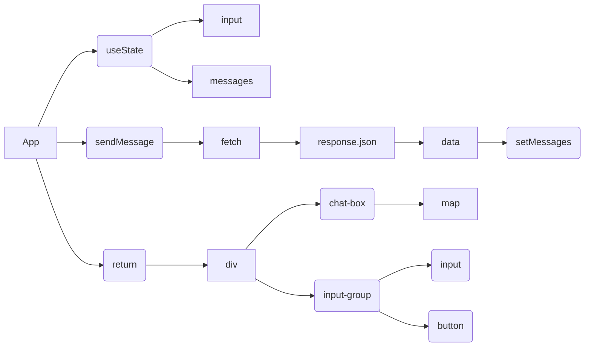

# Анализ кода приложения чат-бота на React

## <input code>

```javascript
function App() {
  const [input, setInput] = React.useState("");
  const [messages, setMessages] = React.useState([]);

  const sendMessage = async () => {
    if (input.trim() === "") return;

    const userMessage = { role: "user", content: input };
    setMessages([...messages, userMessage]);

    try {
      const response = await fetch("http://localhost:8000/api/chat", {
        method: "POST",
        headers: {
          "Content-Type": "application/json"
        },
        body: JSON.stringify({ prompt: input })
      });

      const data = await response.json();
      const aiMessage = { role: "assistant", content: data.response };
      setMessages([...messages, userMessage, aiMessage]);
    } catch (error) {
      console.error("Error:", error);
    }

    setInput("");
  };

  return (
    <div>
      <div className="chat-box" style={{ height: '400px', overflowY: 'scroll', border: '1px solid #ccc', padding: '10px' }}>
        {messages.map((msg, index) => (
          <div key={index} className={msg.role === "user" ? "text-right" : "text-left"}>
            <strong>{msg.role === "user" ? "You" : "AI"}:</strong> {msg.content}
          </div>
        ))}
      </div>
      <div className="input-group mt-3">
        <input
          type="text"
          className="form-control"
          placeholder="Type your message..."
          value={input}
          onChange={(e) => setInput(e.target.value)}
          onKeyDown={(e) => e.key === "Enter" ? sendMessage() : null}
        />
        <button className="btn btn-primary" onClick={sendMessage}>Send</button>
      </div>
    </div>
  );
}

ReactDOM.render(<App />, document.getElementById('chat-app'));
```

## <algorithm>

```mermaid
graph TD
    A[Пользователь вводит текст] --> B{Проверка пустого ввода};
    B -- Пустой -- C[Возврат];
    B -- Не пустой -- D[Формирование сообщения пользователя];
    D --> E[Добавление сообщения в массив сообщений];
    E --> F[Выполнение запроса к API];
    F --> G{Обработка ответа};
    G -- Успешно -- H[Формирование сообщения AI];
    G -- Ошибка -- I[Вывод ошибки];
    H --> J[Добавление сообщений AI и пользователя в массив];
    J --> K[Очистка поля ввода];
    C --> K;
    I --> K;
    K --> L[Отрисовка сообщений];
```

**Пример:**

1. Пользователь вводит "Привет".
2. Проверяется, не пустой ли ввод.
3. Создается объект `userMessage`.
4. Добавляется `userMessage` в массив `messages`.
5. Отправляется запрос на сервер (`http://localhost:8000/api/chat`) с сообщением "Привет".
6. Получен ответ от сервера (например, "Привет, как дела?").
7. Формируется объект `aiMessage`.
8. Добавляются `userMessage` и `aiMessage` в массив `messages`.
9. Поле ввода очищается.
10. Обновляется отображение сообщений на странице.

## <mermaid>



**Объяснение:**

Диаграмма показывает, как `App` использует `useState` для управления состоянием приложения (input и messages). `sendMessage` отправляет запрос на сервер, получает ответ, и обновляет массив `messages`.  `return`  возвращает JSX-элементы, которые отображают сообщения в `chat-box` и форму ввода.  `map` - функция для итерации по массиву сообщений и отображения каждого.  Зависимости: React, ReactDOM, fetch.


## <explanation>

**Импорты:**

Код использует `React` и `ReactDOM`, но эти импорты не видны в данном фрагменте. Они подразумеваются, как стандартные библиотеки для React.

**Классы:**

Нет определенных классов, только функциональный компонент `App`.

**Функции:**

*   **`App`:** Функциональный компонент, управляющий интерфейсом чата.
*   **`sendMessage`:** Асинхронная функция для отправки сообщений на сервер.
    *   Аргументы: нет.
    *   Возвращаемое значение:  `undefined` (асинхронная операция).
    *   Логика: проверяет пустоту ввода, формирует `userMessage`, добавляет его в `messages`, отправляет запрос на сервер, обрабатывает ответ (вывод ошибок), формирует `aiMessage` и добавляет его в `messages`.

**Переменные:**

*   **`input`:** строка, хранящая текст в поле ввода.
*   **`messages`:** массив объектов, содержащих сообщения пользователей и AI.

**Возможные ошибки и улучшения:**

*   Отсутствие обработки ошибок при подключении к серверу. Нужно добавить проверку ответа `response.ok` перед обработкой ответа.
*   Отсутствие индикации загрузки.
*   Необходимо использовать `try...catch` для обработки ошибок, которые могут возникнуть во время запроса к API.  В данном примере это сделано.
*   Необходимо добавить обработку различного статуса ответа.  (404, 500)
*   Нет обработки ошибок при парсинге JSON.  Стоит добавить `JSON.parse()` с проверкой на ошибки.
*   Нет обработки случаев, когда сервер не возвращает `response` или он не содержит `data`.

**Взаимосвязь с другими частями проекта:**

Функция `fetch` делает запрос на `http://localhost:8000/api/chat`. Это указывает на то, что существует backend-сервер (`FastAPI`), обрабатывающий запросы, например, для интеграции с чат-ботом (GPT).

**Выводы:**

Код реализует базовый функционал чат-бота.  В нем есть базовые блоки для работы с данными и представлением сообщений. Но для надежной работы требуется добавить проверки, индикаторы загрузки, а также более полную обработку ошибок.