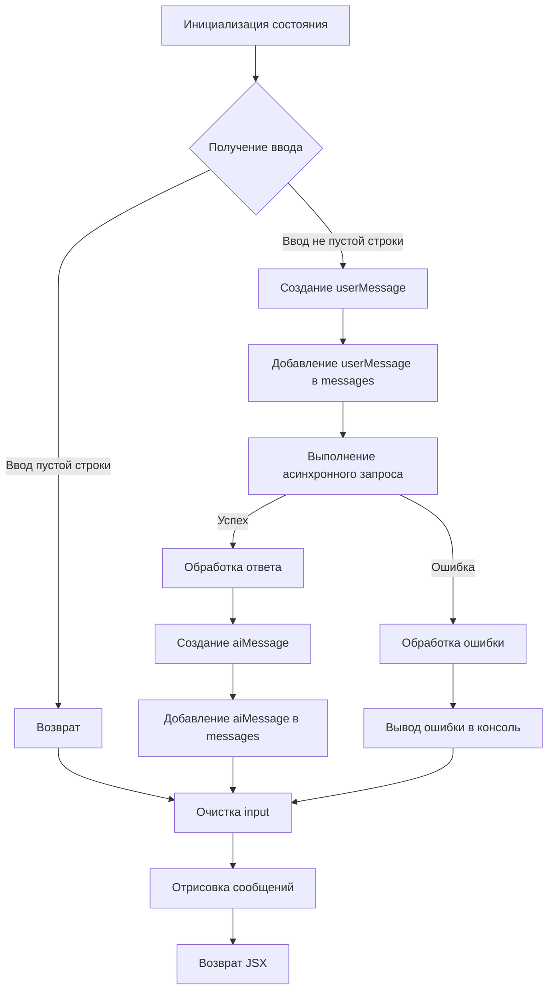
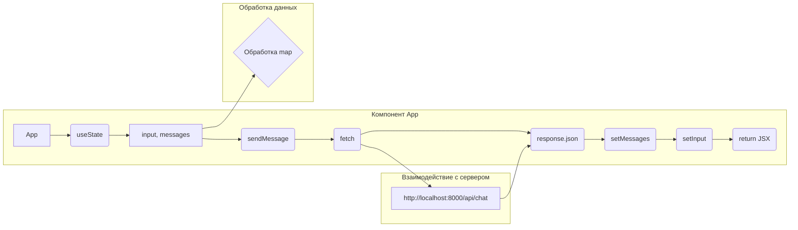

```MD
# Анализ кода компонента чата в React

## <input code>

```javascript
function App() {
  const [input, setInput] = React.useState("");
  const [messages, setMessages] = React.useState([]);

  const sendMessage = async () => {
    if (input.trim() === "") return;

    const userMessage = { role: "user", content: input };
    setMessages([...messages, userMessage]);

    try {
      const response = await fetch("http://localhost:8000/api/chat", {
        method: "POST",
        headers: {
          "Content-Type": "application/json"
        },
        body: JSON.stringify({ prompt: input })
      });

      const data = await response.json();
      const aiMessage = { role: "assistant", content: data.response };
      setMessages([...messages, userMessage, aiMessage]);
    } catch (error) {
      console.error("Error:", error);
    }

    setInput("");
  };

  return (
    <div>
      <div className="chat-box" style={{ height: '400px', overflowY: 'scroll', border: '1px solid #ccc', padding: '10px' }}>
        {messages.map((msg, index) => (
          <div key={index} className={msg.role === "user" ? "text-right" : "text-left"}>
            <strong>{msg.role === "user" ? "You" : "AI"}:</strong> {msg.content}
          </div>
        ))}
      </div>
      <div className="input-group mt-3">
        <input
          type="text"
          className="form-control"
          placeholder="Type your message..."
          value={input}
          onChange={(e) => setInput(e.target.value)}
          onKeyDown={(e) => e.key === "Enter" ? sendMessage() : null}
        />
        <button className="btn btn-primary" onClick={sendMessage}>Send</button>
      </div>
    </div>
  );
}

ReactDOM.render(<App />, document.getElementById('chat-app'));
```

## <algorithm>

**Блок-схема:**



**Примеры:**

* **Ввод:** "Привет"
* **userMessage:** `{ role: "user", content: "Привет" }`
* **Запрос на сервер:** POST запрос на `/api/chat` с телом `{"prompt": "Привет"}`
* **Ответ от сервера:** `{"response": "Здравствуйте!"}`
* **aiMessage:** `{ role: "assistant", content: "Здравствуйте!" }`
* **messages:** `[userMessage, aiMessage]`


## <mermaid>




## <explanation>

**Импорты:**

Код использует `React` и `ReactDOM` из внешних библиотек, необходимых для работы с React.  Предполагается, что эти библиотеки уже подключены в проект.  Нет импортов из `src.`, так как это компонент, вероятно, скомпонован в отдельном файле (например, `frontent/app.js`).

**Классы:**

Код не содержит классов.  Используется функциональный компонент `App`.

**Функции:**

* `App()`: Функциональный компонент, представляющий собой приложение чата. Он управляет состоянием ввода и сообщений, отправляет запросы на сервер и отображает сообщения.
* `sendMessage()`:  Асинхронная функция для отправки сообщений на сервер. Она проверяет, пуст ли ввод, создает объект сообщения `userMessage`, добавляет его в массив сообщений, делает `fetch`-запрос на сервер, обрабатывает ответ, добавляет `aiMessage` в массив и очищает поле ввода. `try...catch`-блок важен для обработки ошибок при запросе.

**Переменные:**

* `input`: Строка, хранящая текущий ввод пользователя. Тип - строка.
* `messages`: Массив объектов, хранящий историю сообщений (как пользователя, так и AI). Тип - массив.
* `userMessage`, `aiMessage`: Объекты, представляющие сообщения пользователя и AI, содержащие атрибут `role` и `content`. Тип - объект.
* `response`, `data`: Переменные, используемые для хранения ответа сервера и данных из ответа.


**Возможные ошибки и улучшения:**

* **Обработка ошибок:** Обработка ошибок при `fetch`-запросе хорошо реализована с помощью `try...catch`. Но стоит добавить более подробную информацию об ошибке в консоль (например, тип ошибки, сообщение).
* **Валидация ввода:** Можно добавить проверку на корректность введенных данных (например, максимальная длина сообщения).
* **Улучшенная структура данных:** Сообщения могут храниться в более структурированном формате, например,  используя интерфейс, что повысит читабельность и добавит возможности для расширения.
* **Обработка пустых запросов:** Логично обрабатывать ситуации, когда сервер возвращает пустой ответ.
* **Задержка отклика:** Включить индикатор загрузки, чтобы пользователь видел, что запрос отправлен и ожидается ответ.
* **Обработка HTTP статусов:** Важно обрабатывать разные HTTP статусы, такие как 400 Bad Request.
* **Ограничение кол-ва сообщений в окне чата:** Для больших чатов стоит ограничить количество отображаемых сообщений, чтобы не создавать больших DOM-структур.
* **Использование API для сообщений:**  Можно использовать API-интерфейс для получения сообщений и их управления.

**Взаимосвязь с другими частями проекта:**

Этот компонент напрямую взаимодействует с API-сервером (`http://localhost:8000/api/chat`).  API-сервер, вероятно, реализован в другом модуле или файле (`backend/api.py` или подобном) и отвечает за обработку входящего запроса и подготовку ответа.  Этот сервер должен быть запущен, чтобы компонент работал корректно.


```