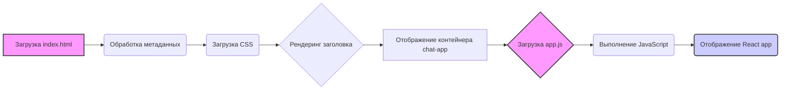

## Анализ кода `hypotez/src/fast_api/gemini/frontent/index.html`

### <алгоритм>

1. **Загрузка HTML-страницы**: Браузер загружает HTML-файл `index.html`.
    *   Пример: Пользователь вводит URL в адресной строке браузера или переходит по ссылке, ведущей к `index.html`.
2. **Обработка метаданных**: Браузер обрабатывает метаданные, такие как кодировка символов (`UTF-8`), настройки viewport для адаптивного дизайна и заголовок страницы (`Chat with Generative AI`).
    *   Пример: Браузер устанавливает кодировку страницы в UTF-8 для правильного отображения текста.
3.  **Загрузка CSS**: Браузер загружает CSS-стили из `/static/bootstrap.min.css` и применяет их к элементам страницы.  Затем применяются стили, заданные в блоке `<style>`.
     *   Пример:  Стили CSS определяют внешний вид кнопки и расположение текстового поля.
4.  **Рендеринг заголовка**:  Браузер отображает заголовок `<h1>AI Chat Interface</h1>`.
    *   Пример: Отображение заголовка "AI Chat Interface" на странице.
5. **Отображение контейнера для чата**: Браузер создает `div` с идентификатором `chat-app`, который будет использоваться как контейнер для приложения чата.
    *   Пример: Создание пустого контейнера для React приложения.
6.  **Загрузка и выполнение JavaScript**: Браузер загружает и выполняет JavaScript-код из `/static/app.js`. Указание `type="text/babel"` говорит о необходимости компиляции JavaScript с использованием Babel.
    *  Пример: Загрузка файла JavaScript для управления логикой чата. JavaScript код будет выполнен для отображения чата.

### <mermaid>

**Объяснение `mermaid`:**

-   `A[Загрузка index.html]`: Начальный этап, когда браузер загружает HTML-файл `index.html`.
-   `B(Обработка метаданных)`: Браузер обрабатывает метаданные, указанные в HTML, такие как кодировка и viewport.
-   `C(Загрузка CSS)`: Браузер загружает CSS-стили из внешних файлов и применяет их к странице.
-   `D{Рендеринг заголовка}`: Браузер отображает основной заголовок страницы.
-   `E[Отображение контейнера chat-app]`: Браузер создает контейнер `div` для приложения чата.
-  `F{Загрузка app.js}`: Браузер загружает JavaScript файл, содержащий логику приложения чата.
-  `G(Выполнение JavaScript)`: Браузер выполняет JavaScript код.
- `H(Отображение React app)`: JavaScript код отображает интерактивное приложение чата внутри `chat-app`.

### <объяснение>

**Импорты:**

*   Файл `index.html` сам по себе не содержит импортов в обычном понимании Python. Но он подключает внешние ресурсы:
    *   `/static/bootstrap.min.css`: Это импорт CSS-стилей Bootstrap, которые используются для оформления страницы.
    *   `/static/app.js`: Это импорт JavaScript-файла, который содержит клиентскую логику чат-приложения, написанную с использованием React.
*   **Связь с `src`:** Эти статические файлы расположены в каталоге `static`, который, вероятно, является частью директории `src` внутри проекта.

**Классы:**

*   В данном HTML файле классы  `container` используются для структурирования контента.
    *   `container`:  Это класс Bootstrap, который используется для создания контейнера, центрирующего контент на странице.
    *  `style`: Этот тэг содержит в себе стили для оформления страницы.

**Функции:**

*   В данном файле нет явных функций, но существует загрузка и выполенние javascript кода.
    *   `app.js`:  Файл `app.js`, скорее всего, содержит React-компоненты и функции для обработки чата.
    *  `type="text/babel"`: Атрибут в теге script указывает, что содержимое скрипта должно быть обработано Babel, предполагая использование JSX и более новых конструкций JavaScript.

**Переменные:**

*   `MODE = 'debug'`:  Эта переменная, объявленная в начале файла, указывает на то, что используется режим отладки.
    *   Тип: Строка
    *   Использование: Эта переменная, вероятно, используется для управления отладочными функциями и не имеет прямого влияния на HTML-код.

**Потенциальные ошибки и области для улучшения:**

*   **Путь к статическим ресурсам:** Пути `/static/bootstrap.min.css` и `/static/app.js` могут быть жестко закодированы, что может привести к проблемам при развертывании приложения. Лучше использовать относительные пути или переменные окружения.
*   **Отсутствие обработки ошибок:** В HTML не предусмотрена обработка ошибок загрузки ресурсов или ошибок выполнения JavaScript. Стоит добавить логгирование и обработку ошибок.
* **Версия библиотеки Bootstrap**: Использование старой версии `bootstrap.min.css` может быть причиной несовместимости стилей и дизайна.

**Взаимосвязь с другими частями проекта:**

*   Этот HTML-файл является частью фронтенда проекта. Он загружает  JavaScript-приложение, которое взаимодействует с бекендом (вероятно, FastAPI) через API для обмена сообщениями с AI.
*   Статические ресурсы (`/static/`) предположительно обслуживаются FastAPI.
*   Бэкенд может использовать `gemini` для обработки запросов и ответов от AI, хотя это не прямо видно в этом коде.

**Цепочка взаимосвязей:**

1.  Пользователь делает запрос в браузере к  FastAPI.
2.  FastAPI отправляет `index.html`.
3.  Браузер загружает HTML, CSS, JavaScript.
4.  JavaScript  React приложение начинает общаться с FastAPI через API.
5.  FastAPI  обрабатывает запросы и использует `gemini`  для взаимодействия с AI.
6.  Результаты  возвращаются в браузер.