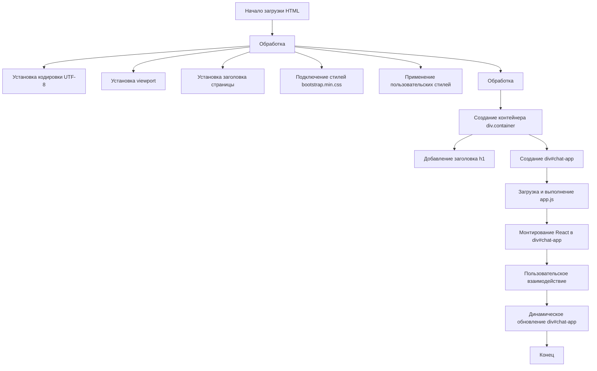

## Анализ кода `index.html`

### 1. **<алгоритм>**
1. **Загрузка HTML-страницы:** Браузер загружает HTML-файл `index.html`.
2. **Заголовок страницы:** Браузер обрабатывает секцию `<head>`:
    *   Устанавливает кодировку `UTF-8`.
    *   Устанавливает viewport для адаптивного отображения на разных устройствах.
    *   Устанавливает заголовок страницы "Chat with Generative AI".
    *   Подключает внешнюю таблицу стилей `bootstrap.min.css` для оформления.
    *   Применяет собственные стили CSS для задания отступов.
3. **Тело страницы:** Браузер обрабатывает секцию `<body>`:
    *   Создаёт контейнер `div` с классом `container`, в котором будет располагаться всё содержимое чата.
    *   Добавляет заголовок первого уровня `<h1>` с текстом "AI Chat Interface".
    *   Создаёт `div` с `id="chat-app"` - это место, куда React будет монтировать приложение.
4. **Загрузка и выполнение скрипта:** Браузер загружает и выполняет JavaScript файл `app.js` (указан в атрибуте `src` тега `<script>`), который содержит код React-приложения для чата. `type="text/babel"` указывает на то, что код должен быть обработан babel.
5. **Инициализация React-приложения:**  Скрипт `app.js`  находит элемент `div` с `id="chat-app"` и монтирует в него React-компоненты, создавая интерактивный интерфейс чата.
6. **Пользовательское взаимодействие:** Пользователь взаимодействует с интерфейсом чата, отправляя сообщения и получая ответы.
7. **Динамическое обновление страницы:** React-приложение динамически обновляет содержимое `div#chat-app` в ответ на действия пользователя и полученные данные.

**Пример:**
1. Браузер получает HTML файл.
2. Браузер парсит теги `<head>` для настройки отображения и подключения стилей.
3. Браузер отображает заголовок `AI Chat Interface`.
4. Браузер загружает и исполняет `app.js`.
5. `app.js` монтирует приложение в `div#chat-app`.
6. Пользователь видит форму чата и может вводить сообщения.
7. При отправке сообщения, React-приложение обрабатывает запрос и отображает ответ, обновляя `div#chat-app`.

### 2. **<mermaid>**

**Объяснение `mermaid` диаграммы:**

*   **Start:** Начальная точка процесса, когда браузер начинает загрузку HTML-документа.
*   **ParseHead:**  Обработка тега `<head>`, включающая в себя следующие действия:
    *   **SetCharset:** Установка кодировки символов как UTF-8.
    *   **SetViewport:** Настройка области просмотра для адаптивного дизайна.
    *   **SetTitle:** Установка заголовка страницы.
    *   **LinkCSS:** Подключение внешней таблицы стилей `bootstrap.min.css`.
    *   **CustomCSS:** Применение пользовательских CSS-стилей.
*    **ParseBody:** Обработка тега `<body>`, включающая в себя следующие действия:
    *   **CreateContainer:** Создание основного контейнера `div` с классом `container`.
    *   **AddTitle:** Добавление заголовка первого уровня `<h1>`.
    *   **CreateChatAppDiv:** Создание `div` с `id="chat-app"`, куда React будет монтировать свое приложение.
*   **LoadScript:** Загрузка и выполнение скрипта `app.js`, в котором находится React код.
*    **MountReact:** Монтирование React-приложения в `div#chat-app`.
*   **UserInteraction:** Взаимодействие пользователя с приложением, которое включает в себя отправку сообщений и получение ответов.
*   **DynamicUpdate:** Динамическое обновление содержимого `div#chat-app` в результате действий пользователя и ответов от сервера.
*   **End:** Конечная точка процесса, когда страница полностью загружена и приложение работает.

### 3. **<объяснение>**

*   **Импорты:**
    *   Файл `index.html` не имеет явных импортов Python. Однако он подключает внешний CSS файл `bootstrap.min.css` и JavaScript файл `app.js`. `bootstrap.min.css` - это фреймворк для стилизации веб-страниц. `app.js` - это javascript код, написанный с применением React и обрабатываемый через babel, который отвечает за логику интерактивного интерфейса чата.
    *   `app.js` импортирует и использует React, но  эти импорты не указаны явно в `index.html`.

*   **Классы:**
    *   В данном HTML файле нет классов Python. Однако присутствуют классы CSS, такие как `container`, используемые для оформления. Классы используются фреймворком bootstrap.js. Класс `container` используется для создания контейнера, который центрирует контент на странице и задает ширину для разных разрешений.

*   **Функции:**
    *   В данном HTML файле нет функций Python. Логика работы реализуется через React в файле `app.js`. Функционал React: отрисовка интерфейса, обработка событий, асинхронная работа (отправка запросов и получение ответов) и т.д.

*   **Переменные:**
    *   `MODE` - это глобальная переменная, объявленная в начале файла. Она устанавливает режим работы приложения.  В данном случае он установлен в `'debug'`.
    *   Остальные переменные относятся к DOM и используются для управления структурой и внешним видом веб-страницы. Например, `container` для организации содержимого, `chat-app` для монтирования React.

*   **Цепочка взаимосвязей с другими частями проекта:**
    *   `index.html` служит точкой входа для пользовательского интерфейса чата.
    *   Он использует `bootstrap.min.css` для стилизации, что является частью статических файлов проекта.
    *   `app.js` содержит React-приложение, которое в свою очередь взаимодействует с бэкенд-сервером (не отображен в данном файле), отправляя и получая сообщения.

*   **Потенциальные ошибки или области для улучшения:**
    *   Не обрабатываются ошибки при загрузке внешних файлов (`bootstrap.min.css`, `app.js`).
    *   Отсутствует механизм кеширования статических файлов.
    *   Возможны проблемы с совместимостью с разными браузерами, особенно без учета префиксов CSS.
    *   Не указаны явные зависимости для `app.js` (React).

**Дополнительные пояснения:**
*  Файл `index.html`  служит отправной точкой приложения, загружаемой браузером. Он содержит минимальный набор HTML-элементов и подключает внешние ресурсы, необходимые для работы приложения.
*  Основная логика приложения находится в `app.js`, который является React-приложением.
*  `index.html` отвечает за инициализацию пользовательского интерфейса и не содержит бизнес-логики. Она делегирована React-приложению, что является распространённой практикой при разработке современных веб-приложений.