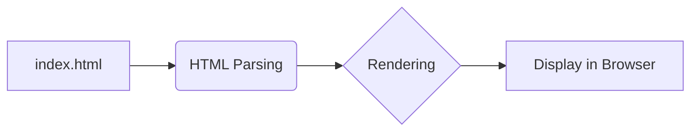

# Анализ кода index.html

**1. <input code>**

```html
## \file hypotez/src/fast_api/gemini/frontent/index.html
# -*- coding: utf-8 -*-\n#! venv/Scripts/python.exe\n\n""" module: src.fast_api.gemini.frontent """\nMODE = 'debug'\n<!DOCTYPE html>\n<html lang="en">\n<head>\n    <meta charset="UTF-8">\n    <meta name="viewport" content="width=device-width, initial-scale=1.0">\n    <title>Chat with Generative AI</title>\n    <link rel="stylesheet" href="/static/bootstrap.min.css">\n    <style>\n        body {\n            padding: 2rem;\n        }\n    </style>\n</head>\n<body>\n    <div class="container">\n        <h1>AI Chat Interface</h1>\n        <div id="chat-app"></div>\n    </div>\n\n    <script type="text/babel" src="/static/app.js"></script>\n</body>\n</html>
```

**2. <algorithm>**

Этот код представляет собой шаблон HTML-документа, который будет отображаться в веб-браузере.  Алгоритм работы - это *отображение*  HTML-структуры. Нет какой-то сложной логики.

**Пример:** Браузер запрашивает этот файл, получает его содержимое, интерпретирует и отображает в виде веб-страницы.

**3. <mermaid>**



**4. <explanation>**

* **Импорты:** Нет импортов в традиционном понимании, т.к. это просто HTML-документ.  Файл `index.html` использует внешние ресурсы, такие как `static/bootstrap.min.css` и `static/app.js`.  Эти файлы, предположительно, находятся в той же директории, что и `index.html`, или указываются с помощью относительного пути, связанного с запросом на сервер.

* **Классы:**  Нет определенных классов в данном файле. Это обычный HTML-документ, использующий встроенные HTML-элементы и стили.

* **Функции:**  Нет определенных функций.

* **Переменные:**  `MODE = 'debug'` — это константа, определенная в файле, скорее всего, используемая для управления режимом работы приложения.

* **Возможные ошибки или области для улучшений:**
    * **Отсутствие ясности относительно `app.js`:**  Файл `app.js` не определен в данном фрагменте. Чтобы понять всю работу, нужно проанализировать этот JavaScript-файл.
    * **Путь к `app.js`:**  Использование относительного пути `/static/app.js` подразумевает, что файл `app.js` доступен в статической директории веб-сервера, который обрабатывает запросы на этот HTML-файл.
    * **Зависимости от `bootstrap`:**  Использование `bootstrap.min.css` предполагает, что  `bootstrap` библиотека CSS доступна на сервере.


* **Взаимосвязи с другими частями проекта:**
    * `index.html` — это начальная точка входа в пользовательский интерфейс приложения, построенного на `fastAPI` фреймворке.
    * `app.js` (вероятно JavaScript файл) содержит JavaScript код, управляющий динамической частью веб-приложения, например, взаимодействие пользователя с интерфейсом чата.
    * `bootstrap.min.css` - библиотека для стилизации и компоновки HTML-элементов.
    * `src.fast_api.gemini` -  указывает на часть приложения, связанную с обработкой запросов чат-ботов от пользователя, предположительно.

**Заключение:**

Файл `index.html` — это просто статический HTML-шаблон, предназначенный для отображения базовой страницы и подключения JavaScript кода. Чтобы оценить полную функциональность, необходимо проанализировать `app.js` и другие связанные файлы.