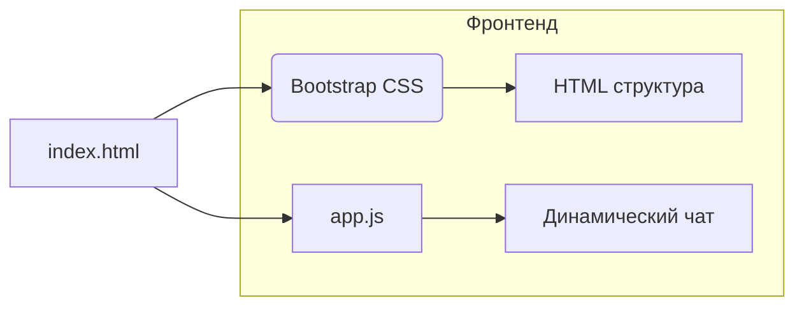

```MD
# Анализ кода index.html

## <input code>

```html
## \file hypotez/src/fast_api/gemini/frontent/index.html
# -*- coding: utf-8 -*-\
#! venv/Scripts/python.exe

""" module: src.fast_api.gemini.frontent """
MODE = 'debug'
<!DOCTYPE html>
<html lang="en">
<head>
    <meta charset="UTF-8">
    <meta name="viewport" content="width=device-width, initial-scale=1.0">
    <title>Chat with Generative AI</title>
    <link rel="stylesheet" href="/static/bootstrap.min.css">
    <style>
        body {
            padding: 2rem;
        }
    </style>
</head>
<body>
    <div class="container">
        <h1>AI Chat Interface</h1>
        <div id="chat-app"></div>
    </div>

    <script type="text/babel" src="/static/app.js"></script>
</body>
</html>
```

## <algorithm>

В данном случае алгоритм работы - это просто структура HTML-документа, определяющая:

1. Структура страницы - заголовок, контейнер, и элемент `div` для отображения чата.
2. Подключение стилей Bootstrap для оформления.
3. Подключение скрипта `app.js` для динамического взаимодействия.

Нет пошаговых действий, так как это статический HTML.  Данные передаются между компонентами проекта через `app.js`.

## <mermaid>



## <explanation>

* **Импорты:**
    * Нет импорта в классическом понимании (нет `import` или `require`).  Файл `index.html` - это обычный HTML-шаблон, который использует внешние ресурсы.
    * `MODE = 'debug'`: Вероятно, константа, задающая режим работы приложения (debug или production).
    * Файл `index.html` - это шаблон веб-страницы, которая будет отображать интерфейс чата с генеративным ИИ.


* **Классы:**
    * Нет явных классов JavaScript. HTML-элементы (`div`, `h1`) определяют структуру.


* **Функции:**
    * Нет функций в чистом виде в данном HTML-файле. Взаимодействие обеспечивается через `app.js` (внешний JavaScript-файл).

* **Переменные:**
    * `MODE`: Строковая переменная, содержащая значение 'debug'.
    * Все остальные элементы - это HTML-теги и атрибуты.

* **Возможные ошибки/улучшения:**
    * Отсутствие логики в файле `index.html`.  Логика и обработка данных перекладываются на `app.js`.
    * Отсутствие явных сообщений об ошибках в случае проблем с загрузкой `app.js` или `bootstrap.min.css`.

* **Взаимосвязь с другими частями проекта:**
    *  `app.js` (JavaScript-файл) - этот файл обрабатывает логику приложения и взаимодействует с backend.  Он отвечает за создание динамического чата, вероятно, используя API-вызовы к backend.
    * `static/bootstrap.min.css`:  Это файл стилей Bootstrap, используемый для визуального оформления интерфейса.
    * Backend (FastAPI): Возможно, этот фронтенд получает данные от FastAPI.


**Вывод:** Данный HTML-файл служит как статическая оболочка для отображения интерфейса чата.  Динамическое поведение и логика чата реализованы в файле `app.js`.  Связь с бэкендом, скорее всего, происходит через `app.js` посредством API-запросов.