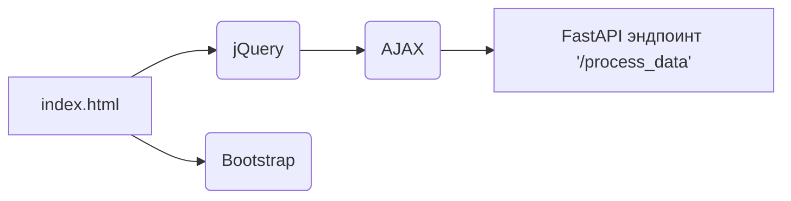

# <input code>

```html
## \file hypotez/src/fast_api/html/index.html
# -*- coding: utf-8 -*-
#! venv/Scripts/python.exe

""" module: src.fast_api.html """
MODE = 'debug'
<!DOCTYPE html>
<html lang="en">
<head>
    <meta charset="UTF-8">
    <meta name="viewport" content="width=device-width, initial-scale=1.0">
    <title>Форма для отправки данных</title>
    <!-- Подключаем Bootstrap CSS -->
    <link rel="stylesheet" href="https://maxcdn.bootstrapcdn.com/bootstrap/4.5.2/css/bootstrap.min.css">
</head>
<body>

    <div class="container">
        <h2>Форма для отправки данных</h2>
        <!-- Форма для ввода данных -->
        <form id="dataForm">
            <div class="form-group">
                <label for="firstName">Имя:</label>
                <input type="text" class="form-control" id="firstName" placeholder="Введите имя" required>
            </div>
            <div class="form-group">
                <label for="lastName">Фамилия:</label>
                <input type="text" class="form-control" id="lastName" placeholder="Введите фамилию" required>
            </div>
            <button type="submit" class="btn btn-primary">Отправить</button>
        </form>
    </div>

    <!-- Подключаем jQuery -->
    <script src="https://ajax.googleapis.com/ajax/libs/jquery/3.5.1/jquery.min.js"></script>

    <script>
        // Обработчик события отправки формы
        $('#dataForm').submit(function(event) {
            // Предотвращаем стандартное поведение формы
            event.preventDefault();

            // Получаем данные из полей ввода
            var firstName = $('#firstName').val();
            var lastName = $('#lastName').val();

            // Отправляем данные на сервер
            $.ajax({
                type: 'POST',
                url: '/process_data',  // Замените '/process_data' на URL вашего FastAPI эндпоинта
                contentType: 'application/json',
                data: JSON.stringify({first_name: firstName, last_name: lastName}), // Преобразуем данные в формат JSON
                success: function(response) {
                    // Обработка успешного ответа от сервера
                    console.log('Ответ от сервера:', response);
                    // Дополнительные действия по необходимости
                },
                error: function(xhr, status, error) {
                    // Обработка ошибки
                    console.error('Ошибка при отправке данных:', error);
                }
            });
        });
    </script>

</body>
</html>
```

# <algorithm>

```mermaid
graph TD
    A[Пользователь вводит имя и фамилию] --> B{Проверяется наличие данных};
    B -- Да -> C[Получаются данные с формы];
    B -- Нет -> D[Выводится ошибка];
    C --> E[Данные преобразуются в JSON];
    E --> F[Отправка POST запроса на /process_data];
    F --> G[Сервер обрабатывает запрос];
    G --> H[Сервер возвращает ответ];
    H -- Успех -> I[Обработка ответа (console.log)];
    H -- Ошибка -> J[Обработка ошибки (console.error)];

```

**Пример:**

Пользователь вводит "Иван" в поле "Имя" и "Иванов" в поле "Фамилия".  Данные собираются, преобразуются в JSON ( `{first_name: "Иван", last_name: "Иванов"}`) и отправляются на сервер.  Сервер обрабатывает запрос и возвращает ответ (например, сообщение "Данные получены"). Клиентский код выводит полученный ответ в консоль.


# <mermaid>



**Объяснение диаграммы:**

* `index.html` -  это HTML-файл, который взаимодействует с  `jQuery`, `Bootstrap` и `AJAX` для отправки данных на сервер.
* `jQuery` - библиотека JavaScript, обеспечивающая удобный способ работы с DOM и AJAX-запросами.
* `Bootstrap` - фреймворк, предоставляющий стили и элементы оформления.
* `AJAX` -  способ асинхронной отправки данных на сервер, не перезагружая страницу.
* `FastAPI эндпоинт '/process_data'` -  точка входа на сервере FastAPI для обработки полученных данных.


# <explanation>

* **Импорты:**
    Нет прямых импортов модулей из `src` в данном файле.  Файл `index.html` - это чисто HTML-код с JavaScript логикой. Связь с `src` происходит через FastAPI эндпоинт `/process_data`, который обрабатывает AJAX запросы.

* **Классы:**
    В файле `index.html` отсутствуют классы.  Все логика JavaScript  работает с элементами HTML и делает AJAX-запросы к FastAPI серверу.

* **Функции:**
    В JavaScript коде есть одна ключевая анонимная функция, обработчик события отправки формы `$('#dataForm').submit(...)`. Эта функция:
    * Предотвращает стандартное поведение формы.
    * Получает значения из полей `firstName` и `lastName`.
    * Формирует JSON объект.
    * Отправляет AJAX запрос к `/process_data` с этими данными.
    * Обрабатывает успешный ответ и ошибки.

* **Переменные:**
    * `firstName`, `lastName` - переменные, хранящие значения из полей формы. Их тип - строка (string).
    * `response` -  переменная, которая будет содержать ответ от сервера.  Тип зависит от ответа сервера.


* **Возможные ошибки и улучшения:**
    * **Проверка данных:** Проверьте, не пустые ли введённые значения `firstName` и `lastName`.  Добавьте валидацию перед отправкой.
    * **Обработка ошибок на сервере:** Важно обрабатывать ошибки, которые могут возникать на серверной стороне и возвращать соответствующие ошибки в формате JSON.
    * **Добавление обработчика `success`:** Укажите действия, которые будут выполнены при успешном выполнении запроса (например, изменение содержимого страницы, отображение сообщений).
    * **Обработка статуса ответа:** Проверьте HTTP статус кода ответа сервера.  Учитывайте возможные HTTP статусы, не только успешные.
    * **Улучшение обработки ошибки:** Пожалуйста, обработайте все возможные типы ошибок.  Разберитесь в том, какой тип ошибок вы получаете на сервере и как их обрабатывать (например, HTTP ошибка 404, ошибка синтаксиса).

* **Связь с другими частями проекта:**
  Файл `index.html` напрямую зависит от серверной части (FastAPI), которая реализует эндпоинт `/process_data`.  Взаимодействие происходит через HTTP POST запрос.  Данные, полученные с клиента, должны быть корректно обработаны на сервере и возвращены обратно.  Обработка ошибок на сервере также важна.