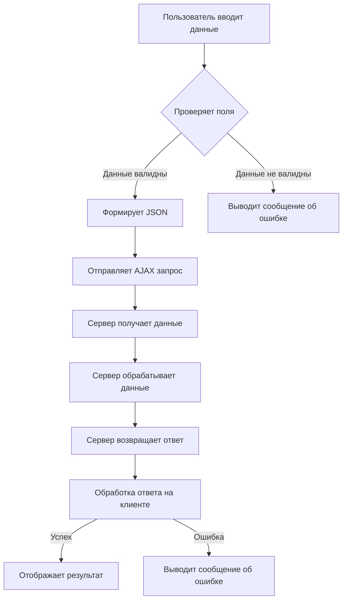
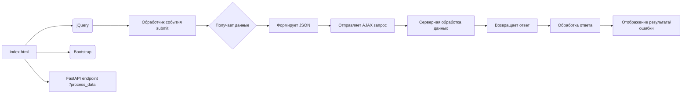

# <input code>

```html
## \file hypotez/src/fast_api/html/index.html
# -*- coding: utf-8 -*-\n#! venv/Scripts/python.exe
""" module: src.fast_api.html """
MODE = 'debug'
<!DOCTYPE html>
<html lang="en">
<head>
    <meta charset="UTF-8">
    <meta name="viewport" content="width=device-width, initial-scale=1.0">
    <title>Форма для отправки данных</title>
    <!-- Подключаем Bootstrap CSS -->
    <link rel="stylesheet" href="https://maxcdn.bootstrapcdn.com/bootstrap/4.5.2/css/bootstrap.min.css">
</head>
<body>

    <div class="container">
        <h2>Форма для отправки данных</h2>
        <!-- Форма для ввода данных -->
        <form id="dataForm">
            <div class="form-group">
                <label for="firstName">Имя:</label>
                <input type="text" class="form-control" id="firstName" placeholder="Введите имя" required>
            </div>
            <div class="form-group">
                <label for="lastName">Фамилия:</label>
                <input type="text" class="form-control" id="lastName" placeholder="Введите фамилию" required>
            </div>
            <button type="submit" class="btn btn-primary">Отправить</button>
        </form>
    </div>

    <!-- Подключаем jQuery -->
    <script src="https://ajax.googleapis.com/ajax/libs/jquery/3.5.1/jquery.min.js"></script>

    <script>
        // Обработчик события отправки формы
        $('#dataForm').submit(function(event) {
            // Предотвращаем стандартное поведение формы
            event.preventDefault();

            // Получаем данные из полей ввода
            var firstName = $('#firstName').val();
            var lastName = $('#lastName').val();

            // Отправляем данные на сервер
            $.ajax({
                type: 'POST',
                url: '/process_data',  // Замените '/process_data' на URL вашего FastAPI эндпоинта
                contentType: 'application/json',
                data: JSON.stringify({first_name: firstName, last_name: lastName}), // Преобразуем данные в формат JSON
                success: function(response) {
                    // Обработка успешного ответа от сервера
                    console.log('Ответ от сервера:', response);
                    // Дополнительные действия по необходимости
                },
                error: function(xhr, status, error) {
                    // Обработка ошибки
                    console.error('Ошибка при отправке данных:', error);
                }
            });
        });
    </script>

</body>
</html>
```

# <algorithm>



**Пример:**

Пользователь вводит имя "Иван" и фамилию "Иванов". Проверка полей успешна. Формируется JSON `{first_name: "Иван", last_name: "Иванов"}`. AJAX запрос отправляется на сервер `/process_data`. Сервер обрабатывает данные, возвращает ответ. На клиенте ответ обрабатывается и отображается.

# <mermaid>



# <explanation>

**Импорты:**

В данном файле нет импортируемых модулей.  Код использует ресурсы (Bootstrap и jQuery), которые подключаются через внешние ссылки.

**Классы:**

Код не содержит объявлений классов.  Он использует HTML-структуру и JavaScript для взаимодействия с пользователем и сервером.

**Функции:**

* **`$.ajax(...)`:**  Эта функция из jQuery выполняет асинхронный HTTP-запрос.
    * `type`: Тип запроса (POST).
    * `url`: Адрес обработчика на сервере (в данном случае `/process_data`).
    * `contentType`: Тип передаваемых данных (`application/json`).
    * `data`:  Данные для отправки в формате JSON.
    * `success`: Обрабатывает успешный ответ сервера.
    * `error`: Обрабатывает ошибку при отправке запроса или получении ответа.


**Переменные:**

* `MODE = 'debug'`:  Переменная, скорее всего, используется для логирования или конфигурации (зависит от проекта).
* `firstName`, `lastName`: Переменные содержат значения, введенные пользователем.

**Возможные ошибки и улучшения:**

* **Зависимость от внешних ресурсов:** Код полагается на наличие подключенных библиотек (Bootstrap и jQuery).  Если подключение нарушено, скрипт не будет работать.
* **Отсутствие валидации:** Код не проверяет введенные данные перед отправкой. Если пользователь введет некорректные данные, сервер может получить непредсказуемый ответ.  Рекомендуется добавить валидацию в JavaScript, чтобы проверять поля перед отправкой.
* **Неявный `JSON.stringify`:** Преобразование в JSON происходит скрыто, но это хорошо, так как не надо писать дополнительный код.
* **Отсутствие обработки ответов сервера:** Код ловит ошибку, но не проверяет, был ли ответ сервера корректным.  В success-функции, например, нужно было бы обработать response на предмет успеха или ошибки сервера.
* **Замените `/process_data`:**  В коде есть комментарий, напоминающий о замене placeholder-URL на реальный URL вашего эндпоинта.

**Взаимосвязь с другими частями проекта:**

Код `index.html` взаимодействует с сервером FastAPI через эндпоинт `/process_data`.  Этот эндпоинт должен быть реализован в другом файле (например, `src/fast_api/routes.py`), который определяет логику обработки полученных данных.  Взаимодействие основано на HTTP POST-запросе с JSON-данными.