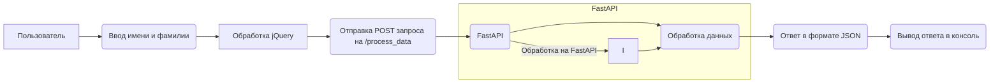

# <input code>

```html
## \file hypotez/src/fast_api/html/index.html
# -*- coding: utf-8 -*-
#! venv/Scripts/python.exe

""" module: src.fast_api.html """
MODE = 'debug'
<!DOCTYPE html>
<html lang="en">
<head>
    <meta charset="UTF-8">
    <meta name="viewport" content="width=device-width, initial-scale=1.0">
    <title>Форма для отправки данных</title>
    <!-- Подключаем Bootstrap CSS -->
    <link rel="stylesheet" href="https://maxcdn.bootstrapcdn.com/bootstrap/4.5.2/css/bootstrap.min.css">
</head>
<body>

    <div class="container">
        <h2>Форма для отправки данных</h2>
        <!-- Форма для ввода данных -->
        <form id="dataForm">
            <div class="form-group">
                <label for="firstName">Имя:</label>
                <input type="text" class="form-control" id="firstName" placeholder="Введите имя" required>
            </div>
            <div class="form-group">
                <label for="lastName">Фамилия:</label>
                <input type="text" class="form-control" id="lastName" placeholder="Введите фамилию" required>
            </div>
            <button type="submit" class="btn btn-primary">Отправить</button>
        </form>
    </div>

    <!-- Подключаем jQuery -->
    <script src="https://ajax.googleapis.com/ajax/libs/jquery/3.5.1/jquery.min.js"></script>

    <script>
        // Обработчик события отправки формы
        $('#dataForm').submit(function(event) {
            // Предотвращаем стандартное поведение формы
            event.preventDefault();

            // Получаем данные из полей ввода
            var firstName = $('#firstName').val();
            var lastName = $('#lastName').val();

            // Отправляем данные на сервер
            $.ajax({
                type: 'POST',
                url: '/process_data',  // Замените '/process_data' на URL вашего FastAPI эндпоинта
                contentType: 'application/json',
                data: JSON.stringify({first_name: firstName, last_name: lastName}),
                success: function(response) {
                    // Обработка успешного ответа от сервера
                    console.log('Ответ от сервера:', response);
                    // Дополнительные действия по необходимости
                },
                error: function(xhr, status, error) {
                    // Обработка ошибки
                    console.error('Ошибка при отправке данных:', error);
                }
            });
        });
    </script>

</body>
</html>
```

# <algorithm>

```mermaid
graph TD
    A[Пользователь вводит имя и фамилию] --> B{Получение данных из формы};
    B --> C[Отправка POST запроса];
    C --> D{Обработка на сервере (FastAPI)};
    D --> E[Возврат данных от сервера];
    E --> F[Вывод ответа в консоль];
    style B fill:#f9f,stroke:#333,stroke-width:2px
    style C fill:#ccf,stroke:#333,stroke-width:2px
    style D fill:#ccf,stroke:#333,stroke-width:2px
    style E fill:#ccf,stroke:#333,stroke-width:2px

    subgraph "Пример данных"
        B --> |Имена, Фамилии|  G;
        G --> C;
        C --> |POST запрос JSON| D;

    end
```

# <mermaid>



# <explanation>

**1. Импорты:**
В этом файле нет импортов, так как это HTML-код, который содержит JavaScript для взаимодействия с FastAPI сервером.


**2. Классы:**
Нет классов.


**3. Функции:**
Нет функций в данном HTML-файле, но есть анонимная функция в JavaScript:

- `$('#dataForm').submit(function(event) {...})`: Обработчик события отправки формы.  При нажатии кнопки "Отправить" выполняет ряд действий.


**4. Переменные:**
- `firstName`, `lastName`:  Переменные, содержащие значения из полей ввода формы. 
- `event`: Переменная, содержащая данные о событии отправки формы.


**5. Объяснение кода:**

Этот HTML-файл определяет форму для ввода имени и фамилии.  JavaScript код использует jQuery для:
- Отслеживания события отправки формы (`submit`).
- Извлечения значений из полей формы.
- Формирования JSON данных для отправки POST запроса на сервер `/process_data`.
- Обработки ответа от сервера.

**6. Связь с другими частями проекта:**

Этот HTML-код взаимодействует с FastAPI сервером.  В файле  `/process_data` на сервере должен быть определен `Endpoint`, который ожидает POST запросы с данными `first_name` и `last_name`, получает данные, обрабатывает их и возвращает ответ в формате JSON.

**7. Возможные ошибки и улучшения:**

- **Необходимо определить `/process_data` эндпоинт на сервере FastAPI**, иначе запрос не будет обрабатываться.
- **Обработка ошибок на сервере** (например, если данные не валидные).
- **Валидация данных** на стороне клиента (перед отправкой на сервер).
- **Использование AJAX для предотвращения перезагрузки страницы**
- **Добавление уведомлений об успехе/ошибке**, чтобы отображать пользователю информацию.
- **Оптимизация  респонса сервера**:  Замена `console.log` на отображения сообщений пользователю (например, в `div` или используя алерт).
- **Лучшее имя для переменной:** использовать `$` в переменных внутри JavaScript, не совсем очевидно, что это jQuery элементы, например, `$firstName` или `$form`.


Этот HTML-код – это клиентская часть приложения.  Он представляет собой интерфейс для ввода данных.  Без соответствующего серверного компонента (FastAPI endpoint `/process_data`) функциональность не будет полной.