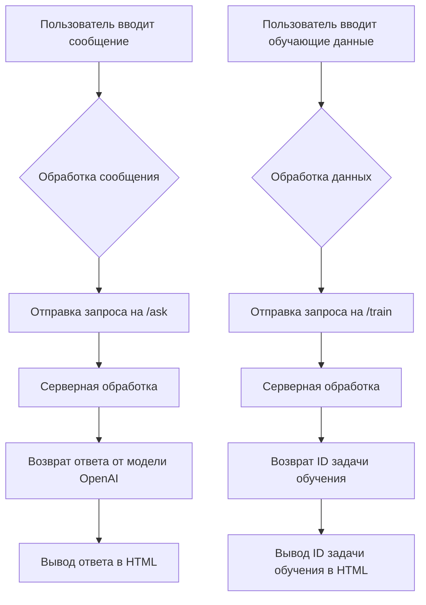

# Анализ кода HTML страницы для взаимодействия с моделью OpenAI

## <input code>

```html
<!-- Код HTML страницы -->
<!-- ... (код HTML страницы) ... -->
```

## <algorithm>



**Описание алгоритма:**

1. **Ввод сообщения/обучающих данных:** Пользователь вводит сообщение для модели или обучающие данные в формате CSV.
2. **Обработка ввода:** JavaScript код обрабатывает введенные данные.
3. **Отправка запроса:** JavaScript код отправляет POST-запрос на сервер с данными. Маршруты `/ask` и `/train` - это предположительно API-эндпоинты для взаимодействия с моделью.
4. **Обработка на сервере:** Серверный код обрабатывает запрос, взаимодействует с API OpenAI.  Для `/ask` - это запрос к модели, а для `/train` - обучение модели.
5. **Возврат ответа:** Сервер возвращает данные в JSON формате, содержащие ответ модели или ID задачи обучения.
6. **Вывод ответа:** JavaScript код обрабатывает полученный ответ и отображает его на странице в соответствующих областях.

## <mermaid>

```mermaid
graph LR
    A[index.html] --> B(AngularJS);
    B --> C{$http};
    C --> D[/ask];
    D --> E[API OpenAI];
    E --> F[Ответ модели];
    F --> G[Вывод в index.html];

    A --> H(AngularJS);
    H --> I[/train];
    I --> J[API Обработки данных];
    J --> K[ID задачи];
    K --> L[Вывод в index.html];
```

**Объяснение зависимостей:**

* `index.html`: HTML-страница, использующая AngularJS для взаимодействия с пользователем.
* `AngularJS`: JavaScript фреймворк для создания динамических веб-приложений.
* `$http`: AngularJS сервис для отправки HTTP запросов.
* `/ask`, `/train`: API-эндпоинты на серверной стороне для работы с моделью OpenAI и обучения.
* `API OpenAI`: Сервисы для взаимодействия с моделью OpenAI.
* `API Обработки данных`: Серверная обработка для обучения модели.

## <explanation>

**Импорты:**

Нет явных импортов в данном коде.  Но используются внешние библиотеки: Bootstrap (CSS стили), AngularJS (JavaScript фреймворк), jQuery и Popper.js (для Bootstrap). Эти библиотеки импортируются через ссылки на внешние ресурсы.

**Классы:**

Код использует `MainController`, управляемый AngularJS.  Он не является самостоятельным классом в классическом ООП смысле, а скорее контроллером для обработки событий (ng-click).

**Функции:**

* `vm.askModel()`: Отправляет POST-запрос на `/ask` с сообщением и системой инструкций для модели OpenAI. Обрабатывает ответ и отображает его в `vm.response`.  Обрабатывает возможные ошибки и выводит их в response.
* `vm.trainModel()`: Отправляет POST-запрос на `/train` с обучающими данными (CSV-строка) и флагом `positive`.  Возвращаемое значение – `job_id` задачи обучения, выводимое в `vm.jobId`. Обрабатывает ошибки.

**Переменные:**

* `vm.message`, `vm.systemInstruction`, `vm.trainingData`: Хранят введенные пользователем данные.
* `vm.response`, `vm.jobId`: Хранят данные, возвращаемые сервером.

**Возможные ошибки/улучшения:**

* **Защита от невалидных данных:** Не хватает проверки корректности формата обучающих данных (CSV), например, на сервере.
* **Обработка ошибок на стороне сервера:**  Необходимо более полная обработка ошибок на сервере.
* **Управление состоянием:** В JavaScript части не хватает обработки состояний (например, `isLoading`).  Важно показывать пользователю, что происходит процесс.
* **Безопасность:** На сервере нужно защитить от XSS атак.
* **Форматирование ответа:** Сервер должен возвращать стандартизированные JSON ответы для корректной обработки AngularJS.
* **Обработка больших данных:** Для обучения больших объемов данных желательно использовать асинхронные запросы или разбиение данных для предотвращения блокировок браузера.
* **Автодополнение:** Добавление автодополнения в поля ввода может улучшить пользовательский опыт.
* **Валидация данных:** Необходимо добавить валидацию данных на стороне клиента, чтобы избежать некорректных запросов.
* **Модульность:** AngularJS приложение можно сделать более модульным для улучшения масштабируемости и повторного использования.
* **Асинхронность:** Использование `async/await` в `vm.askModel` и `vm.trainModel` повысит читаемость и упростит управление асинхронными операциями.


**Взаимосвязь с другими частями проекта:**

Этот код зависит от серверной части (`/ask` и `/train`), которая должна быть реализована для обработки запросов и взаимодействия с моделью OpenAI и системой обучения.  Необходимо приложение на базе FastAPI, которое обрабатывает эти запросы и взаимодействует с API OpenAI (или другим API).  Вероятно, существует отдельный серверный файл, содержащий эти функции.