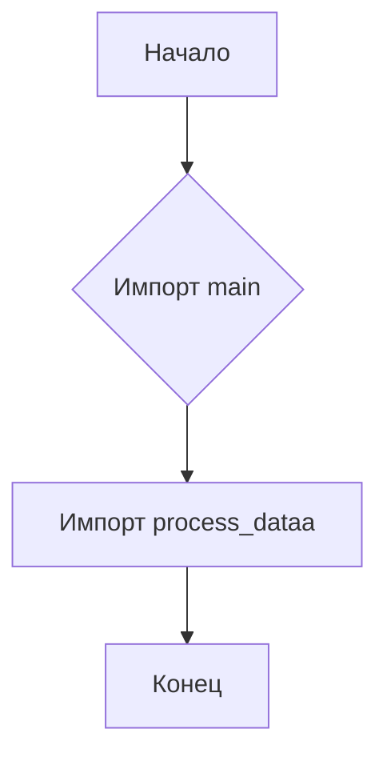
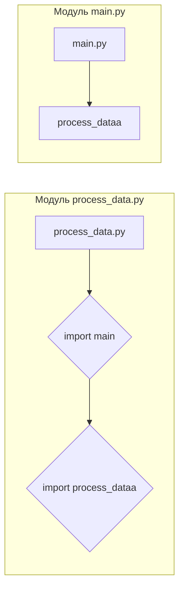

```MD
# Анализ кода process_data.py

1. **<input code>**:

```python
## \file hypotez/src/fast_api/html/process_data.py
# -*- coding: utf-8 -*-
#! venv/Scripts/python.exe
#! venv/bin/python/python3.12

"""
.. module: src.fast_api.html 
	:platform: Windows, Unix
	:synopsis:

"""
MODE = 'dev'

"""
	:platform: Windows, Unix
	:synopsis:

"""


"""
	:platform: Windows, Unix
	:synopsis:

"""


"""
  :platform: Windows, Unix

"""
"""
  :platform: Windows, Unix
  :platform: Windows, Unix
  :synopsis:
"""MODE = 'dev'
  
""" module: src.fast_api.html """


""" @namespace src.fast_api.html """
from .. import main
from main import process_dataa
```

2. **<algorithm>**:

Код представляет собой импорт функций из модуля `main`.  Алгоритм работы в данном случае сводится к импорту и, скорее всего, последующему вызову функции `process_dataa` из модуля `main`. Блок-схема крайне простая:



Пример:
Если `process_dataa` ожидает какие-либо данные (например, из запроса), то эти данные будут переданы в `process_dataa` в момент ее вызова.  Результат работы `process_dataa` затем будет обрабатываться дальше.


3. **<mermaid>**:



**Объяснение диаграммы:**

Модуль `process_data.py` импортирует модуль `main.py` и функцию `process_dataa` из него.  Стрелки отображают направление данных (в данном случае - зависимость импорта).


4. **<explanation>**:

* **Импорты**:
    * `from .. import main`:  Импортирует модуль `main`, который, предположительно, находится в папке выше текущего каталога (`../`). Это стандартный способ импорта модулей в Python, когда файлы находятся вложенными структурами. Важно, что директория `main` должна содержать файл с функцией `process_dataa`.
    * `from main import process_dataa`: Импортирует функцию `process_dataa` непосредственно из модуля `main`.  Это позволяет использовать функцию `process_dataa` в модуле `process_data.py`.

* **Классы**:  Нет никаких классов в представленном коде.

* **Функции**:
    *  `process_dataa`: Эта функция импортируется, но ее реализация не показана.  Без понимания определения `process_dataa` нельзя определить, как она работает, какие данные принимает на вход и что возвращает.

* **Переменные**:
    * `MODE = 'dev'`:  Переменная, скорее всего, определяет режим работы (например, "development" или "production"), но без дополнительной информации о контексте, ее назначение неясно.

* **Возможные ошибки или области для улучшений**:
    * Отсутствует документация к функциям (docstrings), что усложняет понимание их использования.
    * Постоянно повторяющиеся строки с документацией (`"""..."""`), могут быть изменены на более читабельный и эффективный способ документирования функций (напр., использование Sphinx).
    * Не совсем понятен контекст использования.  Важно понимать, где будет вызываться функция `process_dataa` и какие данные она будет обрабатывать.

* **Цепочка взаимосвязей**:
    Модуль `process_data.py` зависит от `main.py` для доступа к `process_dataa`.  Более подробные взаимосвязи зависят от того, как `process_data.py` будет вызываться и использовать функцию `process_dataa`.  Возможно, `process_dataa` и другие функции модуля `main.py` обрабатывают данные, полученные из каких-то источников, и записывают результаты куда-то.


**Заключение:**

Код представляет собой простой импорт функций из другого модуля,  предполагая, что модуль `main` содержит логику, которая обрабатывает данные, вероятно, в контексте веб-приложения, использующего FastAPI.  Для более полного анализа требуется код `main.py`.