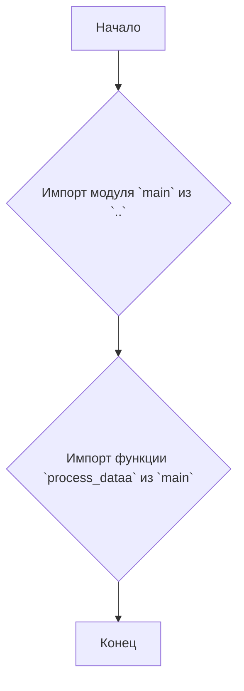
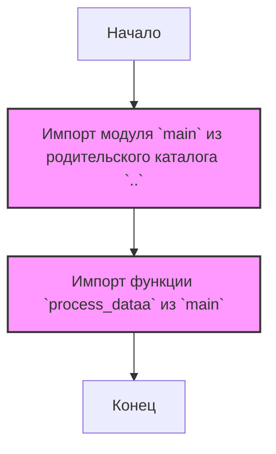

## Анализ кода `hypotez/src/fast_api/html/process_data.py`

### 1. <алгоритм>

**Блок-схема:**



**Пример:**

1.  **Импорт модуля `main`**: Код пытается импортировать модуль `main` из родительского каталога (`..`).
    *   Предположим, что структура каталогов выглядит как:
        ```
        hypotez/
        ├── src/
        │   ├── fast_api/
        │   │   ├── html/
        │   │   │   └── process_data.py
        │   │   └── main.py
        ```
    *   В этом случае, `from .. import main` импортирует `hypotez/src/fast_api/main.py`.
2.  **Импорт функции `process_dataa`**: После успешного импорта `main`, из него импортируется функция `process_dataa`.
    *   Пример кода в `main.py`:
        ```python
        # main.py
        def process_dataa():
            print("Обработка данных в main.py")
        ```
    *   Теперь в `process_data.py` можно использовать функцию `process_dataa`.

### 2. <mermaid>



**Объяснение зависимостей:**

1.  **Импорт модуля `main`**: Импортирует модуль `main`, находящийся на уровень выше в иерархии каталогов. Это делается для доступа к функциональности, определенной в модуле `main`.
2.  **Импорт функции `process_dataa`**: Импортирует конкретную функцию `process_dataa` из модуля `main`. Это позволяет использовать функцию `process_dataa` непосредственно в файле `process_data.py` без необходимости ссылаться на `main`.

### 3. <объяснение>

**Импорты:**

*   `from .. import main`: Этот импорт позволяет получить доступ к модулю `main.py`, находящемуся в родительском каталоге текущего модуля. Двойные точки `..` обозначают переход на один уровень вверх в иерархии каталогов. Это устанавливает связь между текущим модулем `process_data.py` и модулем `main.py`.
*   `from main import process_dataa`: Импортирует функцию `process_dataa` из модуля `main`, что позволяет использовать её в текущем файле. `process_dataa` предположительно занимается какой-то обработкой данных, и этот импорт делает эту функцию доступной в контексте файла `process_data.py`.

**Классы:**

*   В данном коде нет классов.

**Функции:**

*   В данном коде не определены собственные функции. Единственная используемая функция - `process_dataa`, импортирована из `main.py`.
    *   **Аргументы**: На основе импорта, функция `process_dataa` не принимает аргументов.
    *   **Возвращаемое значение**: Неизвестно, так как функция определена в `main.py`, но предполагается, что она может возвращать значение, но это не используется в данном файле.
    *   **Назначение**: По имени можно предположить, что `process_dataa` занимается обработкой данных. Подробности зависят от реализации в `main.py`.
    *   **Пример**:
        ```python
        # Вызов process_dataa
        process_dataa()
        ```

**Переменные:**

*   В этом коде нет явно объявленных переменных.

**Цепочка взаимосвязей:**

1.  `process_data.py` зависит от `main.py`.
2.  `process_data.py` импортирует модуль `main` и функцию `process_dataa`, таким образом используя функциональность, предоставляемую `main.py`.

**Потенциальные ошибки и области для улучшения:**

*   **Отсутствие обработки импортированных функций:** В представленном коде импортируется функция `process_dataa`, но не используется. Это может быть неполным кодом.
*   **Отсутствие конкретного использования:** Код только импортирует, но не показывает, как используются импортированные функции. Это не позволяет понять полную картину работы модуля.
*   **Отсутствие документации:** Нет docstring для модуля `process_data.py`, не понятно, что именно он делает и для чего он предназначен.
*   **Комментарии**: Много избыточных комментариев.

**Улучшения**:

*   **Добавить использование импортированной функции `process_dataa`**: Для демонстрации работы.
*   **Добавить docstring**: Для описания назначения модуля.
*   **Удалить лишние комментарии**: Упростить читаемость кода.
*   **Добавить обработку ошибок:** Если, например, `process_dataa` может вызывать исключения.