## Анализ кода `hypotez/src/fast_api/main.first_version.py`

### 1. <алгоритм>
1. **Инициализация приложения FastAPI:**
   - Создается экземпляр `FastAPI` как `app`.
   - Монтируется директория `html` как статическое содержимое по корневому пути `/`, чтобы можно было отображать `index.html`.
   - Открывается `index.html` в браузере пользователя.
   - *Пример:* `app = FastAPI()` создает основное приложение, `app.mount("/", StaticFiles(directory="html"), name="html")` позволяет обращаться к файлам в `html`.

2. **Обработка POST-запроса на `/process_data`:**
   - Функция `process_data` обрабатывает POST-запросы, которые передают данные формы (имя и фамилию).
   - Проверяется наличие `first_name` и `last_name`. Если какие-то из них отсутствуют, возвращается ошибка `HTTPException` с кодом 400.
   - Формируется строка `input_data` из имени и фамилии.
   - Определяется путь к скрипту `script.py`.
   - Выполняется скрипт `script.py` через `Popen` с переданными `input_data` как ввод.
   - Результат выполнения (стандартный вывод) и ошибки (стандартный вывод ошибок) перехватываются.
   - Проверяется код возврата процесса. Если он не равен 0, возвращается ошибка `HTTPException` с кодом 500 и сообщением об ошибке.
   - В случае успеха возвращается JSON с результатом выполнения скрипта.
   - *Пример:* POST запрос с телом `{"first_name": "John", "last_name": "Doe"}` приводит к выполнению `script.py` со входными данными "John Doe".

3. **Обработка GET-запроса на `/`:**
   - Функция `open_index` обрабатывает GET-запросы к корневому пути `/`.
   - Функция возвращает JSON с сообщением о перенаправлении на `index.html`.
   - *Пример:* Запрос GET на `http://localhost:8000/` возвращает сообщение "Redirecting to index.html...".

**Поток данных:**
1. Браузер отправляет GET-запрос на `/`.
2. Сервер возвращает JSON с сообщением о перенаправлении.
3. Браузер автоматически открывает `index.html` из статического каталога.
4. Пользователь заполняет форму в `index.html` и отправляет POST-запрос на `/process_data`.
5. Функция `process_data` обрабатывает данные формы, вызывая скрипт `script.py` и возвращая результат в JSON.
6. Браузер отображает результат.

```mermaid
graph LR
    A[FastAPI Application] --> B(Mount Static Files);
    B --> C(Open Browser to index.html);
    C --> D{User Input via Form in index.html};
    D -- POST to /process_data --> E[process_data Function];
    E -- Validate Input --> F{Check Input};
    F -- Invalid --> G[Return HTTP Error 400];
    F -- Valid --> H(Format input_data String);
    H --> I[Execute script.py];
    I -- Captures stdOut & stdErr-->J{Check Return Code}
    J -- Error --> K[Return HTTP Error 500];
    J -- Success --> L(Return Output as JSON);
    L --> M[Browser Displays JSON Output];
     A --> N{User Sends GET Request to /}
     N --> O[open_index Function]
     O --> P[Return Message with JSON]
     P --> Q[Browser Redirects]
    
   
   
  
    style A fill:#f9f,stroke:#333,stroke-width:2px
    style B fill:#ccf,stroke:#333,stroke-width:2px
    style C fill:#ccf,stroke:#333,stroke-width:2px
    style D fill:#ccf,stroke:#333,stroke-width:2px
    style E fill:#f9f,stroke:#333,stroke-width:2px
    style F fill:#f9f,stroke:#333,stroke-width:2px
    style G fill:#f9f,stroke:#333,stroke-width:2px
    style H fill:#f9f,stroke:#333,stroke-width:2px
    style I fill:#f9f,stroke:#333,stroke-width:2px
     style J fill:#f9f,stroke:#333,stroke-width:2px
    style K fill:#f9f,stroke:#333,stroke-width:2px
    style L fill:#f9f,stroke:#333,stroke-width:2px
     style M fill:#f9f,stroke:#333,stroke-width:2px
     style N fill:#ccf,stroke:#333,stroke-width:2px
     style O fill:#f9f,stroke:#333,stroke-width:2px
     style P fill:#f9f,stroke:#333,stroke-width:2px
      style Q fill:#f9f,stroke:#333,stroke-width:2px
```

### 2. <mermaid>

**Объяснение зависимостей Mermaid:**
-   `FastAPI Application` является отправной точкой, представляя собой основной экземпляр приложения.
-   `Mount Static Files`  устанавливает связь с файлами HTML, CSS и JS, позволяя их загрузку в браузере.
-   `Open Browser to index.html`  представляет собой действие по открытию браузера со страницей `index.html`.
-   `User Input via Form in index.html`  представляет собой действие пользователя по заполнению формы.
-   `process_data Function`  представляет собой функцию, принимающую данные из формы.
-   `Check Input`  представляет собой проверку наличия входных данных.
-   `Return HTTP Error 400`  представляет собой реакцию на некорректные входные данные, возвращая код ошибки HTTP 400.
-    `Format input_data String`  представляет собой форматирование данных для передачи в скрипт Python.
-   `Execute script.py` представляет собой выполнение скрипта `script.py` с переданными входными данными.
-    `Captures stdOut & stdErr` представляет собой перехват стандартного вывода и стандартного вывода ошибок
-   `Check Return Code`  представляет собой проверку кода возврата скрипта для выявления ошибок.
-   `Return HTTP Error 500`  представляет собой реакцию на ошибку выполнения скрипта, возвращая код ошибки HTTP 500.
-   `Return Output as JSON`  представляет собой форматирование вывода скрипта в JSON.
-   `Browser Displays JSON Output`  представляет собой отображение JSON ответа в браузере.
-    `User Sends GET Request to /`  представляет собой запрос пользователя на корневой путь.
-   `open_index Function`  представляет собой функцию, принимающую запрос на корневой путь.
-   `Return Message with JSON` представляет собой возвращение сообщения в виде JSON
-   `Browser Redirects`  представляет собой перенаправление браузера.

### 3. <объяснение>

**Импорты:**
-   `os`: Используется для взаимодействия с операционной системой, хотя в данном коде напрямую не применяется. Возможно, оставлен для будущего использования.
-   `subprocess`: Модуль для запуска внешних процессов. Используется для запуска скрипта `script.py`.
-   `webbrowser`: Модуль для открытия веб-страниц в браузере по умолчанию. Используется для открытия `index.html` при запуске приложения.
-   `pathlib.Path`:  Модуль для работы с путями файлов и директорий. Используется для определения пути к скрипту `script.py`.
-   `fastapi.FastAPI`: Основной класс FastAPI для создания веб-приложения.
-   `fastapi.Form`: Используется для получения данных из HTML-форм.
-   `fastapi.Request`: Используется для доступа к объекту запроса.
-   `fastapi.HTTPException`: Используется для возврата ошибок HTTP.
-   `subprocess.Popen, subprocess.PIPE`: Используются для управления дочерними процессами и их ввода/вывода.
-   `fastapi.staticfiles.StaticFiles`: Используется для обслуживания статических файлов, таких как HTML, CSS, JS.

**Классы:**
-   `FastAPI`:
    -   `app`: Экземпляр класса FastAPI. Используется для определения роутов (маршрутов) и обработки запросов.

**Функции:**

-   `process_data(request: Request, first_name: str = Form(...), last_name: str = Form(...))`:
    -   **Аргументы:**
        -   `request`: Объект запроса FastAPI, содержащий информацию о входящем запросе.
        -   `first_name`: Имя, полученное из формы (тип `str`).
        -   `last_name`: Фамилия, полученная из формы (тип `str`).
    -   **Возвращаемое значение:**
        -   `dict`: JSON-ответ, содержащий результат выполнения скрипта или сообщение об ошибке.
    -   **Назначение:**
        -   Обрабатывает POST-запросы к `/process_data`, принимает имя и фамилию из формы, выполняет скрипт `script.py` с этими данными и возвращает результат.
    -   **Пример:**
        -   Входящий POST запрос с телом: `{"first_name": "Alice", "last_name": "Smith"}`
        -   Вызывает `script.py` с входными данными "Alice Smith". Возвращает JSON, содержащий результат выполнения `script.py` или HTTP ошибку 400/500.

-   `open_index()`:
    -   **Аргументы:** Нет.
    -   **Возвращаемое значение:**
        -  `dict`: JSON-ответ с сообщением о перенаправлении.
    -   **Назначение:**
        -   Обрабатывает GET-запросы к `/` и возвращает сообщение о перенаправлении на index.html.
    -   **Пример:**
        -   Запрос GET на `http://localhost:8000/` возвращает JSON `{"message": "Redirecting to index.html..."}`.

**Переменные:**
-   `MODE`: Строковая переменная, установлена в `dev`. Возможно, используется для определения режима работы приложения.
-   `app`: Экземпляр класса `FastAPI`, представляющий собой веб-приложение.
-   `script_path`: Объект `Path`, представляющий абсолютный путь к скрипту `script.py`.
-   `process`: Объект `Popen`, представляющий запущенный дочерний процесс `script.py`.
-   `stdout, stderr`: Переменные для хранения стандартного вывода и стандартного вывода ошибок дочернего процесса.
-   `input_data`: Строка, сформированная из `first_name` и `last_name`, используется как ввод для `script.py`.

**Потенциальные ошибки и области для улучшения:**
-   **Отсутствие валидации ввода:** Входные данные `first_name` и `last_name` никак не валидируются. Необходимо добавить валидацию типов и допустимых значений.
-   **Обработка ошибок:** Ошибки, возвращаемые `script.py`, могут быть более информативными. Можно добавить логирование или возвращать более детальные сообщения об ошибках.
-   **Зависимость от `script.py`:** Приложение сильно зависит от внешнего скрипта `script.py`. Необходимо обеспечить его наличие и корректную работу. Можно добавить проверку наличия скрипта перед запуском.
-   **Безопасность:**  Запуск внешних процессов с пользовательским вводом может быть небезопасным. Необходимо проверить `script.py` и входные данные на потенциальные уязвимости.
-   **Развертывание:** Жесткое кодирование пути к `script.py` не подходит для развертывания. Лучше использовать относительные пути или переменные окружения.
-   **Отсутствие документации:** Код не имеет комментариев, объясняющих назначение каждой части.

**Цепочка взаимосвязей:**
1.  **Браузер** (клиент) отправляет запросы к **FastAPI** (сервер).
2.  **FastAPI** обрабатывает запросы через роуты и функции.
3.  Функция `process_data` запускает **`script.py`** как дочерний процесс.
4.  **`script.py`** обрабатывает данные и возвращает результат.
5.  **FastAPI** возвращает результат в браузер.
6.  Функция `open_index` перенаправляет браузер на статический файл `index.html`.
7.  Браузер отображает **`index.html`**.
8.  Статические файлы из каталога `html` обслуживаются FastAPI.

В данной структуре, `FastAPI` выступает как связующее звено между браузером пользователя и выполняемым Python скриптом, обеспечивая интерфейс для обмена данными и отображения результатов.