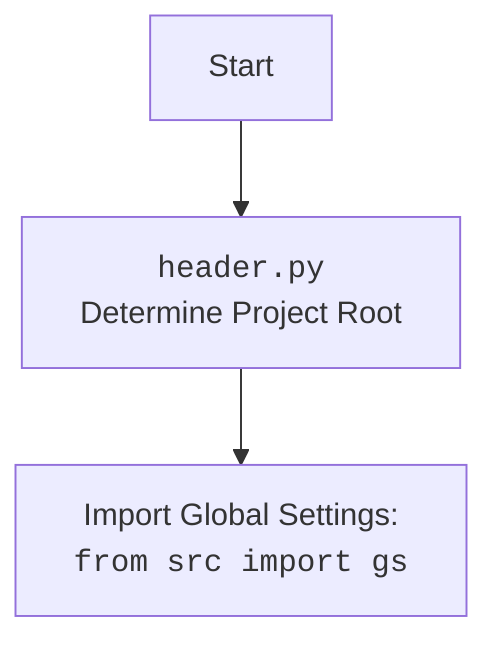

## Анализ кода `hypotez/src/fast_api/openai.py`

### 1. <алгоритм>

**Блок-схема:**

```mermaid
graph LR
    A[Start] --> B{Initialize FastAPI Application};
    B --> C[Mount Static Files: <br> `app.mount("/static", ...)`];
    C --> D[Add CORS Middleware];
    D --> E{Initialize OpenAIModel};
    E --> F{Define `AskRequest` Pydantic Model};
    F --> G{Define Root Endpoint: <br> `@app.get("/", response_class=HTMLResponse)`};
    G --> H{Define Ask Endpoint: <br> `@app.post("/ask")`};
    H --> I{Start Server: <br> `if __name__ == "__main__": uvicorn.run(app, ...)`};
    
    subgraph "Root Endpoint (`/`)"
        G --> G1[Serve `index.html` file]
        G1 --> G2{Error Handling: `try...except`}
        G2 -- Error --> G3[Log Error]
        G3 --> G4[Raise HTTPException]
        G2 -- Success --> G5[Return HTMLResponse]
    end
    
    subgraph "Ask Endpoint (`/ask`)"
        H --> H1[Get Request Data: <br> `AskRequest` model]
        H1 --> H2{Call `model.ask()` method}
        H2 --> H3{Error Handling: `try...except`}
        H3 -- Error --> H4[Log Error]
        H4 --> H5[Raise HTTPException]
        H3 -- Success --> H6[Return Response: <br> `{"response": response}`]
    end
    I --> J[End]
```

**Примеры для логических блоков:**

*   **B (Initialize FastAPI Application):** Создается экземпляр `app = FastAPI()`.
*   **C (Mount Static Files):**  `app.mount("/static", StaticFiles(directory=gs.path.src / 'fast_api' / 'html' / 'openai_training'), name="static")`. Это делает доступными статические файлы (например, HTML, CSS, JS) из указанной директории по URL-пути `/static`.
    *   Пример: обращение к `http://127.0.0.1:8000/static/styles.css` вернет файл `styles.css` из папки `hypotez/src/fast_api/html/openai_training`.
*   **D (Add CORS Middleware):** `app.add_middleware(CORSMiddleware, allow_origins=["*"], ...)`. Это позволяет обрабатывать запросы с любых источников, что полезно при разработке веб-интерфейсов, которые могут быть расположены на другом домене.
*   **E (Initialize OpenAIModel):** Создаётся экземпляр класса `model = OpenAIModel()`, который отвечает за взаимодействие с моделью OpenAI.
*   **F (Define `AskRequest` Pydantic Model):**  Определяется структура данных для запроса к эндпоинту `/ask` с помощью Pydantic BaseModel: `class AskRequest(BaseModel): message: str; system_instruction: str = None`.
    *   Пример: `{"message": "Привет, как дела?", "system_instruction": "Отвечай вежливо"}`.
*   **G (Define Root Endpoint):** `@app.get("/", response_class=HTMLResponse)`. Это обрабатывает GET-запросы к корневому URL (`/`) и возвращает HTML-страницу.
    *   Пример: обращение к `http://127.0.0.1:8000/` вернёт HTML файл `index.html`
*   **H (Define Ask Endpoint):** `@app.post("/ask")`. Это обрабатывает POST-запросы к `/ask` и передает запрос в модель OpenAI.
    *   Пример: POST-запрос с JSON-телом `{"message": "расскажи анекдот", "system_instruction": "будь весёлым"}`.
*   **I (Start Server):** `uvicorn.run(app, host="127.0.0.1", port=8000)`. Запускает Uvicorn сервер, обрабатывающий запросы к приложению FastAPI.

### 2. <mermaid>
```mermaid
flowchart TD
    Start --> FastAPIApp[FastAPI Application]
    FastAPIApp --> StaticFilesMount[Mount Static Files: <br> <code>app.mount("/static", ...)</code>]
    StaticFilesMount --> CORSMiddlewareSetup[CORS Middleware Setup: <br> <code>app.add_middleware(...)</code>]
    CORSMiddlewareSetup --> OpenAIModelInit[Initialize OpenAI Model: <br> <code>model = OpenAIModel()</code>]
    OpenAIModelInit --> AskRequestModel[Define Pydantic Model: <br> <code>class AskRequest(BaseModel)</code>]
    AskRequestModel --> RootEndpoint[Define Root Endpoint: <br> <code>@app.get("/", response_class=HTMLResponse)</code>]
    RootEndpoint --> AskEndpoint[Define Ask Endpoint: <br> <code>@app.post("/ask")</code>]
    AskEndpoint --> UvicornServer[Start Uvicorn Server: <br> <code>uvicorn.run(app, ...)</code>]
    UvicornServer --> End
    
    style FastAPIApp fill:#f9f,stroke:#333,stroke-width:2px
    style UvicornServer fill:#ccf,stroke:#333,stroke-width:2px
```

**Объяснение зависимостей (mermaid):**

*   `FastAPIApp` (FastAPI Application): Основной компонент, представляющий FastAPI приложение.
*   `StaticFilesMount`: Монтирует директорию со статическими файлами для их обслуживания через веб.
*   `CORSMiddlewareSetup`: Настраивает middleware для CORS, что позволяет делать запросы из браузера с разных доменов.
*   `OpenAIModelInit`: Инициализирует экземпляр класса `OpenAIModel`, который инкапсулирует логику взаимодействия с OpenAI API.
*   `AskRequestModel`: Определяет структуру данных для запросов к эндпоинту `/ask` с помощью Pydantic BaseModel.
*   `RootEndpoint`: Определяет обработчик для GET-запросов к корневому пути (`/`), который возвращает HTML-страницу.
*   `AskEndpoint`: Определяет обработчик для POST-запросов к пути `/ask`, который принимает запрос пользователя и возвращает ответ модели.
*   `UvicornServer`: Запускает Uvicorn сервер, который обрабатывает HTTP-запросы к FastAPI-приложению.

### 3. <объяснение>

**Импорты:**

*   `import header`: Импортирует модуль `header.py` для определения корневого каталога проекта и загрузки глобальных настроек.
*   `from fastapi import FastAPI, HTTPException`: Импортирует класс `FastAPI` для создания веб-приложения и класс `HTTPException` для обработки ошибок.
*   `from fastapi.middleware.cors import CORSMiddleware`: Импортирует middleware для обработки CORS (Cross-Origin Resource Sharing), позволяя делать запросы к серверу с разных доменов.
*    `from fastapi.staticfiles import StaticFiles`:  Импортирует класс `StaticFiles` для обслуживания статических файлов, таких как HTML, CSS, JavaScript.
*   `from fastapi.responses import HTMLResponse`:  Импортирует `HTMLResponse` для отправки HTML-ответов клиенту.
*   `from pydantic import BaseModel`:  Импортирует `BaseModel` из Pydantic для создания моделей данных, используемых для валидации запросов.
*   `from pathlib import Path`:  Импортирует класс `Path` из `pathlib` для работы с путями к файлам и директориям.
*   `import uvicorn`:  Импортирует Uvicorn, ASGI-сервер для запуска приложения FastAPI.
*   `from src import gs`: Импортирует глобальные настройки проекта (project root, settings etc.) из модуля `src`.
*   `from src.utils.jjson import j_loads_ns`: Импортирует функцию `j_loads_ns` из модуля `src.utils.jjson` для загрузки JSON с поддержкой комментариев.
*   `from src.logger.logger import logger`: Импортирует кастомный логгер из модуля `src.logger.logger`.
*   `from src.ai.openai.model.training import OpenAIModel`: Импортирует класс `OpenAIModel` для взаимодействия с OpenAI API.
*   `from src.gui.openai_trаiner import AssistantMainWindow`: Импортирует класс `AssistantMainWindow` из GUI.

**Классы:**

*   `FastAPI`: Класс для создания веб-приложения.
*   `CORSMiddleware`: Middleware для обработки CORS-запросов.
*  `StaticFiles`: Middleware для обработки и предоставления статических файлов
*   `HTMLResponse`: Класс для возврата HTML-ответа.
*   `BaseModel` (из Pydantic): Базовый класс для создания моделей данных, используемых для валидации и преобразования данных запросов.
*   `OpenAIModel`:  Класс, инкапсулирующий логику для работы с OpenAI API.
* `AskRequest`: Модель данных для запросов к эндпоинту `/ask`.

**Функции:**

*   `root()`:
    *   **Аргументы:** нет.
    *   **Возвращаемое значение:** HTML-ответ (объект `HTMLResponse`) с содержимым файла `index.html`, или `HTTPException` в случае ошибки.
    *   **Назначение:** Обрабатывает GET-запросы к корневому пути (`/`) и возвращает HTML-страницу для отображения в браузере.
    *   **Пример:** При обращении к `http://127.0.0.1:8000/` будет возвращен `index.html` файл.
*   `ask_model(request: AskRequest)`:
    *   **Аргументы:** `request` - экземпляр класса `AskRequest`, содержащий сообщение пользователя и системную инструкцию.
    *   **Возвращаемое значение:** JSON с ответом модели (`{"response": response}`), или `HTTPException` в случае ошибки.
    *   **Назначение:** Обрабатывает POST-запросы к эндпоинту `/ask`, отправляет запрос в OpenAI model и возвращает ответ.
    *   **Пример:**  POST-запрос с JSON-телом `{"message": "Что такое FastAPI?", "system_instruction": "Отвечай кратко"}` вызовет метод `model.ask()` с этими аргументами и вернет результат в виде JSON.

**Переменные:**

*   `MODE`: Строковая переменная, определяющая режим работы приложения (`'dev'`).
*   `app`: Экземпляр класса `FastAPI`, представляющий веб-приложение.
*   `model`: Экземпляр класса `OpenAIModel`, используемый для взаимодействия с моделью OpenAI.

**Потенциальные ошибки и области для улучшения:**

1.  **Обработка ошибок:** Используется `try...except` для обработки ошибок, но детализация ошибок могла бы быть улучшена. Например, можно было бы добавить более специфичные типы исключений и более подробные логи.
2.  **Конфигурация CORS:** Сейчас `allow_origins=["*"]` разрешает запросы с любых источников, что может быть небезопасно в продакшене. Необходимо настроить CORS более специфично для продакшн-среды.
3.  **Безопасность:**  Необходимо добавить аутентификацию и авторизацию для защиты API, если он должен использоваться вне локальной разработки.
4.  **Логирование:**  Логирование ведётся через кастомный класс `logger`,  но можно добавить более детальную информацию, например, время выполнения запросов.
5.  **Обработка ошибок при открытии файла:**  При открытии `index.html` обрабатывается любое исключение, но можно добавить обработку `FileNotFoundError`.
6.  **Модульность:**  Можно вынести логику работы с моделью OpenAI в отдельный сервис, чтобы сделать код более модульным.

**Цепочка взаимосвязей с другими частями проекта:**

1.  **`header.py`:**  Обеспечивает загрузку глобальных настроек проекта и определения его корня, которые используются для определения пути к статическим файлам.
2.  **`src.gs`:**  Содержит глобальные настройки проекта, такие как пути к файлам и директориям, которые используются при монтировании статических файлов.
3.  **`src.utils.jjson`:**  Предоставляет функцию `j_loads_ns` для загрузки JSON-конфигураций.
4.  **`src.logger.logger`:**  Предоставляет кастомный класс логгирования для записи информации о работе приложения.
5.  **`src.ai.openai.model.training`:** Содержит класс `OpenAIModel`, который инкапсулирует логику для работы с моделью OpenAI.
6.  **`src.gui.openai_trаiner`:** Содержит класс `AssistantMainWindow`, который предназначен для GUI приложения.

Таким образом, `openai.py` является центральным компонентом для работы с OpenAI API через FastAPI. Он зависит от других частей проекта для конфигурации, логгирования, и взаимодействия с моделью.