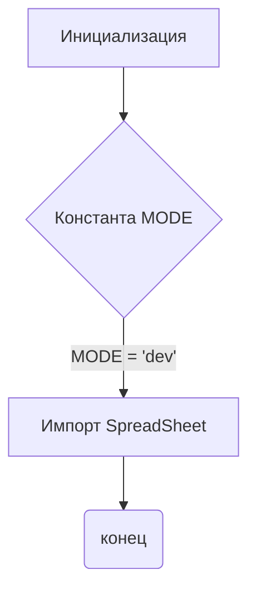
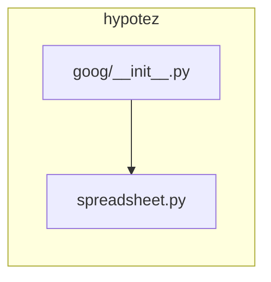

# <input code>

```python
## \file hypotez/src/goog/__init__.py
# -*- coding: utf-8 -*-
#! venv/Scripts/python.exe
#! venv/bin/python/python3.12

"""
.. module: src.goog 
	:platform: Windows, Unix
	:synopsis:

"""
MODE = 'dev'

from .spreadsheet import SpreadSheet
```

# <algorithm>

Этот код представляет собой инициализационный модуль для пакета `goog` в проекте `hypotez`.  Он не содержит сложного алгоритма, но устанавливает константу `MODE` и импортирует класс `Spreadsheet` из подмодуля `spreadsheet`.

**Блок-схема:**



**Примеры:**

*   **Инициализация:**  Модуль `goog` устанавливает значение переменной `MODE` равным 'dev'.
*   **Импорт:** Модуль `goog` подключает класс `Spreadsheet` из подмодуля `spreadsheet` в текущую область видимости.

Данные не передаются между функциями или классами в этом модуле.


# <mermaid>



**Объяснение диаграммы:**

Диаграмма показывает, что модуль `goog/__init__.py` импортирует класс `Spreadsheet` из модуля `spreadsheet.py`.  Это указывает на зависимость `goog` от `spreadsheet` в рамках проекта `hypotez`.


# <explanation>

* **Импорты:**
    `from .spreadsheet import SpreadSheet`: Этот импорт подключает класс `Spreadsheet` из подмодуля `spreadsheet` в текущем модуле `goog`. Символ `.` указывает на поиск модуля `spreadsheet` в том же пакете, что и текущий модуль `goog`.  Это типичная практика для организации структуры пакетов Python.


* **Классы:**
    `Spreadsheet`:  Этот класс (определенный в `spreadsheet.py`)  представляет собой, очевидно,  объект для работы с электронными таблицами Google (или подобными сервисами).  Подробная информация о его методах и атрибутах не видна из предоставленного фрагмента кода.


* **Функции:**
    Нет явных функций в данном файле.


* **Переменные:**
    `MODE = 'dev'`:  Это константа, которая, вероятно, определяет режим работы (например, 'dev' - для разработки, 'prod' - для производства).  Это переменная, которая не изменяется после инициализации.


* **Возможные ошибки или улучшения:**


    * **Документация:** Не хватает более подробной документации для переменной `MODE` и класса `Spreadsheet`.
    * **Типизация:**  Отсутствие аннотаций типов делает код менее читаемым и менее устойчивым к ошибкам.  Рекомендуется использовать аннотации типов (например, `MODE: str`).
    * **Дополнительная проверка:**  Можно добавить проверки, например, чтобы убедиться, что значение `MODE` соответствует ожидаемым вариантам.
    * **Обработка ошибок:** Если импорт `spreadsheet.py` может провалиться (например, если файл не найден или в нём есть синтаксические ошибки), следует добавить обработку исключений `ImportError`.


**Цепочка взаимосвязей с другими частями проекта:**

Модуль `goog` является частью проекта `hypotez` и зависит от модуля `spreadsheet`.  Вероятно, есть другие модули в `hypotez`, которые будут использовать класс `Spreadsheet` для работы с Google Таблицами.  Подробности о взаимодействии с другими частями проекта могут быть видны в других модулях пакета `hypotez`.