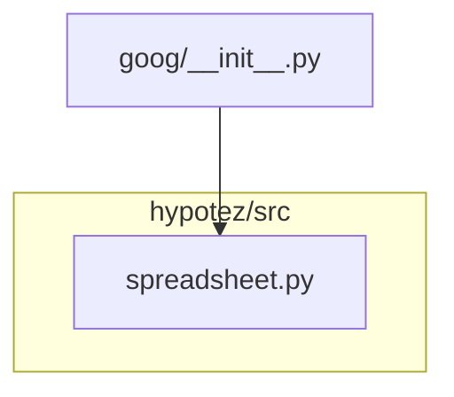

```MD
# Анализ файла hypotez/src/goog/__init__.py

1. **<input code>**:

```python
## \file hypotez/src/goog/__init__.py
# -*- coding: utf-8 -*-
#! venv/Scripts/python.exe
#! venv/bin/python/python3.12

"""
.. module: src.goog 
	:platform: Windows, Unix
	:synopsis:

"""
MODE = 'dev'

from .spreadsheet import SpreadSheet
```

2. **<algorithm>**:

Этот файл является инициализатором модуля `goog` в пакете `hypotez/src`.  Алгоритм работы здесь тривиален: он импортирует класс `Spreadsheet` из модуля `spreadsheet`.  По сути, это один шаг: импортировать необходимый модуль.

Пример:

Нет данных, которые передаются или обрабатываются в этом файле.


3. **<mermaid>**:



4. **<explanation>**:

* **Импорты**: `from .spreadsheet import SpreadSheet` импортирует класс `Spreadsheet` из подмодуля `spreadsheet`, находящегося в том же каталоге (`hypotez/src/goog`).  Символ `.` перед именем модуля указывает на поиск в текущем пакете.  Это ключевой элемент, показывающий, что `goog` и `spreadsheet` связаны.  Использование относительного импорта важно для структуры пакета и организации кода.
* **Классы**: Класс `Spreadsheet` (определенный в `spreadsheet.py`) - это центральный элемент, который, судя по имени, скорее всего отвечает за работу с электронными таблицами Google.
* **Функции**:  Нет функций, определенных напрямую в `goog/__init__.py`.  Логика работы реализуется через импортированный класс `Spreadsheet`.
* **Переменные**: `MODE = 'dev'` — константа, вероятно, определяющая режим работы программы (в данном случае, режим разработки `dev`).  Она имеет важное значение для настройки программы, но в данном файле не используется.
* **Возможные ошибки или области для улучшений**: 
    * Отсутствие документирования внутри кода для классов и функций может затруднить понимание кода.
    * В файле `__init__.py` не стоит включать информацию о платформе и синопсисе; это лучше разместить в документации для модуля.
    * В файле `__init__.py` отсутствуют тесты.

**Цепочка взаимосвязей**:

`goog/__init__.py` импортирует `spreadsheet.py`, которое, в свою очередь, может импортировать другие модули или классы из других пакетов, чтобы реализовать функциональность работы с Google Spreadsheets.  Без кода из `spreadsheet.py` сложно представить полную картину, но можно предположить, что это часть более крупного проекта, направленного на работу с данными Google Spreadsheets, используя библиотеку Google API.

**Рекомендации**:

Добавление Docstrings к классу `Spreadsheet` и любым другим функциям или классам, используемым в подмодуле `spreadsheet` сделает код более читабельным и поддерживаемым.  Важно также добавить тесты для проверки работоспособности кода.