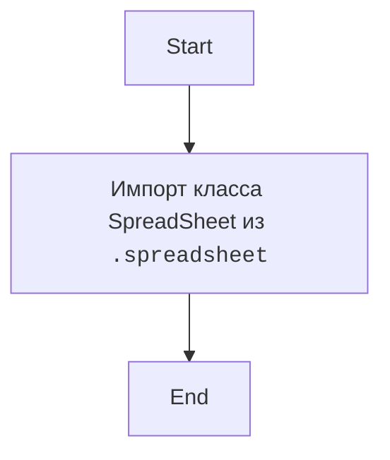

## Анализ кода `src/goog/__init__.py`

### 1. <алгоритм>

1.  **Начало**: Запуск скрипта `__init__.py` в пакете `src.goog`.
2.  **Импорт**: Импортирование класса `SpreadSheet` из модуля `spreadsheet.py`, находящегося в том же пакете `src.goog`.
    *   Пример: `from .spreadsheet import SpreadSheet` импортирует класс `SpreadSheet`, который можно использовать для работы с Google Spreadsheets.
3.  **Завершение**: Завершение выполнения скрипта. Теперь класс `SpreadSheet` доступен для использования в других модулях, импортирующих `src.goog`.

### 2. <mermaid>

**Объяснение:**

*   `Start`: Начало выполнения скрипта `__init__.py`.
*   `ImportSpreadsheet`: Импорт класса `SpreadSheet` из модуля `spreadsheet.py` внутри пакета `src.goog`. Это делает класс `SpreadSheet` доступным для использования в других модулях, импортирующих пакет `src.goog`.
*   `End`: Завершение выполнения скрипта `__init__.py`.

### 3. <объяснение>

*   **Импорты**:
    *   `from .spreadsheet import SpreadSheet`: Этот импорт делает класс `SpreadSheet` доступным в пакете `src.goog`. Точка `.` перед `spreadsheet` означает, что импортируемый модуль находится в том же пакете, что и `__init__.py`. `SpreadSheet`, вероятно, содержит логику для взаимодействия с Google Spreadsheets, такую как чтение, запись и обновление данных. Это обеспечивает модульность, разделяя код для работы со spreadsheet-ами от основного кода пакета `src.goog`.

*   **Классы**:
    *   `SpreadSheet`: Этот класс импортируется из `src.goog.spreadsheet`. Предположительно, он инкапсулирует логику для взаимодействия с Google Spreadsheets. Класс, скорее всего, имеет методы для аутентификации, чтения, записи, обновления и других операций над Google Spreadsheets. Взаимодействие с другими компонентами проекта: другие модули, импортирующие пакет `src.goog`, теперь могут создавать экземпляры класса `SpreadSheet` и использовать его методы для работы со spreadsheet-ами.

*   **Функции**:
    *   В данном файле нет функций. Весь код состоит из импорта.
*   **Переменные**:
    *   В данном файле нет переменных, т.к. единственная строка кода - импорт.

**Цепочка взаимосвязей с другими частями проекта:**

1.  Другие модули в проекте, импортирующие `src.goog`, могут использовать класс `SpreadSheet` для взаимодействия с Google Spreadsheets.
2.  Файл `spreadsheet.py` (не представлен здесь) определяет класс `SpreadSheet`, который реализует конкретные методы для работы с Google Sheets.

**Потенциальные ошибки и области для улучшения:**

*   Файл `__init__.py` на данный момент содержит только один импорт. В будущем, если пакет `src.goog` расширится, сюда могут быть добавлены дополнительные импорты для экспорта других классов, функций или переменных, которые должны быть доступны при импорте пакета `src.goog`.
*   В данном файле отсутствует обработка исключений, которые могут возникнуть в ходе импорта. При добавлении большего количества импортов, следует уделить внимание обработке потенциальных ошибок.

В целом, файл `__init__.py` в пакете `src.goog` выполняет важную функцию по предоставлению доступа к функциональности работы с Google Spreadsheets через класс `SpreadSheet` для других частей проекта.