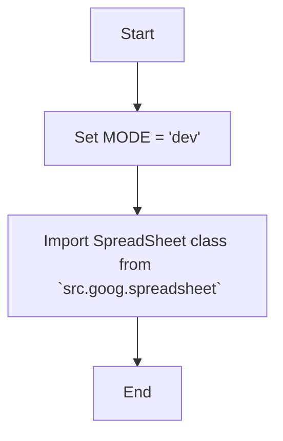

## Анализ кода `hypotez/src/goog/__init__.py`

### 1. <алгоритм>

**Общая схема работы:**

1.  **Инициализация:**
    *   Устанавливается переменная `MODE` в значение `'dev'`. Это может указывать на режим разработки, что позволяет использовать определенные настройки или логику, предназначенную для отладки.
2.  **Импорт:**
    *   Импортируется класс `SpreadSheet` из модуля `src.goog.spreadsheet`. Этот класс, вероятно, используется для работы с Google Spreadsheets.

**Примеры:**

*   **`MODE = 'dev'`**: Это присваивание переменной `MODE` значения `'dev'`. Это значение может использоваться в дальнейшем коде для определения, например, каких логгеров или настроек следует использовать.
*   **`from .spreadsheet import SpreadSheet`**: Эта инструкция импортирует класс `SpreadSheet`. Далее в коде можно будет создавать экземпляры этого класса: `my_spreadsheet = SpreadSheet()`.

### 2. <mermaid>

**Объяснение диаграммы:**

*   **Start**: Начало процесса.
*   **SetMode**: Устанавливает значение переменной `MODE` равным `'dev'`. Переменная `MODE` вероятно, используется для определения режима работы приложения (например, разработка или продакшн).
*   **ImportSpreadsheet**: Импортирует класс `SpreadSheet` из модуля `src.goog.spreadsheet`. Этот класс предположительно предоставляет функционал для работы с Google Sheets.
*   **End**: Конец процесса.

### 3. <объяснение>

**Импорты:**

*   `from .spreadsheet import SpreadSheet`:
    *   **Назначение**: Импортирует класс `SpreadSheet` из модуля `spreadsheet`, который находится в том же пакете (`src.goog`).
    *   **Взаимосвязь**: Это позволяет использовать функциональность, связанную с Google Spreadsheets, внутри текущего модуля `__init__.py` или других модулей, которые могут импортировать данный модуль.

**Переменные:**

*   `MODE = 'dev'`:
    *   **Тип**: Строка (`str`).
    *   **Использование**: Эта переменная, вероятно, используется для определения режима работы приложения. Значение `'dev'` указывает на то, что приложение находится в режиме разработки, что может влиять на логику, например, использовать отладочные настройки.

**Потенциальные улучшения:**

*   **Конфигурация режима:** Вместо жесткого задания `'dev'` можно использовать переменные окружения или конфигурационные файлы для более гибкого управления режимом работы приложения.
*   **Документация**: Добавить более подробное описание модуля, классов, переменных, как это сделано в начале файла, для лучшей читаемости и понимания.

**Цепочка взаимосвязей с другими частями проекта:**

1.  **`src.goog.spreadsheet`**: Файл `spreadsheet.py`  в том же пакете `src.goog` содержит класс `SpreadSheet`. Этот класс, вероятно, инкапсулирует всю логику работы с Google Sheets API.
2.  **Другие части проекта**: Модули, которые импортируют `src.goog`, могут использовать функциональность, предоставляемую классом `SpreadSheet`, например, для чтения и записи данных в Google Sheets. Зависимости от `src.goog.spreadsheet` можно будет проследить в других частях проекта.

Таким образом, файл `__init__.py` в пакете `src.goog` выступает как точка входа для этого пакета, устанавливая первоначальные настройки и предоставляя доступ к основным классам, таким как `SpreadSheet`.