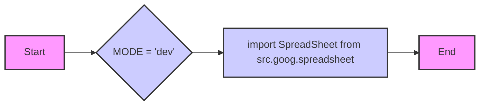

## Анализ кода `hypotez/src/goog/__init__.py`

### 1. <алгоритм>

**Блок-схема:**

1.  **Начало:** Запускается исполнение файла `__init__.py`.
2.  **Определение MODE:**  Присваивается значение `'dev'` переменной `MODE`.
    *   Пример: `MODE` = `'dev'`
3.  **Импорт `SpreadSheet`:** Импортируется класс `SpreadSheet` из модуля `src.goog.spreadsheet`.
    *   Пример: После импорта, класс `SpreadSheet` становится доступным для использования в этом модуле.
4.  **Конец:** Завершение исполнения файла.

**Поток данных:**
   - Данные не передаются между функциями (их нет в коде).
   - Переменная `MODE` инициализируется значением `'dev'`.
   - Класс `SpreadSheet` импортируется для дальнейшего использования.

### 2. <mermaid>

**Анализ зависимостей:**

*   **graph LR:** Определяет направление графа слева направо.
*   **A[Start]**: Начальный узел, обозначающий начало выполнения файла `__init__.py`.
*   **B{MODE = 'dev'}**: Узел, представляющий присвоение значения `'dev'` переменной `MODE`.
*   **C[import SpreadSheet from src.goog.spreadsheet]**: Узел, представляющий импорт класса `SpreadSheet` из модуля `src.goog.spreadsheet`. Это ключевая зависимость, так как импортирует функциональность для работы с Google Spreadsheets.
*   **D[End]**: Конечный узел, обозначающий завершение выполнения файла.
*   **style ...**: Задает стили для узлов графа.

### 3. <объяснение>

**Импорты:**

*   `from .spreadsheet import SpreadSheet`:  Импортирует класс `SpreadSheet` из модуля `spreadsheet`, который находится в том же пакете `goog`.  Это указывает на то, что модуль `goog` зависит от модуля `spreadsheet`, предоставляющего функциональность для работы с электронными таблицами Google.  Этот импорт необходим для того, чтобы использовать функциональность связанную с Google Spreadsheets в этом пакете.

**Переменные:**

*   `MODE = 'dev'`:  Глобальная переменная `MODE` устанавливается в значение `'dev'`. Это может использоваться для управления режимом работы программы (например, разработка, тестирование, продакшн). В данном случае, режим установлен как "разработка".

**Цепочка взаимосвязей с другими частями проекта:**

*   Файл `__init__.py` является точкой входа для пакета `src.goog`. Он устанавливает начальные параметры (`MODE`) и импортирует необходимые классы, такие как `SpreadSheet`.
*   Файл `hypotez/src/goog/spreadsheet.py` (не представлен в данном коде) должен содержать реализацию класса `SpreadSheet`, который предоставляет функциональность для работы с Google Spreadsheets. `__init__.py` зависит от `spreadsheet.py` так как импортирует `SpreadSheet` из него.
*   Предполагается, что другие части проекта, использующие функциональность `src.goog`, будут импортировать этот пакет и использовать класс `SpreadSheet` для взаимодействия с Google Spreadsheets.
*   Переменная `MODE` скорее всего будет использована в других частях проекта чтобы определить режим работы приложения.

**Потенциальные ошибки и области для улучшения:**

*   В данном фрагменте кода ошибок нет.
*   Код довольно минималистичен и предназначен для инициализации пакета, поэтому нет явных областей для улучшения в данном конкретном файле.
*   Возможные улучшения будут связаны с функциональностью класса `SpreadSheet` в файле `spreadsheet.py`.

**Дополнительные замечания:**
*   Первые строки кода `#! venv/Scripts/python.exe` и `#! venv/bin/python/python3.12` это shebangs и обычно указывают на интерпретатор Python для выполнения этого файла.
*   Строка с `.. module:: src.goog` является частью документации в стиле reStructuredText.