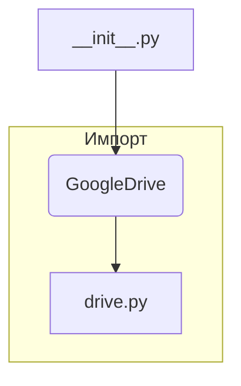

# Анализ файла hypotez/src/goog/drive/__init__.py

1. **<input code>**

```python
## \file hypotez/src/goog/drive/__init__.py
# -*- coding: utf-8 -*-\
#! venv/Scripts/python.exe
#! venv/bin/python/python3.12

"""
.. module: src.goog.drive 
	:platform: Windows, Unix
	:synopsis:

"""
MODE = 'dev'


from .drive import GoogleDrive
```

2. **<algorithm>**

Этот файл является инициализатором модуля `goog.drive`.  Алгоритм крайне прост: он импортирует класс `GoogleDrive` из подмодуля `drive`.  По сути, он выполняет только одну операцию:

**Шаг 1:** Импорт.  Файл импортирует класс `GoogleDrive` из модуля `drive`.  Этот шаг устанавливает связь между файлом `__init__.py` и классом, предоставляя доступ к его функциональности.  


3. **<mermaid>**



4. **<explanation>**

* **Импорты:** `from .drive import GoogleDrive` импортирует класс `GoogleDrive` из файла `drive.py`, который находится в том же каталоге (`./drive`).  Это типичный способ организации модулей в Python, где `__init__.py` служит начальной точкой для доступа к функциональности подмодулей.
    * **`src.goog.drive`**:  Эта структура предполагает, что проект организован иерархически, где `src` – это корневой каталог проекта, `goog` – подкаталог, содержащий логику, связанную с Google, а `drive` – подкаталог с функциональностью для работы с Google Drive.
* **Классы:**  `GoogleDrive` - это класс, который (скорее всего) определен в файле `drive.py`.  Без просмотра кода `drive.py` мы не можем детализировать функциональность этого класса.  Но в `__init__.py` доступ к нему предоставляется.

* **Функции:**  В этом файле нет функций.  Он лишь импортирует необходимый класс.


* **Переменные:** `MODE = 'dev'` - константа, скорее всего используемая для настройки режима работы (например, "разработка", "производство") в последующих частях проекта.  Этот параметр может использоваться для конфигурации поведения других частей кода.

* **Возможные ошибки или области для улучшений:**

    * **Отсутствует документация:**  Дополнительно к существующему `docstring`  был бы полезен короткий комментарий о целях файла `__init__.py`.
    * **Не описан класс `GoogleDrive`**:  Влияет на понимание, что делает этот модуль.  Чтобы улучшить код, следует добавить описание класса `GoogleDrive` в `drive.py` (например, через `docstring`).

* **Взаимосвязь с другими частями проекта:** Этот файл служит связующим звеном между кодом `src.goog.drive` и другими частями проекта, где может быть необходима работа с Google Drive.  Следуя иерархии `src.goog.drive`, можно предположить, что проект использует этот модуль для взаимодействия с API Google Drive.  Это значит, что существуют другие файлы или модули, которые будут использовать класс `GoogleDrive` для выполнения задач, связанных с хранением или манипуляцией данными в Google Drive.  Наиболее важными связями будут те места, где `GoogleDrive` используется для взаимодействия с API Google.


**Итог:**  `__init__.py` из `src.goog.drive` предоставляет начальный точку входа для работы с Google Drive.  Необходим код `drive.py` для более глубокого анализа.