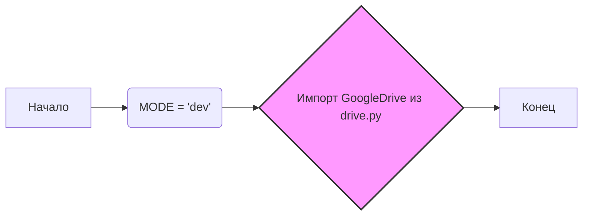

## Анализ кода `hypotez/src/goog/drive/__init__.py`

### <алгоритм>

1. **Инициализация:**
   - Устанавливается переменная `MODE` в значение `'dev'`. Это может использоваться для определения режима работы приложения (например, разработка или продакшн).
   - Пример: `MODE = 'dev'`
2. **Импорт:**
    - Импортируется модуль `GoogleDrive` из файла `drive.py`, расположенного в той же директории.
    - Пример: `from .drive import GoogleDrive`

### <mermaid>

**Объяснение зависимостей `mermaid`:**

- Диаграмма начинается с узла "Начало", который представляет начало выполнения скрипта.
- Затем устанавливается переменная `MODE` в значение `'dev'`.
- Далее происходит импорт модуля `GoogleDrive` из файла `drive.py` в той же директории.
- Конечный узел "Конец" отмечает завершение выполнения скрипта.
- `classDef import` и `class C import;` показывают что шаг импорта отмечен как отдельный класс

### <объяснение>

**Импорты:**

- `from .drive import GoogleDrive`:
    - Импортирует класс `GoogleDrive` из модуля `drive.py`, находящегося в той же директории.
    - `.` указывает на текущий пакет.
    - Этот импорт позволяет использовать функциональность, связанную с Google Drive, в других частях проекта, где импортирован этот модуль `src.goog.drive`.
    - Цепочка связей: `hypotez/src/goog/drive/__init__.py` -> `hypotez/src/goog/drive/drive.py` (предположительно).

**Переменные:**

- `MODE`:
    - Строковая переменная, инициализируется как `'dev'`.
    - Используется для обозначения режима работы приложения. В данном случае, `'dev'` указывает на режим разработки.
    - Тип: `str`.

**Файл:**

- `__init__.py`:
    - Превращает директорию `drive` в пакет Python.
    - Инициализирует пакет, выполняя код, который содержится в нем при импорте пакета.
    - В данном случае, устанавливает переменную `MODE` и импортирует класс `GoogleDrive`, делая его доступным при импорте пакета `src.goog.drive`.

**Потенциальные ошибки и области для улучшения:**

- **Отсутствие документации для `MODE`**:
    - Не указано, как и где используется переменная `MODE`. Рекомендуется добавить комментарий, описывающий ее назначение и возможные значения.
- **Предположение о существовании `drive.py`**:
    - Код предполагает, что файл `drive.py` существует и содержит класс `GoogleDrive`. Необходимо удостовериться, что это файл присутствует и содержит нужный класс.
- **Магическая строка `#! venv/Scripts/python.exe`**:
    - Указывает интерпретатор python, который будет использован. В таком виде это является магической строкой. Лучше использовать виртуальное окружение для запуска скрипта.
- **Магическая строка `#! venv/bin/python/python3.12`**:
    - Указывает интерпретатор python, который будет использован. В таком виде это является магической строкой. Лучше использовать виртуальное окружение для запуска скрипта.

**Дополнительно:**

- Этот файл является точкой входа в пакет `src.goog.drive`. Когда другой модуль импортирует этот пакет, например, `from src.goog import drive`, код в `__init__.py` будет выполнен, делая класс `GoogleDrive` доступным.
- Предполагается, что `drive.py` содержит класс `GoogleDrive`, который реализует логику взаимодействия с Google Drive API. Цепочка взаимосвязи идет от этого `__init__.py` к `drive.py`, а далее, вероятно, к сторонним библиотекам для работы с Google API.