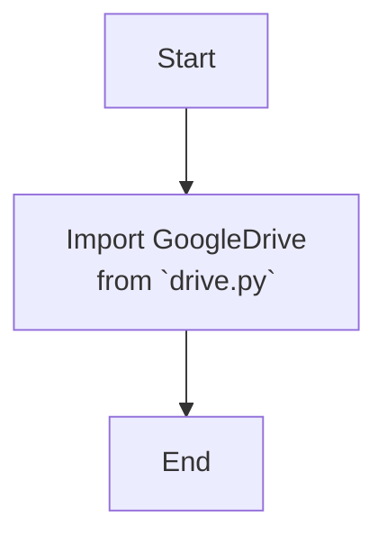

## АНАЛИЗ КОДА: `hypotez/src/goog/drive/__init__.py`

### <алгоритм>

1. **Импорт модуля `drive.py`:**
   - Модуль `__init__.py` импортирует модуль `GoogleDrive` из файла `drive.py`, расположенного в том же каталоге (`from .drive import GoogleDrive`).
   - **Пример:** Если в `drive.py` определен класс `GoogleDrive` или какая-либо функция, то после импорта их можно будет использовать в других модулях пакета `src.goog.drive`.

### <mermaid>

**Объяснение `mermaid`:**

- `Start`: Начало процесса.
- `Import_GoogleDrive`: Операция импорта класса `GoogleDrive` из модуля `drive.py`. В данном случае `drive.py` является модулем, расположенным в той же директории, что и `__init__.py`. Это делается для того, чтобы сделать содержимое `drive.py` доступным при импорте пакета `src.goog.drive`.
- `End`: Конец процесса.

### <объяснение>

**Импорты:**

- `from .drive import GoogleDrive`: 
    - **Назначение**: Этот импорт делает класс `GoogleDrive` доступным для использования в пакете `src.goog.drive`.
    - **Взаимосвязь с `src`**: `drive.py` является частью пакета `src.goog.drive`. Такой импорт, с `.` (точкой) в начале пути, называется относительным импортом и указывает на то, что модуль `drive.py` находится в той же директории, что и текущий `__init__.py`.

**Классы:**

- Класс `GoogleDrive` импортируется из файла `drive.py`, однако конкретная реализация и атрибуты класса здесь не видны, так как это импорт. Данный класс, вероятно, отвечает за взаимодействие с Google Drive API.

**Функции:**

- В данном файле нет функций, кроме неявной функции инициализации пакета `__init__.py`.

**Переменные:**
- Переменные в явном виде не используются.

**Потенциальные ошибки и области улучшения:**
- Файл `__init__.py` выполняет только импорт. В дальнейшем, возможно, потребуется добавить другие инициализационные действия для пакета `src.goog.drive`.
- Необходима проверка работоспособности импорта класса `GoogleDrive` из `drive.py`

**Цепочка взаимосвязей:**

1.  `__init__.py` является входной точкой пакета `src.goog.drive`.
2.  Импортируя `GoogleDrive` из `drive.py`, делает его доступным для других частей проекта, которые захотят использовать функциональность для работы с Google Drive.
3.  Другие модули, импортируя пакет `src.goog.drive`, смогут получить доступ к классу `GoogleDrive` через `from src.goog.drive import GoogleDrive`.

**Дополнительные замечания:**

- Заголовок `# -*- coding: utf-8 -*-` указывает кодировку исходного файла и гарантирует, что он будет правильно обработан, особенно если в коде используются символы, отличные от ASCII.
- Строки `#! venv/Scripts/python.exe` и `#! venv/bin/python/python3.12` являются shebangs, которые обычно указывают интерпретатор для выполнения скрипта. Они могут быть полезны при запуске скрипта непосредственно из командной строки, но обычно не имеют отношения к файлу `__init__.py` в контексте python-пакета.