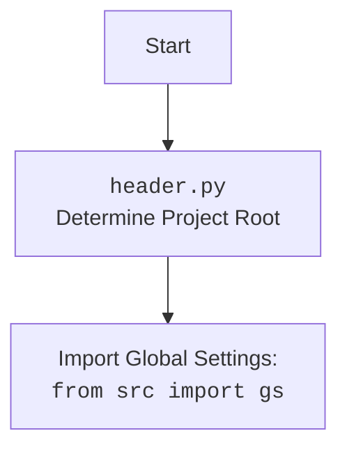

## <алгоритм>

1.  **Инициализация `GoogleDriveHandler`**:
    *   При создании экземпляра `GoogleDriveHandler` передается `folder_name`.
    *   Вызывается метод `_create_credentials` для получения учетных данных.
    *   *Пример*:
        ```python
        google_drive_handler = GoogleDriveHandler(folder_name="My Drive Folder")
        ```

2.  **`_create_credentials`**:
    *   Определяет путь к файлу с учетными данными `creds_file` (используя `gs.path.secrets`).
    *   Определяет область доступа `SCOPES` (права доступа к Google Drive).
    *   Пытается загрузить сохраненные учетные данные из файла `token.pickle`.
        *   Если файл `token.pickle` существует, загружает учетные данные.
        *   Если загрузка неудачна (например, файл не существует или недействителен), то переходит к следующему этапу.
    *   Если учетные данные недействительны, то:
        *   Пытается обновить учетные данные, если они просрочены и есть `refresh_token`.
        *   Если обновление не удалось, то запускает процесс авторизации (`InstalledAppFlow`) с помощью файла `creds_file` и `SCOPES`.
        *   Сохраняет полученные учетные данные в `token.pickle`.
    *   Возвращает учетные данные.

3.  **`upload_file`**:
    *   Принимает путь к файлу `file_path` для загрузки.
    *   **Пока не реализован**, предполагается реализация логики загрузки файла в Google Drive.
    *   *Пример*:
        ```python
        file_path = Path("/mnt/data/google_extracted/sample_file.txt")
        google_drive_handler.upload_file(file_path)
        ```
4.  **`main`**:
    *   Создает объект `GoogleDriveHandler` для получения учетных данных.
    *   Создает объект сервиса Google Drive API (`service`) с использованием полученных учетных данных.
    *   Выполняет запрос `service.files().list` для получения списка файлов на Google Drive.
    *   Печатает список файлов, либо сообщение, что файлов не найдено.

## <mermaid>

```mermaid
flowchart TD
    Start --> GoogleDriveHandlerInit[GoogleDriveHandler: __init__<br>Set folder_name, Get Credentials];
    GoogleDriveHandlerInit --> CreateCredentials[_create_credentials: Get Valid User Credentials];
    CreateCredentials --> CheckTokenFile[Check if token.pickle Exists];
    CheckTokenFile -- Yes --> LoadCredentials[Load Credentials from token.pickle];
    CheckTokenFile -- No -->  CheckCredentialsValid[Check if Credentials Exist and are Valid];
    LoadCredentials -->  CheckCredentialsValid;
    CheckCredentialsValid -- Yes --> ReturnCredentials[Return Credentials];
    CheckCredentialsValid -- No -->  CheckCredentialsExpired[Check if Credentials Expired with Refresh Token];
    CheckCredentialsExpired -- Yes --> RefreshCredentials[Refresh Credentials];
    CheckCredentialsExpired -- No -->  AuthFlow[Start InstalledAppFlow Authentication];
    RefreshCredentials -->  SaveCredentials[Save Credentials to token.pickle];
    AuthFlow -->  SaveCredentials;
    SaveCredentials --> ReturnCredentials;
    GoogleDriveHandlerInit --> ReturnCredentials;
    ReturnCredentials --> UploadFileCheck[Check if Upload File is called];
    UploadFileCheck -- Yes --> UploadFile[Upload File to Google Drive (Not Implemented)];
    UploadFileCheck -- No --> MainFunction[main: list files from Google Drive ];
    MainFunction -->  GetGoogleDriveService[Build Google Drive Service];
    GetGoogleDriveService -->  ListFiles[List Files from Google Drive using Service];
    ListFiles -->  CheckFiles[Check if files are found];
    CheckFiles -- Yes --> PrintFiles[Print Files];
    CheckFiles -- No --> PrintNoFiles[Print "No files found"];
    PrintFiles --> End;
    PrintNoFiles --> End;
    UploadFile --> End;

  classDef classFill fill:#f9f,stroke:#333,stroke-width:2px
  class GoogleDriveHandlerInit,CreateCredentials,CheckTokenFile,LoadCredentials,CheckCredentialsValid,CheckCredentialsExpired,RefreshCredentials,AuthFlow,SaveCredentials,ReturnCredentials,UploadFileCheck,UploadFile,MainFunction,GetGoogleDriveService,ListFiles,CheckFiles,PrintFiles,PrintNoFiles classFill
```



## <объяснение>

**Импорты:**

*   `pickle`: Используется для сериализации и десериализации объектов Python (в данном случае, учетных данных) для сохранения и загрузки их из файла.
*   `os`: Предоставляет функции для взаимодействия с операционной системой, например, для проверки существования файла (`os.path.exists`).
*   `pathlib.Path`: Используется для представления путей к файлам и директориям в кросс-платформенном виде.
*   `googleapiclient.discovery.build`: Используется для создания сервисных объектов Google API, таких как Google Drive API.
*   `google_auth_httplib2.AuthorizedHttpTransport`: Используется для авторизации HTTP-запросов к Google API.
*   `google.auth.transport.requests.Request`: Используется для создания HTTP-запросов для обновления учетных данных.
*   `google.oauth2.credentials.Credentials`: Класс для хранения учетных данных пользователя.
*   `google_auth_oauthlib.flow.InstalledAppFlow`: Используется для выполнения OAuth 2.0 авторизационного потока в десктопных приложениях.
*   `header`:  Локальный модуль (согласно инструкции, обрабатывается отдельно в `mermaid` блоке). Определяет корень проекта.
*   `src.gs`:  Глобальные настройки проекта, включая пути к секретам и другие конфигурации.
*   `src.utils.printer.pprint`:  Предположительно, функция для "красивого" вывода данных на консоль.
*  `src.logger.logger.logger`:  Инстанция логгера проекта.

**Класс `GoogleDriveHandler`:**

*   **Роль**: Инкапсулирует логику взаимодействия с Google Drive API, включая авторизацию и загрузку файлов.
*   **Атрибуты**:
    *   `folder_name` (str): Имя папки в Google Drive, в которую предполагается загружать файлы.
    *   `creds` (google.oauth2.credentials.Credentials): Учетные данные, полученные после авторизации.
*   **Методы**:
    *   `__init__(self, folder_name: str)`: Конструктор класса. Инициализирует атрибуты класса, включая `folder_name` и получает учетные данные.
    *   `_create_credentials(self)`: Приватный метод, отвечающий за получение учетных данных пользователя. Загружает существующие или запускает OAuth 2.0 авторизацию. Возвращает объект `Credentials`.
    *   `upload_file(self, file_path: Path)`: Метод, который (пока не реализован) должен загружать файл по указанному пути в Google Drive.

**Функции:**

*   `main()`: Функция, демонстрирующая базовое использование Google Drive API для получения списка файлов.
    *   Создает объект `GoogleDriveHandler` (используется для получения учетных данных).
    *   Создает объект `service` для взаимодействия с Drive API.
    *   Использует `service.files().list` для получения списка файлов на Google Drive.
    *   Выводит список файлов на экран или сообщение, если файлов не найдено.

**Переменные:**

*   `creds_file` (pathlib.Path): Путь к файлу с секретами JSON для авторизации. Получается из глобальных настроек (`gs`).
*   `SCOPES` (list): Список областей доступа, необходимых для работы с Google Drive.
*   `creds` (google.oauth2.credentials.Credentials): Учетные данные пользователя для доступа к Google Drive.
*   `flow` (google_auth_oauthlib.flow.InstalledAppFlow): Объект для проведения OAuth 2.0 авторизации.
*   `service` (googleapiclient.discovery.Resource): Объект для взаимодействия с Google Drive API.
*    `results` (dict): Результат запроса к Google Drive API.
*    `items` (list): Список файлов, полученный из результатов.
*   `file_path` (pathlib.Path):  Путь к файлу, который предполагается загрузить.
*   `folder_name` (str):  Название папки в Google Drive, куда будет производиться загрузка.

**Потенциальные ошибки и области для улучшения:**

*   **`upload_file` не реализован:** Ключевая функциональность класса (`upload_file`) отсутствует, что ограничивает его использование.
*   **Обработка ошибок авторизации:** Код не содержит явной обработки ошибок, которые могут возникнуть при авторизации или обновлении учетных данных.
*   **Обработка ошибок API:**  Код не обрабатывает потенциальные ошибки, которые могут возникнуть при обращении к Google Drive API (например, сетевые проблемы, ошибки сервера).
*   **Ошибки типизации**: Переменная `self.creds_file` используется без объявления, это может вызвать `AttributeError`.
*    **Множественный импорт**:  Присутствует дублирование импортов, стоит их убрать.
*   **Жестко заданные пути**: Использование `/mnt/data/google_extracted/sample_file.txt` как пути для примера.

**Взаимосвязь с другими частями проекта:**

*   `header.py`: Модуль `header` используется для определения корня проекта и получения путей к ресурсам, включая путь к файлу секретов.
*   `src.gs`:  Глобальные настройки проекта используются для определения пути к файлу `creds_file`.
*   `src.utils.printer`: Модуль `printer` может использоваться для форматирования вывода данных.
*   `src.logger.logger`: Модуль `logger` может использоваться для логирования работы программы.
*  Этот модуль предназначен для работы с Google Drive API, и может быть использован в других частях проекта, где требуется загрузка или управление файлами на Google Drive.