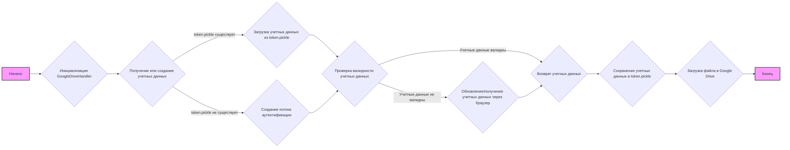

## Анализ кода `hypotez/src/goog/drive/drive.py`

### 1. `<алгоритм>`:

**Блок-схема:**



**Примеры:**

1.  **Инициализация `GoogleDriveHandler`**:
    *   `google_drive_handler = GoogleDriveHandler(folder_name='My Drive Folder')`
    *   Создаётся экземпляр класса `GoogleDriveHandler` с именем папки `'My Drive Folder'`.
2.  **Получение или создание учетных данных `_create_credentials`**:
    *   Проверяет наличие файла `token.pickle`.
    *   Если файл есть, загружает учетные данные.
    *   Если файла нет, или учетные данные не валидны, запускает процесс аутентификации через браузер (если необходимо).
3.  **Загрузка файла `upload_file`**:
    *   `google_drive_handler.upload_file(file_path=Path('/mnt/data/google_extracted/sample_file.txt'))`
    *   Запускает загрузку файла по указанному пути в Google Drive (реализация не показана).
4.  **Основная функция `main`**:
    *   `creds = GoogleDriveHandler()._create_credentials()`
        *   Создаёт экземпляр `GoogleDriveHandler` без имени папки, получает учетные данные.
    *   Создаёт сервис `service = build('drive', 'v3', credentials=creds)` для взаимодействия с Google Drive API.
    *   Получает список файлов и папок с диска, выводя их названия.

### 2. `<mermaid>`:

```mermaid
graph LR
    A[GoogleDriveHandler] --> B(_create_credentials);
    B --> C{os.path.exists("token.pickle")};
    C -- True --> D[pickle.load(token)];
    C -- False --> E{InstalledAppFlow.from_client_secrets_file};
    D --> F{Проверка creds.valid};
    E --> G{flow.run_local_server(port=0)};
    F -- False --> G;
    F -- True --> H[Возврат creds];
    G --> H;
    H --> I[pickle.dump(creds)];
    A --> J(upload_file);
    K[main()] --> L(GoogleDriveHandler()._create_credentials());
    L --> M[build('drive', 'v3', credentials=creds)];
    M --> N{service.files().list()};
    N --> O(Вывод списка файлов);

    style A fill:#f9f,stroke:#333,stroke-width:2px
    style K fill:#f9f,stroke:#333,stroke-width:2px
```

**Объяснение зависимостей:**

*   `GoogleDriveHandler` зависит от `os`, `pickle`, `Path`, `InstalledAppFlow`, `Request`, `Credentials`, `build` для работы с файловой системой, сериализации данных, путями, аутентификацией и Google Drive API.
*   `_create_credentials` зависит от `os`, `pickle` для загрузки/сохранения токена.
*   `main()` зависит от `GoogleDriveHandler`, `build` для использования API.

### 3. `<объяснение>`:

#### Импорты:

*   `pickle`: Используется для сохранения и загрузки учетных данных в файл (`token.pickle`). Это позволяет избежать повторной аутентификации при каждом запуске.
*   `os`: Используется для проверки существования файла (`token.pickle`) в файловой системе.
*   `pathlib.Path`: Используется для работы с путями к файлам, в данном случае, к файлу учетных данных.
*   `googleapiclient.discovery.build`: Используется для создания экземпляра сервиса Google Drive API.
*   `google_auth_httplib2.AuthorizedHttpTransport`: Обеспечивает авторизованный HTTP-транспорт для API.
*   `google.auth.transport.requests.Request`: Используется для обновления учетных данных.
*   `google.oauth2.credentials.Credentials`: Представляет учетные данные, полученные после аутентификации.
*   `google_auth_oauthlib.flow.InstalledAppFlow`: Используется для выполнения процесса аутентификации через браузер.
*   `header`: Локальный модуль, подробности которого не предоставлены.
*   `src.gs`: Локальный модуль, вероятно, для хранения общих настроек, путей.
*   `src.utils.printer.pprint`: Локальный модуль для красивого вывода информации.
*   `src.logger.logger.logger`: Локальный модуль для ведения логов.

#### Классы:

*   `GoogleDriveHandler`:
    *   **Роль**: Класс управляет взаимодействием с Google Drive API.
    *   **Атрибуты**:
        *   `folder_name` (str): Имя папки в Google Drive, куда будет загружаться файл.
        *   `creds` (Credentials): Экземпляр с учетными данными пользователя.
    *   **Методы**:
        *   `__init__(self, folder_name)`: Инициализирует объект класса, устанавливая имя папки и получая учетные данные.
        *   `_create_credentials(self)`: Получает или создает учетные данные пользователя, используя либо файл `token.pickle`, либо процесс аутентификации через браузер.
        *   `upload_file(self, file_path)`: Загружает файл, расположенный по `file_path`, в Google Drive. (реализация не показана).

#### Функции:

*   `main()`:
    *   **Аргументы**: Нет.
    *   **Возвращаемое значение**: Нет.
    *   **Назначение**:  Показывает базовое использование Google Drive API. Получает учетные данные, создаёт сервис Google Drive API, выводит список файлов на диске.
*   `_create_credentials(self)`:
    *   **Аргументы**: Нет.
    *   **Возвращаемое значение**: Объект типа `Credentials`.
    *   **Назначение**: Загружает или создает учетные данные пользователя для доступа к Google Drive API.

#### Переменные:

*   `MODE`: Строковая константа, определяющая режим работы программы.
*   `creds`: Объект `Credentials` с учетными данными.
*   `SCOPES`: Список строк с областями доступа, которые запрашиваются у пользователя.
*   `creds_file`: Объект `Path`, указывающий на файл с секретами клиента Google API.
*   `file_path`: Объект `Path` указывающий на путь к файлу, который нужно загрузить в Google Drive.
*   `folder_name`: Имя папки в Google Drive.
*   `service`: Объект, предоставляющий доступ к Google Drive API.
*   `results`: Результат вызова метода `files().list()` сервиса Google Drive API.
*   `items`: Список файлов, полученных из Google Drive.

#### Потенциальные ошибки и области для улучшения:

1.  **`upload_file` не реализован:** Метод `upload_file` объявлен, но не имеет реализации. Необходимо реализовать логику для загрузки файла в Google Drive.
2.  **Обработка ошибок**: В коде отсутствует обработка возможных ошибок (например, сетевых ошибок, ошибок авторизации). Необходимо добавить блоки `try-except` для обработки исключений.
3.  **Зависимость от `hypo69-c32c8736ca62.json`**:  Файл `hypo69-c32c8736ca62.json` захардкожен, что негибко. Следует использовать переменные окружения или файл конфигурации.
4.  **Аутентификация**: Для продакшена не рекомендуется запускать `flow.run_local_server(port=0)` в текущем виде.

#### Взаимосвязь с другими частями проекта:

*   Модуль `src.goog.drive` зависит от модулей `src.gs`, `src.utils.printer`, `src.logger.logger` для получения общих настроек, вывода сообщений и ведения логов.
*   Предполагается, что модуль `header` может содержать общие настройки проекта или заголовки, но детали не известны.
*   Данный модуль может использоваться в других частях проекта, которые требуют доступа к Google Drive (например, для автоматического резервного копирования данных).
*   Возможно, модуль `src.gs` содержит пути к различным файлам и папкам, что обеспечивает гибкость в настройке приложения.

**Общая картина:**

Код представляет собой базовый модуль для взаимодействия с Google Drive API. Он обеспечивает аутентификацию, получение списка файлов и папок, а также предоставляет основу для реализации загрузки файлов. Для полноценной работы необходима реализация загрузки файлов, добавление обработки ошибок и более гибкая конфигурация.